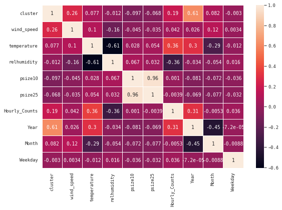

# 1. Motivation.

* *What is your dataset?*
* *Why did you choose this/these particular dataset(s)?*
* *What was your goal for the end user's experience?*

We have chosen a dataset about Melbourne. It contains two main topics: 
1. Pedestrians counting devices with locations and hourly counts 
2. Microclimate sensors with their measurement times, locations and measuring different weather data like temperature, relative humidity, mass density of particles (smaller than 2.5 and 10 micrometers) in the air and wind speed

This is a great dataset to demonstrate the effect of weather on people and through that, bring the reader a bit closer to the confusing and abstract topic climate change. If people start realizing, that climate change is already happening and it affects everyone including them, we hope they will start to actually do something against it.

Who is this article for? These questions might help you make that decision:
* Have you ever wondered about what factors influence that how many people are on the streets? 
* Can climate change affect that? 
* Do you hate crowds or just want to take a nice a picture for your instagram without random people's photobomb? 
* Or the exact opposite, do you want to meet new people? 

If your answer is yes to at least one question, than the following article is for you!

# 2. Basic stats, let's understand the dataset better

* One does not simply feed multiple millions of rows of data to an AI, thus we needed to preprocess our table first. In this section you can read about our way of thinking and our methods of improving the quality of our data.

# A. Clustering

To see what we are working with, we created a couple of visualizations first. Thanks to that, we were able to see that the locations of the sensors can be divided into five rather distinct areas. There are some outliers and there some that don't immediately reveal which area they belong to. So we have called for the help of K-means clustering.

Since there were fever microclimate sensors, we chose those to base our clusters on. After that, we determined the sizes of the clusters and mapped the pedestrians sensors to the clusters. We have omitted the ones that fell outside the clusters. You can see the results on the maps below.

Below the map with the sensors locations, you can find an animated heatmap, that shows the amount of pedestrians over each month, starting with year 2019.

Make this Notebook Trusted to load map: File -> Trust Notebook<iframe src="about:blank" style="position:absolute;width:100%;height:100%;left:0;top:0;border:none !important;" data-html=%3C%21DOCTYPE%20html%3E%0A%3Chead%3E%20%20%20%20%0A%20%20%20%20%3Cmeta%20http-equiv%3D%22content-type%22%20content%3D%22text/html%3B%20charset%3DUTF-8%22%20/%3E%0A%20%20%20%20%0A%20%20%20%20%20%20%20%20%3Cscript%3E%0A%20%20%20%20%20%20%20%20%20%20%20%20L_NO_TOUCH%20%3D%20false%3B%0A%20%20%20%20%20%20%20%20%20%20%20%20L_DISABLE_3D%20%3D%20false%3B%0A%20%20%20%20%20%20%20%20%3C/script%3E%0A%20%20%20%20%0A%20%20%20%20%3Cstyle%3Ehtml%2C%20body%20%7Bwidth%3A%20100%25%3Bheight%3A%20100%25%3Bmargin%3A%200%3Bpadding%3A%200%3B%7D%3C/style%3E%0A%20%20%20%20%3Cstyle%3E%23map%20%7Bposition%3Aabsolute%3Btop%3A0%3Bbottom%3A0%3Bright%3A0%3Bleft%3A0%3B%7D%3C/style%3E%0A%20%20%20%20%3Cscript%20src%3D%22https%3A//cdn.jsdelivr.net/npm/leaflet%401.6.0/dist/leaflet.js%22%3E%3C/script%3E%0A%20%20%20%20%3Cscript%20src%3D%22https%3A//code.jquery.com/jquery-1.12.4.min.js%22%3E%3C/script%3E%0A%20%20%20%20%3Cscript%20src%3D%22https%3A//maxcdn.bootstrapcdn.com/bootstrap/3.2.0/js/bootstrap.min.js%22%3E%3C/script%3E%0A%20%20%20%20%3Cscript%20src%3D%22https%3A//cdnjs.cloudflare.com/ajax/libs/Leaflet.awesome-markers/2.0.2/leaflet.awesome-markers.js%22%3E%3C/script%3E%0A%20%20%20%20%3Clink%20rel%3D%22stylesheet%22%20href%3D%22https%3A//cdn.jsdelivr.net/npm/leaflet%401.6.0/dist/leaflet.css%22/%3E%0A%20%20%20%20%3Clink%20rel%3D%22stylesheet%22%20href%3D%22https%3A//maxcdn.bootstrapcdn.com/bootstrap/3.2.0/css/bootstrap.min.css%22/%3E%0A%20%20%20%20%3Clink%20rel%3D%22stylesheet%22%20href%3D%22https%3A//maxcdn.bootstrapcdn.com/bootstrap/3.2.0/css/bootstrap-theme.min.css%22/%3E%0A%20%20%20%20%3Clink%20rel%3D%22stylesheet%22%20href%3D%22https%3A//maxcdn.bootstrapcdn.com/font-awesome/4.6.3/css/font-awesome.min.css%22/%3E%0A%20%20%20%20%3Clink%20rel%3D%22stylesheet%22%20href%3D%22https%3A//cdnjs.cloudflare.com/ajax/libs/Leaflet.awesome-markers/2.0.2/leaflet.awesome-markers.css%22/%3E%0A%20%20%20%20%3Clink%20rel%3D%22stylesheet%22%20href%3D%22https%3A//cdn.jsdelivr.net/gh/python-visualization/folium/folium/templates/leaflet.awesome.rotate.min.css%22/%3E%0A%20%20%20%20%0A%20%20%20%20%20%20%20%20%20%20%20%20%3Cmeta%20name%3D%22viewport%22%20content%3D%22width%3Ddevice-width%2C%0A%20%20%20%20%20%20%20%20%20%20%20%20%20%20%20%20initial-scale%3D1.0%2C%20maximum-scale%3D1.0%2C%20user-scalable%3Dno%22%20/%3E%0A%20%20%20%20%20%20%20%20%20%20%20%20%3Cstyle%3E%0A%20%20%20%20%20%20%20%20%20%20%20%20%20%20%20%20%23map_497cfca100504075a7c42b5e0b935c19%20%7B%0A%20%20%20%20%20%20%20%20%20%20%20%20%20%20%20%20%20%20%20%20position%3A%20relative%3B%0A%20%20%20%20%20%20%20%20%20%20%20%20%20%20%20%20%20%20%20%20width%3A%20100.0%25%3B%0A%20%20%20%20%20%20%20%20%20%20%20%20%20%20%20%20%20%20%20%20height%3A%20100.0%25%3B%0A%20%20%20%20%20%20%20%20%20%20%20%20%20%20%20%20%20%20%20%20left%3A%200.0%25%3B%0A%20%20%20%20%20%20%20%20%20%20%20%20%20%20%20%20%20%20%20%20top%3A%200.0%25%3B%0A%20%20%20%20%20%20%20%20%20%20%20%20%20%20%20%20%7D%0A%20%20%20%20%20%20%20%20%20%20%20%20%3C/style%3E%0A%20%20%20%20%20%20%20%20%0A%3C/head%3E%0A%3Cbody%3E%20%20%20%20%0A%20%20%20%20%0A%20%20%20%20%20%20%20%20%20%20%20%20%3Cdiv%20class%3D%22folium-map%22%20id%3D%22map_497cfca100504075a7c42b5e0b935c19%22%20%3E%3C/div%3E%0A%20%20%20%20%20%20%20%20%0A%3C/body%3E%0A%3Cscript%3E%20%20%20%20%0A%20%20%20%20%0A%20%20%20%20%20%20%20%20%20%20%20%20var%20map_497cfca100504075a7c42b5e0b935c19%20%3D%20L.map%28%0A%20%20%20%20%20%20%20%20%20%20%20%20%20%20%20%20%22map_497cfca100504075a7c42b5e0b935c19%22%2C%0A%20%20%20%20%20%20%20%20%20%20%20%20%20%20%20%20%7B%0A%20%20%20%20%20%20%20%20%20%20%20%20%20%20%20%20%20%20%20%20center%3A%20%5B-37.8136%2C%20144.9631%5D%2C%0A%20%20%20%20%20%20%20%20%20%20%20%20%20%20%20%20%20%20%20%20crs%3A%20L.CRS.EPSG3857%2C%0A%20%20%20%20%20%20%20%20%20%20%20%20%20%20%20%20%20%20%20%20zoom%3A%2014%2C%0A%20%20%20%20%20%20%20%20%20%20%20%20%20%20%20%20%20%20%20%20zoomControl%3A%20true%2C%0A%20%20%20%20%20%20%20%20%20%20%20%20%20%20%20%20%20%20%20%20preferCanvas%3A%20false%2C%0A%20%20%20%20%20%20%20%20%20%20%20%20%20%20%20%20%7D%0A%20%20%20%20%20%20%20%20%20%20%20%20%29%3B%0A%0A%20%20%20%20%20%20%20%20%20%20%20%20%0A%0A%20%20%20%20%20%20%20%20%0A%20%20%20%20%0A%20%20%20%20%20%20%20%20%20%20%20%20var%20tile_layer_ba1f6f89902f4c1fbd6f47ab1c0b35eb%20%3D%20L.tileLayer%28%0A%20%20%20%20%20%20%20%20%20%20%20%20%20%20%20%20%22https%3A//stamen-tiles-%7Bs%7D.a.ssl.fastly.net/toner/%7Bz%7D/%7Bx%7D/%7By%7D.png%22%2C%0A%20%20%20%20%20%20%20%20%20%20%20%20%20%20%20%20%7B%22attribution%22%3A%20%22Map%20tiles%20by%20%5Cu003ca%20href%3D%5C%22http%3A//stamen.com%5C%22%5Cu003eStamen%20Design%5Cu003c/a%5Cu003e%2C%20under%20%5Cu003ca%20href%3D%5C%22http%3A//creativecommons.org/licenses/by/3.0%5C%22%5Cu003eCC%20BY%203.0%5Cu003c/a%5Cu003e.%20Data%20by%20%5Cu0026copy%3B%20%5Cu003ca%20href%3D%5C%22http%3A//openstreetmap.org%5C%22%5Cu003eOpenStreetMap%5Cu003c/a%5Cu003e%2C%20under%20%5Cu003ca%20href%3D%5C%22http%3A//www.openstreetmap.org/copyright%5C%22%5Cu003eODbL%5Cu003c/a%5Cu003e.%22%2C%20%22detectRetina%22%3A%20false%2C%20%22maxNativeZoom%22%3A%2018%2C%20%22maxZoom%22%3A%2018%2C%20%22minZoom%22%3A%200%2C%20%22noWrap%22%3A%20false%2C%20%22opacity%22%3A%201%2C%20%22subdomains%22%3A%20%22abc%22%2C%20%22tms%22%3A%20false%7D%0A%20%20%20%20%20%20%20%20%20%20%20%20%29.addTo%28map_497cfca100504075a7c42b5e0b935c19%29%3B%0A%20%20%20%20%20%20%20%20%0A%20%20%20%20%0A%20%20%20%20%20%20%20%20%20%20%20%20var%20marker_b83582b12a6a42b5a253a400e48158b3%20%3D%20L.marker%28%0A%20%20%20%20%20%20%20%20%20%20%20%20%20%20%20%20%5B-37.8023%2C%20144.960923%5D%2C%0A%20%20%20%20%20%20%20%20%20%20%20%20%20%20%20%20%7B%7D%0A%20%20%20%20%20%20%20%20%20%20%20%20%29.addTo%28map_497cfca100504075a7c42b5e0b935c19%29%3B%0A%20%20%20%20%20%20%20%20%0A%20%20%20%20%0A%20%20%20%20%20%20%20%20%20%20%20%20var%20icon_89fc51a45fc34e2c96f014404268ad64%20%3D%20L.AwesomeMarkers.icon%28%0A%20%20%20%20%20%20%20%20%20%20%20%20%20%20%20%20%7B%22extraClasses%22%3A%20%22fa-rotate-0%22%2C%20%22icon%22%3A%20%22info-sign%22%2C%20%22iconColor%22%3A%20%22white%22%2C%20%22markerColor%22%3A%20%22darkblue%22%2C%20%22prefix%22%3A%20%22glyphicon%22%7D%0A%20%20%20%20%20%20%20%20%20%20%20%20%29%3B%0A%20%20%20%20%20%20%20%20%20%20%20%20marker_b83582b12a6a42b5a253a400e48158b3.setIcon%28icon_89fc51a45fc34e2c96f014404268ad64%29%3B%0A%20%20%20%20%20%20%20%20%0A%20%20%20%20%0A%20%20%20%20%20%20%20%20var%20popup_a60201e065194b54a596c31bfcb77562%20%3D%20L.popup%28%7B%22maxWidth%22%3A%20%22100%25%22%7D%29%3B%0A%0A%20%20%20%20%20%20%20%20%0A%20%20%20%20%20%20%20%20%20%20%20%20var%20html_a7223d2e93e64590b80310d6c441f312%20%3D%20%24%28%60%3Cdiv%20id%3D%22html_a7223d2e93e64590b80310d6c441f312%22%20style%3D%22width%3A%20100.0%25%3B%20height%3A%20100.0%25%3B%22%3EPelham%20Street%20between%20Bouverie%20Street%20and%20Leicester%20Street%2C%20approximately%2015m%20West%20of%20Mama%20Tsai%2C%20165%20Pelham%20StreetCARLTON%20VIC%203053%3C/div%3E%60%29%5B0%5D%3B%0A%20%20%20%20%20%20%20%20%20%20%20%20popup_a60201e065194b54a596c31bfcb77562.setContent%28html_a7223d2e93e64590b80310d6c441f312%29%3B%0A%20%20%20%20%20%20%20%20%0A%0A%20%20%20%20%20%20%20%20marker_b83582b12a6a42b5a253a400e48158b3.bindPopup%28popup_a60201e065194b54a596c31bfcb77562%29%0A%20%20%20%20%20%20%20%20%3B%0A%0A%20%20%20%20%20%20%20%20%0A%20%20%20%20%0A%20%20%20%20%0A%20%20%20%20%20%20%20%20%20%20%20%20var%20marker_774cf4a24dca46f6bac4c26c48812351%20%3D%20L.marker%28%0A%20%20%20%20%20%20%20%20%20%20%20%20%20%20%20%20%5B-37.81686763%2C%20144.96570467%5D%2C%0A%20%20%20%20%20%20%20%20%20%20%20%20%20%20%20%20%7B%7D%0A%20%20%20%20%20%20%20%20%20%20%20%20%29.addTo%28map_497cfca100504075a7c42b5e0b935c19%29%3B%0A%20%20%20%20%20%20%20%20%0A%20%20%20%20%0A%20%20%20%20%20%20%20%20%20%20%20%20var%20icon_dc2ba9256abb48a8a5c3089349f60fcf%20%3D%20L.AwesomeMarkers.icon%28%0A%20%20%20%20%20%20%20%20%20%20%20%20%20%20%20%20%7B%22extraClasses%22%3A%20%22fa-rotate-0%22%2C%20%22icon%22%3A%20%22info-sign%22%2C%20%22iconColor%22%3A%20%22white%22%2C%20%22markerColor%22%3A%20%22darkred%22%2C%20%22prefix%22%3A%20%22glyphicon%22%7D%0A%20%20%20%20%20%20%20%20%20%20%20%20%29%3B%0A%20%20%20%20%20%20%20%20%20%20%20%20marker_774cf4a24dca46f6bac4c26c48812351.setIcon%28icon_dc2ba9256abb48a8a5c3089349f60fcf%29%3B%0A%20%20%20%20%20%20%20%20%0A%20%20%20%20%0A%20%20%20%20%20%20%20%20var%20popup_30596a6580094e919d9f5125c89294f4%20%3D%20L.popup%28%7B%22maxWidth%22%3A%20%22100%25%22%7D%29%3B%0A%0A%20%20%20%20%20%20%20%20%0A%20%20%20%20%20%20%20%20%20%20%20%20var%20html_60bc1840a746405091a27cb36e14f6a3%20%3D%20%24%28%60%3Cdiv%20id%3D%22html_60bc1840a746405091a27cb36e14f6a3%22%20style%3D%22width%3A%20100.0%25%3B%20height%3A%20100.0%25%3B%22%3EFlinders%20Lane%20between%20Swanston%20Street%20and%20Elizabeth%20Street%2C%20approximately%207m%20South%20of%20Centro%20Espresso%2C%20Shop%202%2C%20252%20Flinders%20LaneMELBOURNE%20VIC%203000%3C/div%3E%60%29%5B0%5D%3B%0A%20%20%20%20%20%20%20%20%20%20%20%20popup_30596a6580094e919d9f5125c89294f4.setContent%28html_60bc1840a746405091a27cb36e14f6a3%29%3B%0A%20%20%20%20%20%20%20%20%0A%0A%20%20%20%20%20%20%20%20marker_774cf4a24dca46f6bac4c26c48812351.bindPopup%28popup_30596a6580094e919d9f5125c89294f4%29%0A%20%20%20%20%20%20%20%20%3B%0A%0A%20%20%20%20%20%20%20%20%0A%20%20%20%20%0A%20%20%20%20%0A%20%20%20%20%20%20%20%20%20%20%20%20var%20marker_8de64b7e25184aa0b965d00aa7bb8fdf%20%3D%20L.marker%28%0A%20%20%20%20%20%20%20%20%20%20%20%20%20%20%20%20%5B-37.81746522%2C%20144.96705703%5D%2C%0A%20%20%20%20%20%20%20%20%20%20%20%20%20%20%20%20%7B%7D%0A%20%20%20%20%20%20%20%20%20%20%20%20%29.addTo%28map_497cfca100504075a7c42b5e0b935c19%29%3B%0A%20%20%20%20%20%20%20%20%0A%20%20%20%20%0A%20%20%20%20%20%20%20%20%20%20%20%20var%20icon_a6a70728a94e46c88d02c1dff4bfd3a1%20%3D%20L.AwesomeMarkers.icon%28%0A%20%20%20%20%20%20%20%20%20%20%20%20%20%20%20%20%7B%22extraClasses%22%3A%20%22fa-rotate-0%22%2C%20%22icon%22%3A%20%22info-sign%22%2C%20%22iconColor%22%3A%20%22white%22%2C%20%22markerColor%22%3A%20%22darkred%22%2C%20%22prefix%22%3A%20%22glyphicon%22%7D%0A%20%20%20%20%20%20%20%20%20%20%20%20%29%3B%0A%20%20%20%20%20%20%20%20%20%20%20%20marker_8de64b7e25184aa0b965d00aa7bb8fdf.setIcon%28icon_a6a70728a94e46c88d02c1dff4bfd3a1%29%3B%0A%20%20%20%20%20%20%20%20%0A%20%20%20%20%0A%20%20%20%20%20%20%20%20var%20popup_2606628c868640d19fe61ee915f0efde%20%3D%20L.popup%28%7B%22maxWidth%22%3A%20%22100%25%22%7D%29%3B%0A%0A%20%20%20%20%20%20%20%20%0A%20%20%20%20%20%20%20%20%20%20%20%20var%20html_5f05881ee2d240c3b58cb178084ad421%20%3D%20%24%28%60%3Cdiv%20id%3D%22html_5f05881ee2d240c3b58cb178084ad421%22%20style%3D%22width%3A%20100.0%25%3B%20height%3A%20100.0%25%3B%22%3EFlinders%20Street%20between%20Swanston%20Street%20and%20Elizabeth%20Street%2C%20approximately%2016m%20East%20of%20Dangerfield%2C%20222-224%20Flinders%20StreetMELBOURNE%20VIC%203000%3C/div%3E%60%29%5B0%5D%3B%0A%20%20%20%20%20%20%20%20%20%20%20%20popup_2606628c868640d19fe61ee915f0efde.setContent%28html_5f05881ee2d240c3b58cb178084ad421%29%3B%0A%20%20%20%20%20%20%20%20%0A%0A%20%20%20%20%20%20%20%20marker_8de64b7e25184aa0b965d00aa7bb8fdf.bindPopup%28popup_2606628c868640d19fe61ee915f0efde%29%0A%20%20%20%20%20%20%20%20%3B%0A%0A%20%20%20%20%20%20%20%20%0A%20%20%20%20%0A%20%20%20%20%0A%20%20%20%20%20%20%20%20%20%20%20%20var%20marker_0a1a358114c040ebafbf13ef2e891a59%20%3D%20L.marker%28%0A%20%20%20%20%20%20%20%20%20%20%20%20%20%20%20%20%5B-37.811944%2C%20144.956389%5D%2C%0A%20%20%20%20%20%20%20%20%20%20%20%20%20%20%20%20%7B%7D%0A%20%20%20%20%20%20%20%20%20%20%20%20%29.addTo%28map_497cfca100504075a7c42b5e0b935c19%29%3B%0A%20%20%20%20%20%20%20%20%0A%20%20%20%20%0A%20%20%20%20%20%20%20%20%20%20%20%20var%20icon_5ccd856fe2d04677ab63db87c84c8986%20%3D%20L.AwesomeMarkers.icon%28%0A%20%20%20%20%20%20%20%20%20%20%20%20%20%20%20%20%7B%22extraClasses%22%3A%20%22fa-rotate-0%22%2C%20%22icon%22%3A%20%22info-sign%22%2C%20%22iconColor%22%3A%20%22white%22%2C%20%22markerColor%22%3A%20%22black%22%2C%20%22prefix%22%3A%20%22glyphicon%22%7D%0A%20%20%20%20%20%20%20%20%20%20%20%20%29%3B%0A%20%20%20%20%20%20%20%20%20%20%20%20marker_0a1a358114c040ebafbf13ef2e891a59.setIcon%28icon_5ccd856fe2d04677ab63db87c84c8986%29%3B%0A%20%20%20%20%20%20%20%20%0A%20%20%20%20%0A%20%20%20%20%20%20%20%20var%20popup_b8754d9d1d3c4892a958f6b46cc26e7a%20%3D%20L.popup%28%7B%22maxWidth%22%3A%20%22100%25%22%7D%29%3B%0A%0A%20%20%20%20%20%20%20%20%0A%20%20%20%20%20%20%20%20%20%20%20%20var%20html_77674621e60e4eb2948b47368082d950%20%3D%20%24%28%60%3Cdiv%20id%3D%22html_77674621e60e4eb2948b47368082d950%22%20style%3D%22width%3A%20100.0%25%3B%20height%3A%20100.0%25%3B%22%3EWilliam%20Street%20between%20Little%20Lonsdale%20Street%20and%20La%20Trobe%20Street%2C%20approximately%2024m%20West%20of%20The%20Mint%20Bar%20%26%20Restaurant%2C%20Northern%20GuardhouseRoyal%20Mint318%20William%20StreetMELBOURNE%20VIC%203000%3C/div%3E%60%29%5B0%5D%3B%0A%20%20%20%20%20%20%20%20%20%20%20%20popup_b8754d9d1d3c4892a958f6b46cc26e7a.setContent%28html_77674621e60e4eb2948b47368082d950%29%3B%0A%20%20%20%20%20%20%20%20%0A%0A%20%20%20%20%20%20%20%20marker_0a1a358114c040ebafbf13ef2e891a59.bindPopup%28popup_b8754d9d1d3c4892a958f6b46cc26e7a%29%0A%20%20%20%20%20%20%20%20%3B%0A%0A%20%20%20%20%20%20%20%20%0A%20%20%20%20%0A%20%20%20%20%0A%20%20%20%20%20%20%20%20%20%20%20%20var%20marker_31f0c1c16ad44186bde233194e3989f8%20%3D%20L.marker%28%0A%20%20%20%20%20%20%20%20%20%20%20%20%20%20%20%20%5B-37.800575%2C%20144.964635%5D%2C%0A%20%20%20%20%20%20%20%20%20%20%20%20%20%20%20%20%7B%7D%0A%20%20%20%20%20%20%20%20%20%20%20%20%29.addTo%28map_497cfca100504075a7c42b5e0b935c19%29%3B%0A%20%20%20%20%20%20%20%20%0A%20%20%20%20%0A%20%20%20%20%20%20%20%20%20%20%20%20var%20icon_4d9b9993c61848ea92b22c1c69b2765e%20%3D%20L.AwesomeMarkers.icon%28%0A%20%20%20%20%20%20%20%20%20%20%20%20%20%20%20%20%7B%22extraClasses%22%3A%20%22fa-rotate-0%22%2C%20%22icon%22%3A%20%22info-sign%22%2C%20%22iconColor%22%3A%20%22white%22%2C%20%22markerColor%22%3A%20%22darkblue%22%2C%20%22prefix%22%3A%20%22glyphicon%22%7D%0A%20%20%20%20%20%20%20%20%20%20%20%20%29%3B%0A%20%20%20%20%20%20%20%20%20%20%20%20marker_31f0c1c16ad44186bde233194e3989f8.setIcon%28icon_4d9b9993c61848ea92b22c1c69b2765e%29%3B%0A%20%20%20%20%20%20%20%20%0A%20%20%20%20%0A%20%20%20%20%20%20%20%20var%20popup_24f7249804634093a5e8076b2f89a34e%20%3D%20L.popup%28%7B%22maxWidth%22%3A%20%22100%25%22%7D%29%3B%0A%0A%20%20%20%20%20%20%20%20%0A%20%20%20%20%20%20%20%20%20%20%20%20var%20html_52d8ed132d7d4034bcc7501d224a2865%20%3D%20%24%28%60%3Cdiv%20id%3D%22html_52d8ed132d7d4034bcc7501d224a2865%22%20style%3D%22width%3A%20100.0%25%3B%20height%3A%20100.0%25%3B%22%3EGrattan%20Street%20between%20Cardigan%20Street%20and%20Swanston%20Street%2C%20approximately%2047m%20East%20of%20Colourful%20Yunnan%20Restaurant%2C%20680-682%20Swanston%20StreetCARLTON%20VIC%203053%3C/div%3E%60%29%5B0%5D%3B%0A%20%20%20%20%20%20%20%20%20%20%20%20popup_24f7249804634093a5e8076b2f89a34e.setContent%28html_52d8ed132d7d4034bcc7501d224a2865%29%3B%0A%20%20%20%20%20%20%20%20%0A%0A%20%20%20%20%20%20%20%20marker_31f0c1c16ad44186bde233194e3989f8.bindPopup%28popup_24f7249804634093a5e8076b2f89a34e%29%0A%20%20%20%20%20%20%20%20%3B%0A%0A%20%20%20%20%20%20%20%20%0A%20%20%20%20%0A%20%20%20%20%0A%20%20%20%20%20%20%20%20%20%20%20%20var%20marker_d6c7b97a82dc473da7aafb3f5bdd6070%20%3D%20L.marker%28%0A%20%20%20%20%20%20%20%20%20%20%20%20%20%20%20%20%5B-37.82250002%2C%20144.95222195%5D%2C%0A%20%20%20%20%20%20%20%20%20%20%20%20%20%20%20%20%7B%7D%0A%20%20%20%20%20%20%20%20%20%20%20%20%29.addTo%28map_497cfca100504075a7c42b5e0b935c19%29%3B%0A%20%20%20%20%20%20%20%20%0A%20%20%20%20%0A%20%20%20%20%20%20%20%20%20%20%20%20var%20icon_d06c71b24b26472da4d1837d6139e7bd%20%3D%20L.AwesomeMarkers.icon%28%0A%20%20%20%20%20%20%20%20%20%20%20%20%20%20%20%20%7B%22extraClasses%22%3A%20%22fa-rotate-0%22%2C%20%22icon%22%3A%20%22info-sign%22%2C%20%22iconColor%22%3A%20%22white%22%2C%20%22markerColor%22%3A%20%22darkgreen%22%2C%20%22prefix%22%3A%20%22glyphicon%22%7D%0A%20%20%20%20%20%20%20%20%20%20%20%20%29%3B%0A%20%20%20%20%20%20%20%20%20%20%20%20marker_d6c7b97a82dc473da7aafb3f5bdd6070.setIcon%28icon_d06c71b24b26472da4d1837d6139e7bd%29%3B%0A%20%20%20%20%20%20%20%20%0A%20%20%20%20%0A%20%20%20%20%20%20%20%20var%20popup_130a070a833947d88f6132fce39a5394%20%3D%20L.popup%28%7B%22maxWidth%22%3A%20%22100%25%22%7D%29%3B%0A%0A%20%20%20%20%20%20%20%20%0A%20%20%20%20%20%20%20%20%20%20%20%20var%20html_20f9181d0fc949f69a3684d480404d9b%20%3D%20%24%28%60%3Cdiv%20id%3D%22html_20f9181d0fc949f69a3684d480404d9b%22%20style%3D%22width%3A%20100.0%25%3B%20height%3A%20100.0%25%3B%22%3EMelbourne%20Convention%20Centre%20Carpark%2C%20approximately%2031m%20NE%20of%20Perso%20Home%20Style%20Grill%20And%20Kebabs%2C%20Unit%2015%2C%20Ground%2060%20Siddeley%20StreetDOCKLANDS%20VIC%203008%3C/div%3E%60%29%5B0%5D%3B%0A%20%20%20%20%20%20%20%20%20%20%20%20popup_130a070a833947d88f6132fce39a5394.setContent%28html_20f9181d0fc949f69a3684d480404d9b%29%3B%0A%20%20%20%20%20%20%20%20%0A%0A%20%20%20%20%20%20%20%20marker_d6c7b97a82dc473da7aafb3f5bdd6070.bindPopup%28popup_130a070a833947d88f6132fce39a5394%29%0A%20%20%20%20%20%20%20%20%3B%0A%0A%20%20%20%20%20%20%20%20%0A%20%20%20%20%0A%20%20%20%20%0A%20%20%20%20%20%20%20%20%20%20%20%20var%20marker_8f85c76094b849c4ba5745dc371793fb%20%3D%20L.marker%28%0A%20%20%20%20%20%20%20%20%20%20%20%20%20%20%20%20%5B-37.822222%2C%20144.952222%5D%2C%0A%20%20%20%20%20%20%20%20%20%20%20%20%20%20%20%20%7B%7D%0A%20%20%20%20%20%20%20%20%20%20%20%20%29.addTo%28map_497cfca100504075a7c42b5e0b935c19%29%3B%0A%20%20%20%20%20%20%20%20%0A%20%20%20%20%0A%20%20%20%20%20%20%20%20%20%20%20%20var%20icon_7284fd7ee18c46da8681dcde75a991b6%20%3D%20L.AwesomeMarkers.icon%28%0A%20%20%20%20%20%20%20%20%20%20%20%20%20%20%20%20%7B%22extraClasses%22%3A%20%22fa-rotate-0%22%2C%20%22icon%22%3A%20%22info-sign%22%2C%20%22iconColor%22%3A%20%22white%22%2C%20%22markerColor%22%3A%20%22darkgreen%22%2C%20%22prefix%22%3A%20%22glyphicon%22%7D%0A%20%20%20%20%20%20%20%20%20%20%20%20%29%3B%0A%20%20%20%20%20%20%20%20%20%20%20%20marker_8f85c76094b849c4ba5745dc371793fb.setIcon%28icon_7284fd7ee18c46da8681dcde75a991b6%29%3B%0A%20%20%20%20%20%20%20%20%0A%20%20%20%20%0A%20%20%20%20%20%20%20%20var%20popup_b36ba9d440674c4388c919f8d571f16b%20%3D%20L.popup%28%7B%22maxWidth%22%3A%20%22100%25%22%7D%29%3B%0A%0A%20%20%20%20%20%20%20%20%0A%20%20%20%20%20%20%20%20%20%20%20%20var%20html_b894e5ac881f41cc9b63ac59eb984c69%20%3D%20%24%28%60%3Cdiv%20id%3D%22html_b894e5ac881f41cc9b63ac59eb984c69%22%20style%3D%22width%3A%20100.0%25%3B%20height%3A%20100.0%25%3B%22%3EMelbourne%20Convention%20Centre%20Carpark%2C%20approximately%2038m%20East%20of%20Care%20Park%2C%20Melbourne%20Convention%20Centre%20Carpark671-701%20Flinders%20StreetDOCKLANDS%20VIC%203008%3C/div%3E%60%29%5B0%5D%3B%0A%20%20%20%20%20%20%20%20%20%20%20%20popup_b36ba9d440674c4388c919f8d571f16b.setContent%28html_b894e5ac881f41cc9b63ac59eb984c69%29%3B%0A%20%20%20%20%20%20%20%20%0A%0A%20%20%20%20%20%20%20%20marker_8f85c76094b849c4ba5745dc371793fb.bindPopup%28popup_b36ba9d440674c4388c919f8d571f16b%29%0A%20%20%20%20%20%20%20%20%3B%0A%0A%20%20%20%20%20%20%20%20%0A%20%20%20%20%0A%20%20%20%20%0A%20%20%20%20%20%20%20%20%20%20%20%20var%20marker_dc0450c438654fb292effeb62ae679ed%20%3D%20L.marker%28%0A%20%20%20%20%20%20%20%20%20%20%20%20%20%20%20%20%5B-37.8175%2C%20144.967222%5D%2C%0A%20%20%20%20%20%20%20%20%20%20%20%20%20%20%20%20%7B%7D%0A%20%20%20%20%20%20%20%20%20%20%20%20%29.addTo%28map_497cfca100504075a7c42b5e0b935c19%29%3B%0A%20%20%20%20%20%20%20%20%0A%20%20%20%20%0A%20%20%20%20%20%20%20%20%20%20%20%20var%20icon_de2e7796338b47a4be0f1aade78ee6ee%20%3D%20L.AwesomeMarkers.icon%28%0A%20%20%20%20%20%20%20%20%20%20%20%20%20%20%20%20%7B%22extraClasses%22%3A%20%22fa-rotate-0%22%2C%20%22icon%22%3A%20%22info-sign%22%2C%20%22iconColor%22%3A%20%22white%22%2C%20%22markerColor%22%3A%20%22darkred%22%2C%20%22prefix%22%3A%20%22glyphicon%22%7D%0A%20%20%20%20%20%20%20%20%20%20%20%20%29%3B%0A%20%20%20%20%20%20%20%20%20%20%20%20marker_dc0450c438654fb292effeb62ae679ed.setIcon%28icon_de2e7796338b47a4be0f1aade78ee6ee%29%3B%0A%20%20%20%20%20%20%20%20%0A%20%20%20%20%0A%20%20%20%20%20%20%20%20var%20popup_a22d0fbaf3bb48038cf8411ab0d06813%20%3D%20L.popup%28%7B%22maxWidth%22%3A%20%22100%25%22%7D%29%3B%0A%0A%20%20%20%20%20%20%20%20%0A%20%20%20%20%20%20%20%20%20%20%20%20var%20html_6f69e1e607574862b6021423e3324c9d%20%3D%20%24%28%60%3Cdiv%20id%3D%22html_6f69e1e607574862b6021423e3324c9d%22%20style%3D%22width%3A%20100.0%25%3B%20height%3A%20100.0%25%3B%22%3EFlinders%20Street%20between%20Swanston%20Street%20and%20Elizabeth%20Street%2C%20approximately%2015m%20South%20of%20Young%20%26%20Jackson%2C%20Young%20And%20Jacksons%20Hotel1-7%20Swanston%20StreetMELBOURNE%20VIC%203000%3C/div%3E%60%29%5B0%5D%3B%0A%20%20%20%20%20%20%20%20%20%20%20%20popup_a22d0fbaf3bb48038cf8411ab0d06813.setContent%28html_6f69e1e607574862b6021423e3324c9d%29%3B%0A%20%20%20%20%20%20%20%20%0A%0A%20%20%20%20%20%20%20%20marker_dc0450c438654fb292effeb62ae679ed.bindPopup%28popup_a22d0fbaf3bb48038cf8411ab0d06813%29%0A%20%20%20%20%20%20%20%20%3B%0A%0A%20%20%20%20%20%20%20%20%0A%20%20%20%20%0A%20%20%20%20%0A%20%20%20%20%20%20%20%20%20%20%20%20var%20marker_69c3c90672f94a4db62217b9d7274e23%20%3D%20L.marker%28%0A%20%20%20%20%20%20%20%20%20%20%20%20%20%20%20%20%5B-37.812778%2C%20144.960556%5D%2C%0A%20%20%20%20%20%20%20%20%20%20%20%20%20%20%20%20%7B%7D%0A%20%20%20%20%20%20%20%20%20%20%20%20%29.addTo%28map_497cfca100504075a7c42b5e0b935c19%29%3B%0A%20%20%20%20%20%20%20%20%0A%20%20%20%20%0A%20%20%20%20%20%20%20%20%20%20%20%20var%20icon_768081f1fb824a7bbfc3ac18bdea0e1f%20%3D%20L.AwesomeMarkers.icon%28%0A%20%20%20%20%20%20%20%20%20%20%20%20%20%20%20%20%7B%22extraClasses%22%3A%20%22fa-rotate-0%22%2C%20%22icon%22%3A%20%22info-sign%22%2C%20%22iconColor%22%3A%20%22white%22%2C%20%22markerColor%22%3A%20%22black%22%2C%20%22prefix%22%3A%20%22glyphicon%22%7D%0A%20%20%20%20%20%20%20%20%20%20%20%20%29%3B%0A%20%20%20%20%20%20%20%20%20%20%20%20marker_69c3c90672f94a4db62217b9d7274e23.setIcon%28icon_768081f1fb824a7bbfc3ac18bdea0e1f%29%3B%0A%20%20%20%20%20%20%20%20%0A%20%20%20%20%0A%20%20%20%20%20%20%20%20var%20popup_ae86a77bb62c4c5fb3dc3837ed643905%20%3D%20L.popup%28%7B%22maxWidth%22%3A%20%22100%25%22%7D%29%3B%0A%0A%20%20%20%20%20%20%20%20%0A%20%20%20%20%20%20%20%20%20%20%20%20var%20html_d12ce15ca8164b65be6ccee46cc7a508%20%3D%20%24%28%60%3Cdiv%20id%3D%22html_d12ce15ca8164b65be6ccee46cc7a508%22%20style%3D%22width%3A%20100.0%25%3B%20height%3A%20100.0%25%3B%22%3ELonsdale%20Street%20between%20Elizabeth%20Street%20and%20Queen%20Street%2C%20approximately%2016m%20South%20of%20Who%20Salon%2C%20402%20Lonsdale%20StreetMELBOURNE%20VIC%203000%3C/div%3E%60%29%5B0%5D%3B%0A%20%20%20%20%20%20%20%20%20%20%20%20popup_ae86a77bb62c4c5fb3dc3837ed643905.setContent%28html_d12ce15ca8164b65be6ccee46cc7a508%29%3B%0A%20%20%20%20%20%20%20%20%0A%0A%20%20%20%20%20%20%20%20marker_69c3c90672f94a4db62217b9d7274e23.bindPopup%28popup_ae86a77bb62c4c5fb3dc3837ed643905%29%0A%20%20%20%20%20%20%20%20%3B%0A%0A%20%20%20%20%20%20%20%20%0A%20%20%20%20%0A%20%20%20%20%0A%20%20%20%20%20%20%20%20%20%20%20%20var%20marker_ec533e8e49ff4b1bae00fa2dfd33f7cb%20%3D%20L.marker%28%0A%20%20%20%20%20%20%20%20%20%20%20%20%20%20%20%20%5B-37.813333%2C%20144.97%5D%2C%0A%20%20%20%20%20%20%20%20%20%20%20%20%20%20%20%20%7B%7D%0A%20%20%20%20%20%20%20%20%20%20%20%20%29.addTo%28map_497cfca100504075a7c42b5e0b935c19%29%3B%0A%20%20%20%20%20%20%20%20%0A%20%20%20%20%0A%20%20%20%20%20%20%20%20%20%20%20%20var%20icon_ab1c04e1c82d4b00b81f159a63b6e8b7%20%3D%20L.AwesomeMarkers.icon%28%0A%20%20%20%20%20%20%20%20%20%20%20%20%20%20%20%20%7B%22extraClasses%22%3A%20%22fa-rotate-0%22%2C%20%22icon%22%3A%20%22info-sign%22%2C%20%22iconColor%22%3A%20%22white%22%2C%20%22markerColor%22%3A%20%22darkpurple%22%2C%20%22prefix%22%3A%20%22glyphicon%22%7D%0A%20%20%20%20%20%20%20%20%20%20%20%20%29%3B%0A%20%20%20%20%20%20%20%20%20%20%20%20marker_ec533e8e49ff4b1bae00fa2dfd33f7cb.setIcon%28icon_ab1c04e1c82d4b00b81f159a63b6e8b7%29%3B%0A%20%20%20%20%20%20%20%20%0A%20%20%20%20%0A%20%20%20%20%20%20%20%20var%20popup_424024a8231a4bef966b2939a81c9043%20%3D%20L.popup%28%7B%22maxWidth%22%3A%20%22100%25%22%7D%29%3B%0A%0A%20%20%20%20%20%20%20%20%0A%20%20%20%20%20%20%20%20%20%20%20%20var%20html_b30271bf5dd348ae8e385426b13f8ba1%20%3D%20%24%28%60%3Cdiv%20id%3D%22html_b30271bf5dd348ae8e385426b13f8ba1%22%20style%3D%22width%3A%20100.0%25%3B%20height%3A%20100.0%25%3B%22%3ELittle%20Collins%20Street%20between%20Exhibition%20Street%20and%20Russell%20Street%2C%20approximately%203m%20SE%20of%20Vacant%20as%20at%2019-APR-22%2C%20112%20Little%20Collins%20StreetMELBOURNE%20VIC%203000%3C/div%3E%60%29%5B0%5D%3B%0A%20%20%20%20%20%20%20%20%20%20%20%20popup_424024a8231a4bef966b2939a81c9043.setContent%28html_b30271bf5dd348ae8e385426b13f8ba1%29%3B%0A%20%20%20%20%20%20%20%20%0A%0A%20%20%20%20%20%20%20%20marker_ec533e8e49ff4b1bae00fa2dfd33f7cb.bindPopup%28popup_424024a8231a4bef966b2939a81c9043%29%0A%20%20%20%20%20%20%20%20%3B%0A%0A%20%20%20%20%20%20%20%20%0A%20%20%20%20%0A%20%20%20%20%0A%20%20%20%20%20%20%20%20%20%20%20%20var%20marker_9cb2715ab7d5439892f4f6ebf1d28209%20%3D%20L.marker%28%0A%20%20%20%20%20%20%20%20%20%20%20%20%20%20%20%20%5B-37.800793%2C%20144.966492%5D%2C%0A%20%20%20%20%20%20%20%20%20%20%20%20%20%20%20%20%7B%7D%0A%20%20%20%20%20%20%20%20%20%20%20%20%29.addTo%28map_497cfca100504075a7c42b5e0b935c19%29%3B%0A%20%20%20%20%20%20%20%20%0A%20%20%20%20%0A%20%20%20%20%20%20%20%20%20%20%20%20var%20icon_1466eb4b707a4fa69aa19281839aebfa%20%3D%20L.AwesomeMarkers.icon%28%0A%20%20%20%20%20%20%20%20%20%20%20%20%20%20%20%20%7B%22extraClasses%22%3A%20%22fa-rotate-0%22%2C%20%22icon%22%3A%20%22info-sign%22%2C%20%22iconColor%22%3A%20%22white%22%2C%20%22markerColor%22%3A%20%22darkblue%22%2C%20%22prefix%22%3A%20%22glyphicon%22%7D%0A%20%20%20%20%20%20%20%20%20%20%20%20%29%3B%0A%20%20%20%20%20%20%20%20%20%20%20%20marker_9cb2715ab7d5439892f4f6ebf1d28209.setIcon%28icon_1466eb4b707a4fa69aa19281839aebfa%29%3B%0A%20%20%20%20%20%20%20%20%0A%20%20%20%20%0A%20%20%20%20%20%20%20%20var%20popup_410070d2c95a49f6a9a1f31dfb4e6e6f%20%3D%20L.popup%28%7B%22maxWidth%22%3A%20%22100%25%22%7D%29%3B%0A%0A%20%20%20%20%20%20%20%20%0A%20%20%20%20%20%20%20%20%20%20%20%20var%20html_08d15738fe24441c811e1f73b448de04%20%3D%20%24%28%60%3Cdiv%20id%3D%22html_08d15738fe24441c811e1f73b448de04%22%20style%3D%22width%3A%20100.0%25%3B%20height%3A%20100.0%25%3B%22%3EGrattan%20Street%20between%20Lygon%20Street%20and%20Cardigan%20Street%2C%20approximately%209m%20NE%20of%20Jot%20Bikes%2C%2089%20Grattan%20StreetCARLTON%20VIC%203053%3C/div%3E%60%29%5B0%5D%3B%0A%20%20%20%20%20%20%20%20%20%20%20%20popup_410070d2c95a49f6a9a1f31dfb4e6e6f.setContent%28html_08d15738fe24441c811e1f73b448de04%29%3B%0A%20%20%20%20%20%20%20%20%0A%0A%20%20%20%20%20%20%20%20marker_9cb2715ab7d5439892f4f6ebf1d28209.bindPopup%28popup_410070d2c95a49f6a9a1f31dfb4e6e6f%29%0A%20%20%20%20%20%20%20%20%3B%0A%0A%20%20%20%20%20%20%20%20%0A%20%20%20%20%0A%20%20%20%20%0A%20%20%20%20%20%20%20%20%20%20%20%20var%20marker_79122cfc9a77418eb3ed3e21a360966b%20%3D%20L.marker%28%0A%20%20%20%20%20%20%20%20%20%20%20%20%20%20%20%20%5B-37.810278%2C%20144.9725%5D%2C%0A%20%20%20%20%20%20%20%20%20%20%20%20%20%20%20%20%7B%7D%0A%20%20%20%20%20%20%20%20%20%20%20%20%29.addTo%28map_497cfca100504075a7c42b5e0b935c19%29%3B%0A%20%20%20%20%20%20%20%20%0A%20%20%20%20%0A%20%20%20%20%20%20%20%20%20%20%20%20var%20icon_efec99a8e7c74bbc9428abee2b0ea8e2%20%3D%20L.AwesomeMarkers.icon%28%0A%20%20%20%20%20%20%20%20%20%20%20%20%20%20%20%20%7B%22extraClasses%22%3A%20%22fa-rotate-0%22%2C%20%22icon%22%3A%20%22info-sign%22%2C%20%22iconColor%22%3A%20%22white%22%2C%20%22markerColor%22%3A%20%22darkpurple%22%2C%20%22prefix%22%3A%20%22glyphicon%22%7D%0A%20%20%20%20%20%20%20%20%20%20%20%20%29%3B%0A%20%20%20%20%20%20%20%20%20%20%20%20marker_79122cfc9a77418eb3ed3e21a360966b.setIcon%28icon_efec99a8e7c74bbc9428abee2b0ea8e2%29%3B%0A%20%20%20%20%20%20%20%20%0A%20%20%20%20%0A%20%20%20%20%20%20%20%20var%20popup_90b818600ac041f09ba84d532fe2a1e7%20%3D%20L.popup%28%7B%22maxWidth%22%3A%20%22100%25%22%7D%29%3B%0A%0A%20%20%20%20%20%20%20%20%0A%20%20%20%20%20%20%20%20%20%20%20%20var%20html_98adbed0d888450e9fb356265425b24d%20%3D%20%24%28%60%3Cdiv%20id%3D%22html_98adbed0d888450e9fb356265425b24d%22%20style%3D%22width%3A%20100.0%25%3B%20height%3A%20100.0%25%3B%22%3ESpring%20Street%20between%20Little%20Bourke%20Street%20and%20Lonsdale%20Street%2C%20approximately%2013m%20NE%20of%20Holmes%20Colleges%20Australia%2C%20185-197%20Spring%20StreetMELBOURNE%20VIC%203000%3C/div%3E%60%29%5B0%5D%3B%0A%20%20%20%20%20%20%20%20%20%20%20%20popup_90b818600ac041f09ba84d532fe2a1e7.setContent%28html_98adbed0d888450e9fb356265425b24d%29%3B%0A%20%20%20%20%20%20%20%20%0A%0A%20%20%20%20%20%20%20%20marker_79122cfc9a77418eb3ed3e21a360966b.bindPopup%28popup_90b818600ac041f09ba84d532fe2a1e7%29%0A%20%20%20%20%20%20%20%20%3B%0A%0A%20%20%20%20%20%20%20%20%0A%20%20%20%20%0A%20%20%20%20%0A%20%20%20%20%20%20%20%20%20%20%20%20var%20marker_e71fcc02d54f415e823097613eaef11c%20%3D%20L.marker%28%0A%20%20%20%20%20%20%20%20%20%20%20%20%20%20%20%20%5B-37.800629%2C%20144.965052%5D%2C%0A%20%20%20%20%20%20%20%20%20%20%20%20%20%20%20%20%7B%7D%0A%20%20%20%20%20%20%20%20%20%20%20%20%29.addTo%28map_497cfca100504075a7c42b5e0b935c19%29%3B%0A%20%20%20%20%20%20%20%20%0A%20%20%20%20%0A%20%20%20%20%20%20%20%20%20%20%20%20var%20icon_df4d1dc7458c4851b87a5b232c79eab8%20%3D%20L.AwesomeMarkers.icon%28%0A%20%20%20%20%20%20%20%20%20%20%20%20%20%20%20%20%7B%22extraClasses%22%3A%20%22fa-rotate-0%22%2C%20%22icon%22%3A%20%22info-sign%22%2C%20%22iconColor%22%3A%20%22white%22%2C%20%22markerColor%22%3A%20%22darkblue%22%2C%20%22prefix%22%3A%20%22glyphicon%22%7D%0A%20%20%20%20%20%20%20%20%20%20%20%20%29%3B%0A%20%20%20%20%20%20%20%20%20%20%20%20marker_e71fcc02d54f415e823097613eaef11c.setIcon%28icon_df4d1dc7458c4851b87a5b232c79eab8%29%3B%0A%20%20%20%20%20%20%20%20%0A%20%20%20%20%0A%20%20%20%20%20%20%20%20var%20popup_742d5feb9f4f4d4d9427ddf399ae6757%20%3D%20L.popup%28%7B%22maxWidth%22%3A%20%22100%25%22%7D%29%3B%0A%0A%20%20%20%20%20%20%20%20%0A%20%20%20%20%20%20%20%20%20%20%20%20var%20html_ae60b38885c244f3a37c02a3f71975f0%20%3D%20%24%28%60%3Cdiv%20id%3D%22html_ae60b38885c244f3a37c02a3f71975f0%22%20style%3D%22width%3A%20100.0%25%3B%20height%3A%20100.0%25%3B%22%3EGrattan%20Street%20between%20Cardigan%20Street%20and%20Swanston%20Street%2C%20approximately%2016m%20NW%20of%20Domino%27s%20Pizza%2C%20Shop%202%2C%20Ground%20121%20Grattan%20StreetCARLTON%20VIC%203053%3C/div%3E%60%29%5B0%5D%3B%0A%20%20%20%20%20%20%20%20%20%20%20%20popup_742d5feb9f4f4d4d9427ddf399ae6757.setContent%28html_ae60b38885c244f3a37c02a3f71975f0%29%3B%0A%20%20%20%20%20%20%20%20%0A%0A%20%20%20%20%20%20%20%20marker_e71fcc02d54f415e823097613eaef11c.bindPopup%28popup_742d5feb9f4f4d4d9427ddf399ae6757%29%0A%20%20%20%20%20%20%20%20%3B%0A%0A%20%20%20%20%20%20%20%20%0A%20%20%20%20%0A%20%20%20%20%0A%20%20%20%20%20%20%20%20%20%20%20%20var%20marker_917753a0d7f44d48b05c3638bd8afd0d%20%3D%20L.marker%28%0A%20%20%20%20%20%20%20%20%20%20%20%20%20%20%20%20%5B-37.822486%2C%20144.952065%5D%2C%0A%20%20%20%20%20%20%20%20%20%20%20%20%20%20%20%20%7B%7D%0A%20%20%20%20%20%20%20%20%20%20%20%20%29.addTo%28map_497cfca100504075a7c42b5e0b935c19%29%3B%0A%20%20%20%20%20%20%20%20%0A%20%20%20%20%0A%20%20%20%20%20%20%20%20%20%20%20%20var%20icon_7e21ebace6284a8f98523647240ab4a5%20%3D%20L.AwesomeMarkers.icon%28%0A%20%20%20%20%20%20%20%20%20%20%20%20%20%20%20%20%7B%22extraClasses%22%3A%20%22fa-rotate-0%22%2C%20%22icon%22%3A%20%22info-sign%22%2C%20%22iconColor%22%3A%20%22white%22%2C%20%22markerColor%22%3A%20%22darkgreen%22%2C%20%22prefix%22%3A%20%22glyphicon%22%7D%0A%20%20%20%20%20%20%20%20%20%20%20%20%29%3B%0A%20%20%20%20%20%20%20%20%20%20%20%20marker_917753a0d7f44d48b05c3638bd8afd0d.setIcon%28icon_7e21ebace6284a8f98523647240ab4a5%29%3B%0A%20%20%20%20%20%20%20%20%0A%20%20%20%20%0A%20%20%20%20%20%20%20%20var%20popup_3d85479f5ff6438b828ecf4299d22c53%20%3D%20L.popup%28%7B%22maxWidth%22%3A%20%22100%25%22%7D%29%3B%0A%0A%20%20%20%20%20%20%20%20%0A%20%20%20%20%20%20%20%20%20%20%20%20var%20html_858d22ae0f5345b28ef37b62890f36e3%20%3D%20%24%28%60%3Cdiv%20id%3D%22html_858d22ae0f5345b28ef37b62890f36e3%22%20style%3D%22width%3A%20100.0%25%3B%20height%3A%20100.0%25%3B%22%3EMelbourne%20Convention%20Centre%20Carpark%2C%20approximately%2030m%20North%20of%20Perso%20Home%20Style%20Grill%20And%20Kebabs%2C%20Unit%2015%2C%20Ground%2060%20Siddeley%20StreetDOCKLANDS%20VIC%203008%3C/div%3E%60%29%5B0%5D%3B%0A%20%20%20%20%20%20%20%20%20%20%20%20popup_3d85479f5ff6438b828ecf4299d22c53.setContent%28html_858d22ae0f5345b28ef37b62890f36e3%29%3B%0A%20%20%20%20%20%20%20%20%0A%0A%20%20%20%20%20%20%20%20marker_917753a0d7f44d48b05c3638bd8afd0d.bindPopup%28popup_3d85479f5ff6438b828ecf4299d22c53%29%0A%20%20%20%20%20%20%20%20%3B%0A%0A%20%20%20%20%20%20%20%20%0A%20%20%20%20%0A%20%20%20%20%0A%20%20%20%20%20%20%20%20%20%20%20%20var%20marker_722fc502aeea4e1e94a5f18eeb16b368%20%3D%20L.marker%28%0A%20%20%20%20%20%20%20%20%20%20%20%20%20%20%20%20%5B-37.800524%2C%20144.964122%5D%2C%0A%20%20%20%20%20%20%20%20%20%20%20%20%20%20%20%20%7B%7D%0A%20%20%20%20%20%20%20%20%20%20%20%20%29.addTo%28map_497cfca100504075a7c42b5e0b935c19%29%3B%0A%20%20%20%20%20%20%20%20%0A%20%20%20%20%0A%20%20%20%20%20%20%20%20%20%20%20%20var%20icon_47cdbdb86a4d49c289c3a64d2b3c034c%20%3D%20L.AwesomeMarkers.icon%28%0A%20%20%20%20%20%20%20%20%20%20%20%20%20%20%20%20%7B%22extraClasses%22%3A%20%22fa-rotate-0%22%2C%20%22icon%22%3A%20%22info-sign%22%2C%20%22iconColor%22%3A%20%22white%22%2C%20%22markerColor%22%3A%20%22darkblue%22%2C%20%22prefix%22%3A%20%22glyphicon%22%7D%0A%20%20%20%20%20%20%20%20%20%20%20%20%29%3B%0A%20%20%20%20%20%20%20%20%20%20%20%20marker_722fc502aeea4e1e94a5f18eeb16b368.setIcon%28icon_47cdbdb86a4d49c289c3a64d2b3c034c%29%3B%0A%20%20%20%20%20%20%20%20%0A%20%20%20%20%0A%20%20%20%20%20%20%20%20var%20popup_6daac131a5c74453ada8534f462d163a%20%3D%20L.popup%28%7B%22maxWidth%22%3A%20%22100%25%22%7D%29%3B%0A%0A%20%20%20%20%20%20%20%20%0A%20%20%20%20%20%20%20%20%20%20%20%20var%20html_132d04c14636470798913a5869864c4f%20%3D%20%24%28%60%3Cdiv%20id%3D%22html_132d04c14636470798913a5869864c4f%22%20style%3D%22width%3A%20100.0%25%3B%20height%3A%20100.0%25%3B%22%3EIntersection%20of%20Swanston%20Street%20and%20Grattan%20Street%2C%20approximately%2012m%20North%20of%20Colourful%20Yunnan%20Restaurant%2C%20680-682%20Swanston%20StreetCARLTON%20VIC%203053%3C/div%3E%60%29%5B0%5D%3B%0A%20%20%20%20%20%20%20%20%20%20%20%20popup_6daac131a5c74453ada8534f462d163a.setContent%28html_132d04c14636470798913a5869864c4f%29%3B%0A%20%20%20%20%20%20%20%20%0A%0A%20%20%20%20%20%20%20%20marker_722fc502aeea4e1e94a5f18eeb16b368.bindPopup%28popup_6daac131a5c74453ada8534f462d163a%29%0A%20%20%20%20%20%20%20%20%3B%0A%0A%20%20%20%20%20%20%20%20%0A%20%20%20%20%0A%20%20%20%20%0A%20%20%20%20%20%20%20%20%20%20%20%20var%20marker_fa3d1d072099465c8be593a2885e79a2%20%3D%20L.marker%28%0A%20%20%20%20%20%20%20%20%20%20%20%20%20%20%20%20%5B-37.82246%2C%20144.951835%5D%2C%0A%20%20%20%20%20%20%20%20%20%20%20%20%20%20%20%20%7B%7D%0A%20%20%20%20%20%20%20%20%20%20%20%20%29.addTo%28map_497cfca100504075a7c42b5e0b935c19%29%3B%0A%20%20%20%20%20%20%20%20%0A%20%20%20%20%0A%20%20%20%20%20%20%20%20%20%20%20%20var%20icon_79eb70b24fed4874964e6f645917d16c%20%3D%20L.AwesomeMarkers.icon%28%0A%20%20%20%20%20%20%20%20%20%20%20%20%20%20%20%20%7B%22extraClasses%22%3A%20%22fa-rotate-0%22%2C%20%22icon%22%3A%20%22info-sign%22%2C%20%22iconColor%22%3A%20%22white%22%2C%20%22markerColor%22%3A%20%22darkgreen%22%2C%20%22prefix%22%3A%20%22glyphicon%22%7D%0A%20%20%20%20%20%20%20%20%20%20%20%20%29%3B%0A%20%20%20%20%20%20%20%20%20%20%20%20marker_fa3d1d072099465c8be593a2885e79a2.setIcon%28icon_79eb70b24fed4874964e6f645917d16c%29%3B%0A%20%20%20%20%20%20%20%20%0A%20%20%20%20%0A%20%20%20%20%20%20%20%20var%20popup_a7a7cbdca0b844eb823defa60eb29600%20%3D%20L.popup%28%7B%22maxWidth%22%3A%20%22100%25%22%7D%29%3B%0A%0A%20%20%20%20%20%20%20%20%0A%20%20%20%20%20%20%20%20%20%20%20%20var%20html_817df3a3cc5548e9b1733d70073dee9e%20%3D%20%24%28%60%3Cdiv%20id%3D%22html_817df3a3cc5548e9b1733d70073dee9e%22%20style%3D%22width%3A%20100.0%25%3B%20height%3A%20100.0%25%3B%22%3ESiddeley%20Street%20between%20Spencer%20Street%20and%20Wurundjeri%20Way%2C%20approximately%2024m%20South%20of%20Care%20Park%2C%20Melbourne%20Convention%20Centre%20Carpark671-701%20Flinders%20StreetDOCKLANDS%20VIC%203008%3C/div%3E%60%29%5B0%5D%3B%0A%20%20%20%20%20%20%20%20%20%20%20%20popup_a7a7cbdca0b844eb823defa60eb29600.setContent%28html_817df3a3cc5548e9b1733d70073dee9e%29%3B%0A%20%20%20%20%20%20%20%20%0A%0A%20%20%20%20%20%20%20%20marker_fa3d1d072099465c8be593a2885e79a2.bindPopup%28popup_a7a7cbdca0b844eb823defa60eb29600%29%0A%20%20%20%20%20%20%20%20%3B%0A%0A%20%20%20%20%20%20%20%20%0A%20%20%20%20%0A%20%20%20%20%0A%20%20%20%20%20%20%20%20%20%20%20%20var%20marker_f487a535b17b42e78e616d5e85af6840%20%3D%20L.marker%28%0A%20%20%20%20%20%20%20%20%20%20%20%20%20%20%20%20%5B-37.80988941%2C%20144.96134331%5D%2C%0A%20%20%20%20%20%20%20%20%20%20%20%20%20%20%20%20%7B%7D%0A%20%20%20%20%20%20%20%20%20%20%20%20%29.addTo%28map_497cfca100504075a7c42b5e0b935c19%29%3B%0A%20%20%20%20%20%20%20%20%0A%20%20%20%20%0A%20%20%20%20%20%20%20%20%20%20%20%20var%20icon_d04b202d3d4d4adaa04bea8bd48b6846%20%3D%20L.AwesomeMarkers.icon%28%0A%20%20%20%20%20%20%20%20%20%20%20%20%20%20%20%20%7B%22extraClasses%22%3A%20%22fa-rotate-0%22%2C%20%22icon%22%3A%20%22info-sign%22%2C%20%22iconColor%22%3A%20%22white%22%2C%20%22markerColor%22%3A%20%22gray%22%2C%20%22prefix%22%3A%20%22glyphicon%22%7D%0A%20%20%20%20%20%20%20%20%20%20%20%20%29%3B%0A%20%20%20%20%20%20%20%20%20%20%20%20marker_f487a535b17b42e78e616d5e85af6840.setIcon%28icon_d04b202d3d4d4adaa04bea8bd48b6846%29%3B%0A%20%20%20%20%20%20%20%20%0A%20%20%20%20%0A%20%20%20%20%20%20%20%20var%20popup_5f2d56ad4f8a417ebb17674eeacf9dde%20%3D%20L.popup%28%7B%22maxWidth%22%3A%20%22100%25%22%7D%29%3B%0A%0A%20%20%20%20%20%20%20%20%0A%20%20%20%20%20%20%20%20%20%20%20%20var%20html_38bed788c0f248efabfa27d893abf9a0%20%3D%20%24%28%60%3Cdiv%20id%3D%22html_38bed788c0f248efabfa27d893abf9a0%22%20style%3D%22width%3A%20100.0%25%3B%20height%3A%20100.0%25%3B%22%3EElizabeth%20St-La%20Trobe%20St%20%28East%29%3C/div%3E%60%29%5B0%5D%3B%0A%20%20%20%20%20%20%20%20%20%20%20%20popup_5f2d56ad4f8a417ebb17674eeacf9dde.setContent%28html_38bed788c0f248efabfa27d893abf9a0%29%3B%0A%20%20%20%20%20%20%20%20%0A%0A%20%20%20%20%20%20%20%20marker_f487a535b17b42e78e616d5e85af6840.bindPopup%28popup_5f2d56ad4f8a417ebb17674eeacf9dde%29%0A%20%20%20%20%20%20%20%20%3B%0A%0A%20%20%20%20%20%20%20%20%0A%20%20%20%20%0A%20%20%20%20%0A%20%20%20%20%20%20%20%20%20%20%20%20var%20marker_c2754176215b4b9f9f056aa589575481%20%3D%20L.marker%28%0A%20%20%20%20%20%20%20%20%20%20%20%20%20%20%20%20%5B-37.81414074%2C%20144.9660938%5D%2C%0A%20%20%20%20%20%20%20%20%20%20%20%20%20%20%20%20%7B%7D%0A%20%20%20%20%20%20%20%20%20%20%20%20%29.addTo%28map_497cfca100504075a7c42b5e0b935c19%29%3B%0A%20%20%20%20%20%20%20%20%0A%20%20%20%20%0A%20%20%20%20%20%20%20%20%20%20%20%20var%20icon_6c94192deea74756ac9b41ad65176397%20%3D%20L.AwesomeMarkers.icon%28%0A%20%20%20%20%20%20%20%20%20%20%20%20%20%20%20%20%7B%22extraClasses%22%3A%20%22fa-rotate-0%22%2C%20%22icon%22%3A%20%22info-sign%22%2C%20%22iconColor%22%3A%20%22white%22%2C%20%22markerColor%22%3A%20%22red%22%2C%20%22prefix%22%3A%20%22glyphicon%22%7D%0A%20%20%20%20%20%20%20%20%20%20%20%20%29%3B%0A%20%20%20%20%20%20%20%20%20%20%20%20marker_c2754176215b4b9f9f056aa589575481.setIcon%28icon_6c94192deea74756ac9b41ad65176397%29%3B%0A%20%20%20%20%20%20%20%20%0A%20%20%20%20%0A%20%20%20%20%20%20%20%20var%20popup_c4b18f6b33144d5ebeff2b7702e1b542%20%3D%20L.popup%28%7B%22maxWidth%22%3A%20%22100%25%22%7D%29%3B%0A%0A%20%20%20%20%20%20%20%20%0A%20%20%20%20%20%20%20%20%20%20%20%20var%20html_fa6c73c6cddb4d839975fe369f09469e%20%3D%20%24%28%60%3Cdiv%20id%3D%22html_fa6c73c6cddb4d839975fe369f09469e%22%20style%3D%22width%3A%20100.0%25%3B%20height%3A%20100.0%25%3B%22%3ELittle%20Collins%20St-Swanston%20St%20%28East%29%3C/div%3E%60%29%5B0%5D%3B%0A%20%20%20%20%20%20%20%20%20%20%20%20popup_c4b18f6b33144d5ebeff2b7702e1b542.setContent%28html_fa6c73c6cddb4d839975fe369f09469e%29%3B%0A%20%20%20%20%20%20%20%20%0A%0A%20%20%20%20%20%20%20%20marker_c2754176215b4b9f9f056aa589575481.bindPopup%28popup_c4b18f6b33144d5ebeff2b7702e1b542%29%0A%20%20%20%20%20%20%20%20%3B%0A%0A%20%20%20%20%20%20%20%20%0A%20%20%20%20%0A%20%20%20%20%0A%20%20%20%20%20%20%20%20%20%20%20%20var%20marker_0c1956a0ca23406aafcdaa56212dc9b6%20%3D%20L.marker%28%0A%20%20%20%20%20%20%20%20%20%20%20%20%20%20%20%20%5B-37.81726337%2C%20144.96872809%5D%2C%0A%20%20%20%20%20%20%20%20%20%20%20%20%20%20%20%20%7B%7D%0A%20%20%20%20%20%20%20%20%20%20%20%20%29.addTo%28map_497cfca100504075a7c42b5e0b935c19%29%3B%0A%20%20%20%20%20%20%20%20%0A%20%20%20%20%0A%20%20%20%20%20%20%20%20%20%20%20%20var%20icon_231128aab92041839e7ffe6080e39a10%20%3D%20L.AwesomeMarkers.icon%28%0A%20%20%20%20%20%20%20%20%20%20%20%20%20%20%20%20%7B%22extraClasses%22%3A%20%22fa-rotate-0%22%2C%20%22icon%22%3A%20%22info-sign%22%2C%20%22iconColor%22%3A%20%22white%22%2C%20%22markerColor%22%3A%20%22red%22%2C%20%22prefix%22%3A%20%22glyphicon%22%7D%0A%20%20%20%20%20%20%20%20%20%20%20%20%29%3B%0A%20%20%20%20%20%20%20%20%20%20%20%20marker_0c1956a0ca23406aafcdaa56212dc9b6.setIcon%28icon_231128aab92041839e7ffe6080e39a10%29%3B%0A%20%20%20%20%20%20%20%20%0A%20%20%20%20%0A%20%20%20%20%20%20%20%20var%20popup_4b567b4826ac4909a1dcf3f29866f7d4%20%3D%20L.popup%28%7B%22maxWidth%22%3A%20%22100%25%22%7D%29%3B%0A%0A%20%20%20%20%20%20%20%20%0A%20%20%20%20%20%20%20%20%20%20%20%20var%20html_56ad6f3e644045ecb31aa7a374df1067%20%3D%20%24%28%60%3Cdiv%20id%3D%22html_56ad6f3e644045ecb31aa7a374df1067%22%20style%3D%22width%3A%20100.0%25%3B%20height%3A%20100.0%25%3B%22%3EFlinders%20St-%20ACMI%3C/div%3E%60%29%5B0%5D%3B%0A%20%20%20%20%20%20%20%20%20%20%20%20popup_4b567b4826ac4909a1dcf3f29866f7d4.setContent%28html_56ad6f3e644045ecb31aa7a374df1067%29%3B%0A%20%20%20%20%20%20%20%20%0A%0A%20%20%20%20%20%20%20%20marker_0c1956a0ca23406aafcdaa56212dc9b6.bindPopup%28popup_4b567b4826ac4909a1dcf3f29866f7d4%29%0A%20%20%20%20%20%20%20%20%3B%0A%0A%20%20%20%20%20%20%20%20%0A%20%20%20%20%0A%20%20%20%20%0A%20%20%20%20%20%20%20%20%20%20%20%20var%20marker_b7b8cc8c4e714f84abd870792c73ccc2%20%3D%20L.marker%28%0A%20%20%20%20%20%20%20%20%20%20%20%20%20%20%20%20%5B-37.80996494%2C%20144.96216521%5D%2C%0A%20%20%20%20%20%20%20%20%20%20%20%20%20%20%20%20%7B%7D%0A%20%20%20%20%20%20%20%20%20%20%20%20%29.addTo%28map_497cfca100504075a7c42b5e0b935c19%29%3B%0A%20%20%20%20%20%20%20%20%0A%20%20%20%20%0A%20%20%20%20%20%20%20%20%20%20%20%20var%20icon_184e99c8d1ce40b8af8988c07a52ae3e%20%3D%20L.AwesomeMarkers.icon%28%0A%20%20%20%20%20%20%20%20%20%20%20%20%20%20%20%20%7B%22extraClasses%22%3A%20%22fa-rotate-0%22%2C%20%22icon%22%3A%20%22info-sign%22%2C%20%22iconColor%22%3A%20%22white%22%2C%20%22markerColor%22%3A%20%22gray%22%2C%20%22prefix%22%3A%20%22glyphicon%22%7D%0A%20%20%20%20%20%20%20%20%20%20%20%20%29%3B%0A%20%20%20%20%20%20%20%20%20%20%20%20marker_b7b8cc8c4e714f84abd870792c73ccc2.setIcon%28icon_184e99c8d1ce40b8af8988c07a52ae3e%29%3B%0A%20%20%20%20%20%20%20%20%0A%20%20%20%20%0A%20%20%20%20%20%20%20%20var%20popup_5e8d0a33e5b74f09a06bf4422162744f%20%3D%20L.popup%28%7B%22maxWidth%22%3A%20%22100%25%22%7D%29%3B%0A%0A%20%20%20%20%20%20%20%20%0A%20%20%20%20%20%20%20%20%20%20%20%20var%20html_80406a0f115b4e42a64463ac57dcbf22%20%3D%20%24%28%60%3Cdiv%20id%3D%22html_80406a0f115b4e42a64463ac57dcbf22%22%20style%3D%22width%3A%20100.0%25%3B%20height%3A%20100.0%25%3B%22%3ELa%20Trobe%20St%20%28North%29%3C/div%3E%60%29%5B0%5D%3B%0A%20%20%20%20%20%20%20%20%20%20%20%20popup_5e8d0a33e5b74f09a06bf4422162744f.setContent%28html_80406a0f115b4e42a64463ac57dcbf22%29%3B%0A%20%20%20%20%20%20%20%20%0A%0A%20%20%20%20%20%20%20%20marker_b7b8cc8c4e714f84abd870792c73ccc2.bindPopup%28popup_5e8d0a33e5b74f09a06bf4422162744f%29%0A%20%20%20%20%20%20%20%20%3B%0A%0A%20%20%20%20%20%20%20%20%0A%20%20%20%20%0A%20%20%20%20%0A%20%20%20%20%20%20%20%20%20%20%20%20var%20marker_4e7122a08a6a439eabc2ee4db5f81da1%20%3D%20L.marker%28%0A%20%20%20%20%20%20%20%20%20%20%20%20%20%20%20%20%5B-37.81668633%2C%20144.96689733%5D%2C%0A%20%20%20%20%20%20%20%20%20%20%20%20%20%20%20%20%7B%7D%0A%20%20%20%20%20%20%20%20%20%20%20%20%29.addTo%28map_497cfca100504075a7c42b5e0b935c19%29%3B%0A%20%20%20%20%20%20%20%20%0A%20%20%20%20%0A%20%20%20%20%20%20%20%20%20%20%20%20var%20icon_a38c5b1e6db640b7ab4971cef764ed7c%20%3D%20L.AwesomeMarkers.icon%28%0A%20%20%20%20%20%20%20%20%20%20%20%20%20%20%20%20%7B%22extraClasses%22%3A%20%22fa-rotate-0%22%2C%20%22icon%22%3A%20%22info-sign%22%2C%20%22iconColor%22%3A%20%22white%22%2C%20%22markerColor%22%3A%20%22red%22%2C%20%22prefix%22%3A%20%22glyphicon%22%7D%0A%20%20%20%20%20%20%20%20%20%20%20%20%29%3B%0A%20%20%20%20%20%20%20%20%20%20%20%20marker_4e7122a08a6a439eabc2ee4db5f81da1.setIcon%28icon_a38c5b1e6db640b7ab4971cef764ed7c%29%3B%0A%20%20%20%20%20%20%20%20%0A%20%20%20%20%0A%20%20%20%20%20%20%20%20var%20popup_0c8a23e94440458f94c55bf5b6444586%20%3D%20L.popup%28%7B%22maxWidth%22%3A%20%22100%25%22%7D%29%3B%0A%0A%20%20%20%20%20%20%20%20%0A%20%20%20%20%20%20%20%20%20%20%20%20var%20html_17b506ac32fa45e28ffe2863f7080786%20%3D%20%24%28%60%3Cdiv%20id%3D%22html_17b506ac32fa45e28ffe2863f7080786%22%20style%3D%22width%3A%20100.0%25%3B%20height%3A%20100.0%25%3B%22%3EFlinders%20La-Swanston%20St%20%28West%29%3C/div%3E%60%29%5B0%5D%3B%0A%20%20%20%20%20%20%20%20%20%20%20%20popup_0c8a23e94440458f94c55bf5b6444586.setContent%28html_17b506ac32fa45e28ffe2863f7080786%29%3B%0A%20%20%20%20%20%20%20%20%0A%0A%20%20%20%20%20%20%20%20marker_4e7122a08a6a439eabc2ee4db5f81da1.bindPopup%28popup_0c8a23e94440458f94c55bf5b6444586%29%0A%20%20%20%20%20%20%20%20%3B%0A%0A%20%20%20%20%20%20%20%20%0A%20%20%20%20%0A%20%20%20%20%0A%20%20%20%20%20%20%20%20%20%20%20%20var%20marker_134d19e0eda44ff089e379e264015936%20%3D%20L.marker%28%0A%20%20%20%20%20%20%20%20%20%20%20%20%20%20%20%20%5B-37.82401776%2C%20144.95604426%5D%2C%0A%20%20%20%20%20%20%20%20%20%20%20%20%20%20%20%20%7B%7D%0A%20%20%20%20%20%20%20%20%20%20%20%20%29.addTo%28map_497cfca100504075a7c42b5e0b935c19%29%3B%0A%20%20%20%20%20%20%20%20%0A%20%20%20%20%0A%20%20%20%20%20%20%20%20%20%20%20%20var%20icon_482137089b3741fbb2e6f664e9c24946%20%3D%20L.AwesomeMarkers.icon%28%0A%20%20%20%20%20%20%20%20%20%20%20%20%20%20%20%20%7B%22extraClasses%22%3A%20%22fa-rotate-0%22%2C%20%22icon%22%3A%20%22info-sign%22%2C%20%22iconColor%22%3A%20%22white%22%2C%20%22markerColor%22%3A%20%22green%22%2C%20%22prefix%22%3A%20%22glyphicon%22%7D%0A%20%20%20%20%20%20%20%20%20%20%20%20%29%3B%0A%20%20%20%20%20%20%20%20%20%20%20%20marker_134d19e0eda44ff089e379e264015936.setIcon%28icon_482137089b3741fbb2e6f664e9c24946%29%3B%0A%20%20%20%20%20%20%20%20%0A%20%20%20%20%0A%20%20%20%20%20%20%20%20var%20popup_bc7cd6f83e2f43cba66907bdc55f8960%20%3D%20L.popup%28%7B%22maxWidth%22%3A%20%22100%25%22%7D%29%3B%0A%0A%20%20%20%20%20%20%20%20%0A%20%20%20%20%20%20%20%20%20%20%20%20var%20html_06c0d0e252b3410b8e6c37ca11c4e678%20%3D%20%24%28%60%3Cdiv%20id%3D%22html_06c0d0e252b3410b8e6c37ca11c4e678%22%20style%3D%22width%3A%20100.0%25%3B%20height%3A%20100.0%25%3B%22%3EMelbourne%20Convention%20Exhibition%20Centre%3C/div%3E%60%29%5B0%5D%3B%0A%20%20%20%20%20%20%20%20%20%20%20%20popup_bc7cd6f83e2f43cba66907bdc55f8960.setContent%28html_06c0d0e252b3410b8e6c37ca11c4e678%29%3B%0A%20%20%20%20%20%20%20%20%0A%0A%20%20%20%20%20%20%20%20marker_134d19e0eda44ff089e379e264015936.bindPopup%28popup_bc7cd6f83e2f43cba66907bdc55f8960%29%0A%20%20%20%20%20%20%20%20%3B%0A%0A%20%20%20%20%20%20%20%20%0A%20%20%20%20%0A%20%20%20%20%0A%20%20%20%20%20%20%20%20%20%20%20%20var%20marker_49e44507513943ffa93817ae4f4a7f4c%20%3D%20L.marker%28%0A%20%20%20%20%20%20%20%20%20%20%20%20%20%20%20%20%5B-37.81668188%2C%20144.9668954%5D%2C%0A%20%20%20%20%20%20%20%20%20%20%20%20%20%20%20%20%7B%7D%0A%20%20%20%20%20%20%20%20%20%20%20%20%29.addTo%28map_497cfca100504075a7c42b5e0b935c19%29%3B%0A%20%20%20%20%20%20%20%20%0A%20%20%20%20%0A%20%20%20%20%20%20%20%20%20%20%20%20var%20icon_8c76e3b5b6be4b469cbb3ded699f6e53%20%3D%20L.AwesomeMarkers.icon%28%0A%20%20%20%20%20%20%20%20%20%20%20%20%20%20%20%20%7B%22extraClasses%22%3A%20%22fa-rotate-0%22%2C%20%22icon%22%3A%20%22info-sign%22%2C%20%22iconColor%22%3A%20%22white%22%2C%20%22markerColor%22%3A%20%22red%22%2C%20%22prefix%22%3A%20%22glyphicon%22%7D%0A%20%20%20%20%20%20%20%20%20%20%20%20%29%3B%0A%20%20%20%20%20%20%20%20%20%20%20%20marker_49e44507513943ffa93817ae4f4a7f4c.setIcon%28icon_8c76e3b5b6be4b469cbb3ded699f6e53%29%3B%0A%20%20%20%20%20%20%20%20%0A%20%20%20%20%0A%20%20%20%20%20%20%20%20var%20popup_5f71e4a7ff254c9b91ca079894ba2e1a%20%3D%20L.popup%28%7B%22maxWidth%22%3A%20%22100%25%22%7D%29%3B%0A%0A%20%20%20%20%20%20%20%20%0A%20%20%20%20%20%20%20%20%20%20%20%20var%20html_d92a5ee92cff426da1d8d1aa87c5685e%20%3D%20%24%28%60%3Cdiv%20id%3D%22html_d92a5ee92cff426da1d8d1aa87c5685e%22%20style%3D%22width%3A%20100.0%25%3B%20height%3A%20100.0%25%3B%22%3EFlinders%20La%20-%20Swanston%20St%20%28West%29%20Temporary%3C/div%3E%60%29%5B0%5D%3B%0A%20%20%20%20%20%20%20%20%20%20%20%20popup_5f71e4a7ff254c9b91ca079894ba2e1a.setContent%28html_d92a5ee92cff426da1d8d1aa87c5685e%29%3B%0A%20%20%20%20%20%20%20%20%0A%0A%20%20%20%20%20%20%20%20marker_49e44507513943ffa93817ae4f4a7f4c.bindPopup%28popup_5f71e4a7ff254c9b91ca079894ba2e1a%29%0A%20%20%20%20%20%20%20%20%3B%0A%0A%20%20%20%20%20%20%20%20%0A%20%20%20%20%0A%20%20%20%20%0A%20%20%20%20%20%20%20%20%20%20%20%20var%20marker_a683f4ee900140b5b1028d5cecaf1fde%20%3D%20L.marker%28%0A%20%20%20%20%20%20%20%20%20%20%20%20%20%20%20%20%5B-37.81379749%2C%20144.96995745%5D%2C%0A%20%20%20%20%20%20%20%20%20%20%20%20%20%20%20%20%7B%7D%0A%20%20%20%20%20%20%20%20%20%20%20%20%29.addTo%28map_497cfca100504075a7c42b5e0b935c19%29%3B%0A%20%20%20%20%20%20%20%20%0A%20%20%20%20%0A%20%20%20%20%20%20%20%20%20%20%20%20var%20icon_ba1eac7d4dd94874bb33e4d2da944f0e%20%3D%20L.AwesomeMarkers.icon%28%0A%20%20%20%20%20%20%20%20%20%20%20%20%20%20%20%20%7B%22extraClasses%22%3A%20%22fa-rotate-0%22%2C%20%22icon%22%3A%20%22info-sign%22%2C%20%22iconColor%22%3A%20%22white%22%2C%20%22markerColor%22%3A%20%22purple%22%2C%20%22prefix%22%3A%20%22glyphicon%22%7D%0A%20%20%20%20%20%20%20%20%20%20%20%20%29%3B%0A%20%20%20%20%20%20%20%20%20%20%20%20marker_a683f4ee900140b5b1028d5cecaf1fde.setIcon%28icon_ba1eac7d4dd94874bb33e4d2da944f0e%29%3B%0A%20%20%20%20%20%20%20%20%0A%20%20%20%20%0A%20%20%20%20%20%20%20%20var%20popup_a83aecb1d360491b9f4b926ceed955a1%20%3D%20L.popup%28%7B%22maxWidth%22%3A%20%22100%25%22%7D%29%3B%0A%0A%20%20%20%20%20%20%20%20%0A%20%20%20%20%20%20%20%20%20%20%20%20var%20html_dc2c5a7e22e940b0958aa2c9ce316642%20%3D%20%24%28%60%3Cdiv%20id%3D%22html_dc2c5a7e22e940b0958aa2c9ce316642%22%20style%3D%22width%3A%20100.0%25%3B%20height%3A%20100.0%25%3B%22%3EAlfred%20Place%3C/div%3E%60%29%5B0%5D%3B%0A%20%20%20%20%20%20%20%20%20%20%20%20popup_a83aecb1d360491b9f4b926ceed955a1.setContent%28html_dc2c5a7e22e940b0958aa2c9ce316642%29%3B%0A%20%20%20%20%20%20%20%20%0A%0A%20%20%20%20%20%20%20%20marker_a683f4ee900140b5b1028d5cecaf1fde.bindPopup%28popup_a83aecb1d360491b9f4b926ceed955a1%29%0A%20%20%20%20%20%20%20%20%3B%0A%0A%20%20%20%20%20%20%20%20%0A%20%20%20%20%0A%20%20%20%20%0A%20%20%20%20%20%20%20%20%20%20%20%20var%20marker_ef316fdc362e46368be2c2d698e1f891%20%3D%20L.marker%28%0A%20%20%20%20%20%20%20%20%20%20%20%20%20%20%20%20%5B-37.81362542%2C%20144.97323592%5D%2C%0A%20%20%20%20%20%20%20%20%20%20%20%20%20%20%20%20%7B%7D%0A%20%20%20%20%20%20%20%20%20%20%20%20%29.addTo%28map_497cfca100504075a7c42b5e0b935c19%29%3B%0A%20%20%20%20%20%20%20%20%0A%20%20%20%20%0A%20%20%20%20%20%20%20%20%20%20%20%20var%20icon_c1ce8778202c411183faecc1f074d75f%20%3D%20L.AwesomeMarkers.icon%28%0A%20%20%20%20%20%20%20%20%20%20%20%20%20%20%20%20%7B%22extraClasses%22%3A%20%22fa-rotate-0%22%2C%20%22icon%22%3A%20%22info-sign%22%2C%20%22iconColor%22%3A%20%22white%22%2C%20%22markerColor%22%3A%20%22purple%22%2C%20%22prefix%22%3A%20%22glyphicon%22%7D%0A%20%20%20%20%20%20%20%20%20%20%20%20%29%3B%0A%20%20%20%20%20%20%20%20%20%20%20%20marker_ef316fdc362e46368be2c2d698e1f891.setIcon%28icon_c1ce8778202c411183faecc1f074d75f%29%3B%0A%20%20%20%20%20%20%20%20%0A%20%20%20%20%0A%20%20%20%20%20%20%20%20var%20popup_e257af9121be42e8bc2d30afaaf69574%20%3D%20L.popup%28%7B%22maxWidth%22%3A%20%22100%25%22%7D%29%3B%0A%0A%20%20%20%20%20%20%20%20%0A%20%20%20%20%20%20%20%20%20%20%20%20var%20html_7acd16945b7a4d2cab4f626f36c86e17%20%3D%20%24%28%60%3Cdiv%20id%3D%22html_7acd16945b7a4d2cab4f626f36c86e17%22%20style%3D%22width%3A%20100.0%25%3B%20height%3A%20100.0%25%3B%22%3ECollins%20Place%20%28South%29%3C/div%3E%60%29%5B0%5D%3B%0A%20%20%20%20%20%20%20%20%20%20%20%20popup_e257af9121be42e8bc2d30afaaf69574.setContent%28html_7acd16945b7a4d2cab4f626f36c86e17%29%3B%0A%20%20%20%20%20%20%20%20%0A%0A%20%20%20%20%20%20%20%20marker_ef316fdc362e46368be2c2d698e1f891.bindPopup%28popup_e257af9121be42e8bc2d30afaaf69574%29%0A%20%20%20%20%20%20%20%20%3B%0A%0A%20%20%20%20%20%20%20%20%0A%20%20%20%20%0A%20%20%20%20%0A%20%20%20%20%20%20%20%20%20%20%20%20var%20marker_9b8e0f119e0345dbbc795b97f4f09a0a%20%3D%20L.marker%28%0A%20%20%20%20%20%20%20%20%20%20%20%20%20%20%20%20%5B-37.81569416%2C%20144.96680641%5D%2C%0A%20%20%20%20%20%20%20%20%20%20%20%20%20%20%20%20%7B%7D%0A%20%20%20%20%20%20%20%20%20%20%20%20%29.addTo%28map_497cfca100504075a7c42b5e0b935c19%29%3B%0A%20%20%20%20%20%20%20%20%0A%20%20%20%20%0A%20%20%20%20%20%20%20%20%20%20%20%20var%20icon_c0149ad2082245e6a547ad12e6286da3%20%3D%20L.AwesomeMarkers.icon%28%0A%20%20%20%20%20%20%20%20%20%20%20%20%20%20%20%20%7B%22extraClasses%22%3A%20%22fa-rotate-0%22%2C%20%22icon%22%3A%20%22info-sign%22%2C%20%22iconColor%22%3A%20%22white%22%2C%20%22markerColor%22%3A%20%22red%22%2C%20%22prefix%22%3A%20%22glyphicon%22%7D%0A%20%20%20%20%20%20%20%20%20%20%20%20%29%3B%0A%20%20%20%20%20%20%20%20%20%20%20%20marker_9b8e0f119e0345dbbc795b97f4f09a0a.setIcon%28icon_c0149ad2082245e6a547ad12e6286da3%29%3B%0A%20%20%20%20%20%20%20%20%0A%20%20%20%20%0A%20%20%20%20%20%20%20%20var%20popup_1648d5c190db466592c8fb0f099066d2%20%3D%20L.popup%28%7B%22maxWidth%22%3A%20%22100%25%22%7D%29%3B%0A%0A%20%20%20%20%20%20%20%20%0A%20%20%20%20%20%20%20%20%20%20%20%20var%20html_25b17ca00f084d6b82fa38daa0cb2f5a%20%3D%20%24%28%60%3Cdiv%20id%3D%22html_25b17ca00f084d6b82fa38daa0cb2f5a%22%20style%3D%22width%3A%20100.0%25%3B%20height%3A%20100.0%25%3B%22%3ESwanston%20St%20-%20City%20Square%3C/div%3E%60%29%5B0%5D%3B%0A%20%20%20%20%20%20%20%20%20%20%20%20popup_1648d5c190db466592c8fb0f099066d2.setContent%28html_25b17ca00f084d6b82fa38daa0cb2f5a%29%3B%0A%20%20%20%20%20%20%20%20%0A%0A%20%20%20%20%20%20%20%20marker_9b8e0f119e0345dbbc795b97f4f09a0a.bindPopup%28popup_1648d5c190db466592c8fb0f099066d2%29%0A%20%20%20%20%20%20%20%20%3B%0A%0A%20%20%20%20%20%20%20%20%0A%20%20%20%20%0A%20%20%20%20%0A%20%20%20%20%20%20%20%20%20%20%20%20var%20marker_03d18c24c60a4c5691e6b0f6aa69f495%20%3D%20L.marker%28%0A%20%20%20%20%20%20%20%20%20%20%20%20%20%20%20%20%5B-37.81688755%2C%20144.9656257%5D%2C%0A%20%20%20%20%20%20%20%20%20%20%20%20%20%20%20%20%7B%7D%0A%20%20%20%20%20%20%20%20%20%20%20%20%29.addTo%28map_497cfca100504075a7c42b5e0b935c19%29%3B%0A%20%20%20%20%20%20%20%20%0A%20%20%20%20%0A%20%20%20%20%20%20%20%20%20%20%20%20var%20icon_e1b5de519973401eba17ba78db5e34b8%20%3D%20L.AwesomeMarkers.icon%28%0A%20%20%20%20%20%20%20%20%20%20%20%20%20%20%20%20%7B%22extraClasses%22%3A%20%22fa-rotate-0%22%2C%20%22icon%22%3A%20%22info-sign%22%2C%20%22iconColor%22%3A%20%22white%22%2C%20%22markerColor%22%3A%20%22red%22%2C%20%22prefix%22%3A%20%22glyphicon%22%7D%0A%20%20%20%20%20%20%20%20%20%20%20%20%29%3B%0A%20%20%20%20%20%20%20%20%20%20%20%20marker_03d18c24c60a4c5691e6b0f6aa69f495.setIcon%28icon_e1b5de519973401eba17ba78db5e34b8%29%3B%0A%20%20%20%20%20%20%20%20%0A%20%20%20%20%0A%20%20%20%20%20%20%20%20var%20popup_852bf18d4b5246ba8d70be0c5afb01ef%20%3D%20L.popup%28%7B%22maxWidth%22%3A%20%22100%25%22%7D%29%3B%0A%0A%20%20%20%20%20%20%20%20%0A%20%20%20%20%20%20%20%20%20%20%20%20var%20html_fdc484267e8e42b4bd0b50acd494f738%20%3D%20%24%28%60%3Cdiv%20id%3D%22html_fdc484267e8e42b4bd0b50acd494f738%22%20style%3D%22width%3A%20100.0%25%3B%20height%3A%20100.0%25%3B%22%3EFlinders%20Ln%20-Degraves%20St%20%28South%29%3C/div%3E%60%29%5B0%5D%3B%0A%20%20%20%20%20%20%20%20%20%20%20%20popup_852bf18d4b5246ba8d70be0c5afb01ef.setContent%28html_fdc484267e8e42b4bd0b50acd494f738%29%3B%0A%20%20%20%20%20%20%20%20%0A%0A%20%20%20%20%20%20%20%20marker_03d18c24c60a4c5691e6b0f6aa69f495.bindPopup%28popup_852bf18d4b5246ba8d70be0c5afb01ef%29%0A%20%20%20%20%20%20%20%20%3B%0A%0A%20%20%20%20%20%20%20%20%0A%20%20%20%20%0A%20%20%20%20%0A%20%20%20%20%20%20%20%20%20%20%20%20var%20marker_b8742fa03c8c4af897f537cfe1b0d6a6%20%3D%20L.marker%28%0A%20%20%20%20%20%20%20%20%20%20%20%20%20%20%20%20%5B-37.81160331%2C%20144.96220077%5D%2C%0A%20%20%20%20%20%20%20%20%20%20%20%20%20%20%20%20%7B%7D%0A%20%20%20%20%20%20%20%20%20%20%20%20%29.addTo%28map_497cfca100504075a7c42b5e0b935c19%29%3B%0A%20%20%20%20%20%20%20%20%0A%20%20%20%20%0A%20%20%20%20%20%20%20%20%20%20%20%20var%20icon_ef47b537c3c04b37a91bae05574b30c8%20%3D%20L.AwesomeMarkers.icon%28%0A%20%20%20%20%20%20%20%20%20%20%20%20%20%20%20%20%7B%22extraClasses%22%3A%20%22fa-rotate-0%22%2C%20%22icon%22%3A%20%22info-sign%22%2C%20%22iconColor%22%3A%20%22white%22%2C%20%22markerColor%22%3A%20%22gray%22%2C%20%22prefix%22%3A%20%22glyphicon%22%7D%0A%20%20%20%20%20%20%20%20%20%20%20%20%29%3B%0A%20%20%20%20%20%20%20%20%20%20%20%20marker_b8742fa03c8c4af897f537cfe1b0d6a6.setIcon%28icon_ef47b537c3c04b37a91bae05574b30c8%29%3B%0A%20%20%20%20%20%20%20%20%0A%20%20%20%20%0A%20%20%20%20%20%20%20%20var%20popup_46c2fd399f184a83968ba6cb5bec9575%20%3D%20L.popup%28%7B%22maxWidth%22%3A%20%22100%25%22%7D%29%3B%0A%0A%20%20%20%20%20%20%20%20%0A%20%20%20%20%20%20%20%20%20%20%20%20var%20html_7cce2d2ab76c4527b4c42d66b67e5bdb%20%3D%20%24%28%60%3Cdiv%20id%3D%22html_7cce2d2ab76c4527b4c42d66b67e5bdb%22%20style%3D%22width%3A%20100.0%25%3B%20height%3A%20100.0%25%3B%22%3EMelbourne%20Central-Elizabeth%20St%20%28East%29%3C/div%3E%60%29%5B0%5D%3B%0A%20%20%20%20%20%20%20%20%20%20%20%20popup_46c2fd399f184a83968ba6cb5bec9575.setContent%28html_7cce2d2ab76c4527b4c42d66b67e5bdb%29%3B%0A%20%20%20%20%20%20%20%20%0A%0A%20%20%20%20%20%20%20%20marker_b8742fa03c8c4af897f537cfe1b0d6a6.bindPopup%28popup_46c2fd399f184a83968ba6cb5bec9575%29%0A%20%20%20%20%20%20%20%20%3B%0A%0A%20%20%20%20%20%20%20%20%0A%20%20%20%20%0A%20%20%20%20%0A%20%20%20%20%20%20%20%20%20%20%20%20var%20marker_da3b825353374f6abfb7e426a1fd8374%20%3D%20L.marker%28%0A%20%20%20%20%20%20%20%20%20%20%20%20%20%20%20%20%5B-37.81684789%2C%20144.96559789%5D%2C%0A%20%20%20%20%20%20%20%20%20%20%20%20%20%20%20%20%7B%7D%0A%20%20%20%20%20%20%20%20%20%20%20%20%29.addTo%28map_497cfca100504075a7c42b5e0b935c19%29%3B%0A%20%20%20%20%20%20%20%20%0A%20%20%20%20%0A%20%20%20%20%20%20%20%20%20%20%20%20var%20icon_f7d282c810b545d7923ed0017bc4ecc6%20%3D%20L.AwesomeMarkers.icon%28%0A%20%20%20%20%20%20%20%20%20%20%20%20%20%20%20%20%7B%22extraClasses%22%3A%20%22fa-rotate-0%22%2C%20%22icon%22%3A%20%22info-sign%22%2C%20%22iconColor%22%3A%20%22white%22%2C%20%22markerColor%22%3A%20%22red%22%2C%20%22prefix%22%3A%20%22glyphicon%22%7D%0A%20%20%20%20%20%20%20%20%20%20%20%20%29%3B%0A%20%20%20%20%20%20%20%20%20%20%20%20marker_da3b825353374f6abfb7e426a1fd8374.setIcon%28icon_f7d282c810b545d7923ed0017bc4ecc6%29%3B%0A%20%20%20%20%20%20%20%20%0A%20%20%20%20%0A%20%20%20%20%20%20%20%20var%20popup_b765f33af4c7461ebb7333cb86814392%20%3D%20L.popup%28%7B%22maxWidth%22%3A%20%22100%25%22%7D%29%3B%0A%0A%20%20%20%20%20%20%20%20%0A%20%20%20%20%20%20%20%20%20%20%20%20var%20html_d99bc57f2e6f428aa858c1f016521ad4%20%3D%20%24%28%60%3Cdiv%20id%3D%22html_d99bc57f2e6f428aa858c1f016521ad4%22%20style%3D%22width%3A%20100.0%25%3B%20height%3A%20100.0%25%3B%22%3EFlinders%20Ln%20-Degraves%20St%20%28North%29%3C/div%3E%60%29%5B0%5D%3B%0A%20%20%20%20%20%20%20%20%20%20%20%20popup_b765f33af4c7461ebb7333cb86814392.setContent%28html_d99bc57f2e6f428aa858c1f016521ad4%29%3B%0A%20%20%20%20%20%20%20%20%0A%0A%20%20%20%20%20%20%20%20marker_da3b825353374f6abfb7e426a1fd8374.bindPopup%28popup_b765f33af4c7461ebb7333cb86814392%29%0A%20%20%20%20%20%20%20%20%3B%0A%0A%20%20%20%20%20%20%20%20%0A%20%20%20%20%0A%20%20%20%20%0A%20%20%20%20%20%20%20%20%20%20%20%20var%20marker_0cd29d0a5d1041b7abd1fcfd94bf870d%20%3D%20L.marker%28%0A%20%20%20%20%20%20%20%20%20%20%20%20%20%20%20%20%5B-37.81687225%2C%20144.96559145%5D%2C%0A%20%20%20%20%20%20%20%20%20%20%20%20%20%20%20%20%7B%7D%0A%20%20%20%20%20%20%20%20%20%20%20%20%29.addTo%28map_497cfca100504075a7c42b5e0b935c19%29%3B%0A%20%20%20%20%20%20%20%20%0A%20%20%20%20%0A%20%20%20%20%20%20%20%20%20%20%20%20var%20icon_3ad749f87fda431bace61d57d58755a4%20%3D%20L.AwesomeMarkers.icon%28%0A%20%20%20%20%20%20%20%20%20%20%20%20%20%20%20%20%7B%22extraClasses%22%3A%20%22fa-rotate-0%22%2C%20%22icon%22%3A%20%22info-sign%22%2C%20%22iconColor%22%3A%20%22white%22%2C%20%22markerColor%22%3A%20%22red%22%2C%20%22prefix%22%3A%20%22glyphicon%22%7D%0A%20%20%20%20%20%20%20%20%20%20%20%20%29%3B%0A%20%20%20%20%20%20%20%20%20%20%20%20marker_0cd29d0a5d1041b7abd1fcfd94bf870d.setIcon%28icon_3ad749f87fda431bace61d57d58755a4%29%3B%0A%20%20%20%20%20%20%20%20%0A%20%20%20%20%0A%20%20%20%20%20%20%20%20var%20popup_9bafd35556e54258b9bb50b71ac9b960%20%3D%20L.popup%28%7B%22maxWidth%22%3A%20%22100%25%22%7D%29%3B%0A%0A%20%20%20%20%20%20%20%20%0A%20%20%20%20%20%20%20%20%20%20%20%20var%20html_aca4d47d3d5d4cd488fd5789e68b6aae%20%3D%20%24%28%60%3Cdiv%20id%3D%22html_aca4d47d3d5d4cd488fd5789e68b6aae%22%20style%3D%22width%3A%20100.0%25%3B%20height%3A%20100.0%25%3B%22%3EFlinders%20Ln%20-Degraves%20St%20%28Crossing%29%3C/div%3E%60%29%5B0%5D%3B%0A%20%20%20%20%20%20%20%20%20%20%20%20popup_9bafd35556e54258b9bb50b71ac9b960.setContent%28html_aca4d47d3d5d4cd488fd5789e68b6aae%29%3B%0A%20%20%20%20%20%20%20%20%0A%0A%20%20%20%20%20%20%20%20marker_0cd29d0a5d1041b7abd1fcfd94bf870d.bindPopup%28popup_9bafd35556e54258b9bb50b71ac9b960%29%0A%20%20%20%20%20%20%20%20%3B%0A%0A%20%20%20%20%20%20%20%20%0A%20%20%20%20%0A%20%20%20%20%0A%20%20%20%20%20%20%20%20%20%20%20%20var%20marker_26a306640091479ca318f0cb4d955ab3%20%3D%20L.marker%28%0A%20%20%20%20%20%20%20%20%20%20%20%20%20%20%20%20%5B-37.81965808%2C%20144.96863453%5D%2C%0A%20%20%20%20%20%20%20%20%20%20%20%20%20%20%20%20%7B%7D%0A%20%20%20%20%20%20%20%20%20%20%20%20%29.addTo%28map_497cfca100504075a7c42b5e0b935c19%29%3B%0A%20%20%20%20%20%20%20%20%0A%20%20%20%20%0A%20%20%20%20%20%20%20%20%20%20%20%20var%20icon_4957589480d644c0894bb5eb2b3bd798%20%3D%20L.AwesomeMarkers.icon%28%0A%20%20%20%20%20%20%20%20%20%20%20%20%20%20%20%20%7B%22extraClasses%22%3A%20%22fa-rotate-0%22%2C%20%22icon%22%3A%20%22info-sign%22%2C%20%22iconColor%22%3A%20%22white%22%2C%20%22markerColor%22%3A%20%22red%22%2C%20%22prefix%22%3A%20%22glyphicon%22%7D%0A%20%20%20%20%20%20%20%20%20%20%20%20%29%3B%0A%20%20%20%20%20%20%20%20%20%20%20%20marker_26a306640091479ca318f0cb4d955ab3.setIcon%28icon_4957589480d644c0894bb5eb2b3bd798%29%3B%0A%20%20%20%20%20%20%20%20%0A%20%20%20%20%0A%20%20%20%20%20%20%20%20var%20popup_92c81948e3be45bc9eef7ab473062f4f%20%3D%20L.popup%28%7B%22maxWidth%22%3A%20%22100%25%22%7D%29%3B%0A%0A%20%20%20%20%20%20%20%20%0A%20%20%20%20%20%20%20%20%20%20%20%20var%20html_d8ce3bff86c54199a646dc622ff9a707%20%3D%20%24%28%60%3Cdiv%20id%3D%22html_d8ce3bff86c54199a646dc622ff9a707%22%20style%3D%22width%3A%20100.0%25%3B%20height%3A%20100.0%25%3B%22%3ESt%20Kilda%20Rd-Alexandra%20Gardens%3C/div%3E%60%29%5B0%5D%3B%0A%20%20%20%20%20%20%20%20%20%20%20%20popup_92c81948e3be45bc9eef7ab473062f4f.setContent%28html_d8ce3bff86c54199a646dc622ff9a707%29%3B%0A%20%20%20%20%20%20%20%20%0A%0A%20%20%20%20%20%20%20%20marker_26a306640091479ca318f0cb4d955ab3.bindPopup%28popup_92c81948e3be45bc9eef7ab473062f4f%29%0A%20%20%20%20%20%20%20%20%3B%0A%0A%20%20%20%20%20%20%20%20%0A%20%20%20%20%0A%20%20%20%20%0A%20%20%20%20%20%20%20%20%20%20%20%20var%20marker_26a0fda2b52647e4a079609d7170a248%20%3D%20L.marker%28%0A%20%20%20%20%20%20%20%20%20%20%20%20%20%20%20%20%5B-37.81235775%2C%20144.97136962%5D%2C%0A%20%20%20%20%20%20%20%20%20%20%20%20%20%20%20%20%7B%7D%0A%20%20%20%20%20%20%20%20%20%20%20%20%29.addTo%28map_497cfca100504075a7c42b5e0b935c19%29%3B%0A%20%20%20%20%20%20%20%20%0A%20%20%20%20%0A%20%20%20%20%20%20%20%20%20%20%20%20var%20icon_f359cbab251a47c0805f093d223e1e2b%20%3D%20L.AwesomeMarkers.icon%28%0A%20%20%20%20%20%20%20%20%20%20%20%20%20%20%20%20%7B%22extraClasses%22%3A%20%22fa-rotate-0%22%2C%20%22icon%22%3A%20%22info-sign%22%2C%20%22iconColor%22%3A%20%22white%22%2C%20%22markerColor%22%3A%20%22purple%22%2C%20%22prefix%22%3A%20%22glyphicon%22%7D%0A%20%20%20%20%20%20%20%20%20%20%20%20%29%3B%0A%20%20%20%20%20%20%20%20%20%20%20%20marker_26a0fda2b52647e4a079609d7170a248.setIcon%28icon_f359cbab251a47c0805f093d223e1e2b%29%3B%0A%20%20%20%20%20%20%20%20%0A%20%20%20%20%0A%20%20%20%20%20%20%20%20var%20popup_27ce919ff2f14ecc8fb6ac451c384aba%20%3D%20L.popup%28%7B%22maxWidth%22%3A%20%22100%25%22%7D%29%3B%0A%0A%20%20%20%20%20%20%20%20%0A%20%20%20%20%20%20%20%20%20%20%20%20var%20html_8cd328ab992f40b89a0f8f8fd71bca0d%20%3D%20%24%28%60%3Cdiv%20id%3D%22html_8cd328ab992f40b89a0f8f8fd71bca0d%22%20style%3D%22width%3A%20100.0%25%3B%20height%3A%20100.0%25%3B%22%3EWestwood%20Place%3C/div%3E%60%29%5B0%5D%3B%0A%20%20%20%20%20%20%20%20%20%20%20%20popup_27ce919ff2f14ecc8fb6ac451c384aba.setContent%28html_8cd328ab992f40b89a0f8f8fd71bca0d%29%3B%0A%20%20%20%20%20%20%20%20%0A%0A%20%20%20%20%20%20%20%20marker_26a0fda2b52647e4a079609d7170a248.bindPopup%28popup_27ce919ff2f14ecc8fb6ac451c384aba%29%0A%20%20%20%20%20%20%20%20%3B%0A%0A%20%20%20%20%20%20%20%20%0A%20%20%20%20%0A%20%20%20%20%0A%20%20%20%20%20%20%20%20%20%20%20%20var%20marker_6b20b668513844d2b37352ee548393a2%20%3D%20L.marker%28%0A%20%20%20%20%20%20%20%20%20%20%20%20%20%20%20%20%5B-37.81239679%2C%20144.95652653%5D%2C%0A%20%20%20%20%20%20%20%20%20%20%20%20%20%20%20%20%7B%7D%0A%20%20%20%20%20%20%20%20%20%20%20%20%29.addTo%28map_497cfca100504075a7c42b5e0b935c19%29%3B%0A%20%20%20%20%20%20%20%20%0A%20%20%20%20%0A%20%20%20%20%20%20%20%20%20%20%20%20var%20icon_2a30d40146c94a70866cc873eda22cf7%20%3D%20L.AwesomeMarkers.icon%28%0A%20%20%20%20%20%20%20%20%20%20%20%20%20%20%20%20%7B%22extraClasses%22%3A%20%22fa-rotate-0%22%2C%20%22icon%22%3A%20%22info-sign%22%2C%20%22iconColor%22%3A%20%22white%22%2C%20%22markerColor%22%3A%20%22gray%22%2C%20%22prefix%22%3A%20%22glyphicon%22%7D%0A%20%20%20%20%20%20%20%20%20%20%20%20%29%3B%0A%20%20%20%20%20%20%20%20%20%20%20%20marker_6b20b668513844d2b37352ee548393a2.setIcon%28icon_2a30d40146c94a70866cc873eda22cf7%29%3B%0A%20%20%20%20%20%20%20%20%0A%20%20%20%20%0A%20%20%20%20%20%20%20%20var%20popup_08d387ee140f46908a66dcd11f8bb578%20%3D%20L.popup%28%7B%22maxWidth%22%3A%20%22100%25%22%7D%29%3B%0A%0A%20%20%20%20%20%20%20%20%0A%20%20%20%20%20%20%20%20%20%20%20%20var%20html_8d37d6fd3df74d9589ce3f8d30cbc702%20%3D%20%24%28%60%3Cdiv%20id%3D%22html_8d37d6fd3df74d9589ce3f8d30cbc702%22%20style%3D%22width%3A%20100.0%25%3B%20height%3A%20100.0%25%3B%22%3EFlagstaff%20Station%3C/div%3E%60%29%5B0%5D%3B%0A%20%20%20%20%20%20%20%20%20%20%20%20popup_08d387ee140f46908a66dcd11f8bb578.setContent%28html_8d37d6fd3df74d9589ce3f8d30cbc702%29%3B%0A%20%20%20%20%20%20%20%20%0A%0A%20%20%20%20%20%20%20%20marker_6b20b668513844d2b37352ee548393a2.bindPopup%28popup_08d387ee140f46908a66dcd11f8bb578%29%0A%20%20%20%20%20%20%20%20%3B%0A%0A%20%20%20%20%20%20%20%20%0A%20%20%20%20%0A%20%20%20%20%0A%20%20%20%20%20%20%20%20%20%20%20%20var%20marker_2088164a5e0548f5947c7a2ebc60e73a%20%3D%20L.marker%28%0A%20%20%20%20%20%20%20%20%20%20%20%20%20%20%20%20%5B-37.8156419%2C%20144.965499%5D%2C%0A%20%20%20%20%20%20%20%20%20%20%20%20%20%20%20%20%7B%7D%0A%20%20%20%20%20%20%20%20%20%20%20%20%29.addTo%28map_497cfca100504075a7c42b5e0b935c19%29%3B%0A%20%20%20%20%20%20%20%20%0A%20%20%20%20%0A%20%20%20%20%20%20%20%20%20%20%20%20var%20icon_408cf95c780d4384ac983687d8b73e2c%20%3D%20L.AwesomeMarkers.icon%28%0A%20%20%20%20%20%20%20%20%20%20%20%20%20%20%20%20%7B%22extraClasses%22%3A%20%22fa-rotate-0%22%2C%20%22icon%22%3A%20%22info-sign%22%2C%20%22iconColor%22%3A%20%22white%22%2C%20%22markerColor%22%3A%20%22red%22%2C%20%22prefix%22%3A%20%22glyphicon%22%7D%0A%20%20%20%20%20%20%20%20%20%20%20%20%29%3B%0A%20%20%20%20%20%20%20%20%20%20%20%20marker_2088164a5e0548f5947c7a2ebc60e73a.setIcon%28icon_408cf95c780d4384ac983687d8b73e2c%29%3B%0A%20%20%20%20%20%20%20%20%0A%20%20%20%20%0A%20%20%20%20%20%20%20%20var%20popup_14f7b763ccf4498e841297c08b86548d%20%3D%20L.popup%28%7B%22maxWidth%22%3A%20%22100%25%22%7D%29%3B%0A%0A%20%20%20%20%20%20%20%20%0A%20%20%20%20%20%20%20%20%20%20%20%20var%20html_2b664b14f2894500865097354ade6f33%20%3D%20%24%28%60%3Cdiv%20id%3D%22html_2b664b14f2894500865097354ade6f33%22%20style%3D%22width%3A%20100.0%25%3B%20height%3A%20100.0%25%3B%22%3ECollins%20Street%20%28North%29%3C/div%3E%60%29%5B0%5D%3B%0A%20%20%20%20%20%20%20%20%20%20%20%20popup_14f7b763ccf4498e841297c08b86548d.setContent%28html_2b664b14f2894500865097354ade6f33%29%3B%0A%20%20%20%20%20%20%20%20%0A%0A%20%20%20%20%20%20%20%20marker_2088164a5e0548f5947c7a2ebc60e73a.bindPopup%28popup_14f7b763ccf4498e841297c08b86548d%29%0A%20%20%20%20%20%20%20%20%3B%0A%0A%20%20%20%20%20%20%20%20%0A%20%20%20%20%0A%20%20%20%20%0A%20%20%20%20%20%20%20%20%20%20%20%20var%20marker_f5ce74315d0f456ba424ba6f2e6f00f5%20%3D%20L.marker%28%0A%20%20%20%20%20%20%20%20%20%20%20%20%20%20%20%20%5B-37.81982992%2C%20144.95102556%5D%2C%0A%20%20%20%20%20%20%20%20%20%20%20%20%20%20%20%20%7B%7D%0A%20%20%20%20%20%20%20%20%20%20%20%20%29.addTo%28map_497cfca100504075a7c42b5e0b935c19%29%3B%0A%20%20%20%20%20%20%20%20%0A%20%20%20%20%0A%20%20%20%20%20%20%20%20%20%20%20%20var%20icon_5451c44c8417484e93916f907e56a54c%20%3D%20L.AwesomeMarkers.icon%28%0A%20%20%20%20%20%20%20%20%20%20%20%20%20%20%20%20%7B%22extraClasses%22%3A%20%22fa-rotate-0%22%2C%20%22icon%22%3A%20%22info-sign%22%2C%20%22iconColor%22%3A%20%22white%22%2C%20%22markerColor%22%3A%20%22green%22%2C%20%22prefix%22%3A%20%22glyphicon%22%7D%0A%20%20%20%20%20%20%20%20%20%20%20%20%29%3B%0A%20%20%20%20%20%20%20%20%20%20%20%20marker_f5ce74315d0f456ba424ba6f2e6f00f5.setIcon%28icon_5451c44c8417484e93916f907e56a54c%29%3B%0A%20%20%20%20%20%20%20%20%0A%20%20%20%20%0A%20%20%20%20%20%20%20%20var%20popup_ebada1be250449c8b7f1e7e4bdb04f14%20%3D%20L.popup%28%7B%22maxWidth%22%3A%20%22100%25%22%7D%29%3B%0A%0A%20%20%20%20%20%20%20%20%0A%20%20%20%20%20%20%20%20%20%20%20%20var%20html_550958d410bf486880af3216224f27e0%20%3D%20%24%28%60%3Cdiv%20id%3D%22html_550958d410bf486880af3216224f27e0%22%20style%3D%22width%3A%20100.0%25%3B%20height%3A%20100.0%25%3B%22%3ESouthern%20Cross%20Station%3C/div%3E%60%29%5B0%5D%3B%0A%20%20%20%20%20%20%20%20%20%20%20%20popup_ebada1be250449c8b7f1e7e4bdb04f14.setContent%28html_550958d410bf486880af3216224f27e0%29%3B%0A%20%20%20%20%20%20%20%20%0A%0A%20%20%20%20%20%20%20%20marker_f5ce74315d0f456ba424ba6f2e6f00f5.bindPopup%28popup_ebada1be250449c8b7f1e7e4bdb04f14%29%0A%20%20%20%20%20%20%20%20%3B%0A%0A%20%20%20%20%20%20%20%20%0A%20%20%20%20%0A%20%20%20%20%0A%20%20%20%20%20%20%20%20%20%20%20%20var%20marker_476f7edb376c49d2a32200961577d7f7%20%3D%20L.marker%28%0A%20%20%20%20%20%20%20%20%20%20%20%20%20%20%20%20%5B-37.81723437%2C%20144.96715033%5D%2C%0A%20%20%20%20%20%20%20%20%20%20%20%20%20%20%20%20%7B%7D%0A%20%20%20%20%20%20%20%20%20%20%20%20%29.addTo%28map_497cfca100504075a7c42b5e0b935c19%29%3B%0A%20%20%20%20%20%20%20%20%0A%20%20%20%20%0A%20%20%20%20%20%20%20%20%20%20%20%20var%20icon_35f8c6dd700b4e02b9539fb434fa438d%20%3D%20L.AwesomeMarkers.icon%28%0A%20%20%20%20%20%20%20%20%20%20%20%20%20%20%20%20%7B%22extraClasses%22%3A%20%22fa-rotate-0%22%2C%20%22icon%22%3A%20%22info-sign%22%2C%20%22iconColor%22%3A%20%22white%22%2C%20%22markerColor%22%3A%20%22red%22%2C%20%22prefix%22%3A%20%22glyphicon%22%7D%0A%20%20%20%20%20%20%20%20%20%20%20%20%29%3B%0A%20%20%20%20%20%20%20%20%20%20%20%20marker_476f7edb376c49d2a32200961577d7f7.setIcon%28icon_35f8c6dd700b4e02b9539fb434fa438d%29%3B%0A%20%20%20%20%20%20%20%20%0A%20%20%20%20%0A%20%20%20%20%20%20%20%20var%20popup_0964f93f23024cb985293cab01e54fb9%20%3D%20L.popup%28%7B%22maxWidth%22%3A%20%22100%25%22%7D%29%3B%0A%0A%20%20%20%20%20%20%20%20%0A%20%20%20%20%20%20%20%20%20%20%20%20var%20html_8ed9def8fb854febb539fe0cafc69417%20%3D%20%24%28%60%3Cdiv%20id%3D%22html_8ed9def8fb854febb539fe0cafc69417%22%20style%3D%22width%3A%20100.0%25%3B%20height%3A%20100.0%25%3B%22%3EFlinders%20St-Swanston%20St%20%28West%29%3C/div%3E%60%29%5B0%5D%3B%0A%20%20%20%20%20%20%20%20%20%20%20%20popup_0964f93f23024cb985293cab01e54fb9.setContent%28html_8ed9def8fb854febb539fe0cafc69417%29%3B%0A%20%20%20%20%20%20%20%20%0A%0A%20%20%20%20%20%20%20%20marker_476f7edb376c49d2a32200961577d7f7.bindPopup%28popup_0964f93f23024cb985293cab01e54fb9%29%0A%20%20%20%20%20%20%20%20%3B%0A%0A%20%20%20%20%20%20%20%20%0A%20%20%20%20%0A%20%20%20%20%0A%20%20%20%20%20%20%20%20%20%20%20%20var%20marker_7fdce6d1c19e4233be1d5fa19377f11f%20%3D%20L.marker%28%0A%20%20%20%20%20%20%20%20%20%20%20%20%20%20%20%20%5B-37.81573742%2C%20144.96685718%5D%2C%0A%20%20%20%20%20%20%20%20%20%20%20%20%20%20%20%20%7B%7D%0A%20%20%20%20%20%20%20%20%20%20%20%20%29.addTo%28map_497cfca100504075a7c42b5e0b935c19%29%3B%0A%20%20%20%20%20%20%20%20%0A%20%20%20%20%0A%20%20%20%20%20%20%20%20%20%20%20%20var%20icon_17b5199c0f00445f8c9575daf59742d1%20%3D%20L.AwesomeMarkers.icon%28%0A%20%20%20%20%20%20%20%20%20%20%20%20%20%20%20%20%7B%22extraClasses%22%3A%20%22fa-rotate-0%22%2C%20%22icon%22%3A%20%22info-sign%22%2C%20%22iconColor%22%3A%20%22white%22%2C%20%22markerColor%22%3A%20%22red%22%2C%20%22prefix%22%3A%20%22glyphicon%22%7D%0A%20%20%20%20%20%20%20%20%20%20%20%20%29%3B%0A%20%20%20%20%20%20%20%20%20%20%20%20marker_7fdce6d1c19e4233be1d5fa19377f11f.setIcon%28icon_17b5199c0f00445f8c9575daf59742d1%29%3B%0A%20%20%20%20%20%20%20%20%0A%20%20%20%20%0A%20%20%20%20%20%20%20%20var%20popup_2a4967415fee4bc6950fbd7a4e8590e1%20%3D%20L.popup%28%7B%22maxWidth%22%3A%20%22100%25%22%7D%29%3B%0A%0A%20%20%20%20%20%20%20%20%0A%20%20%20%20%20%20%20%20%20%20%20%20var%20html_4388d316cfba436b8ed5d6e6fe5444a8%20%3D%20%24%28%60%3Cdiv%20id%3D%22html_4388d316cfba436b8ed5d6e6fe5444a8%22%20style%3D%22width%3A%20100.0%25%3B%20height%3A%20100.0%25%3B%22%3ECity%20Square%3C/div%3E%60%29%5B0%5D%3B%0A%20%20%20%20%20%20%20%20%20%20%20%20popup_2a4967415fee4bc6950fbd7a4e8590e1.setContent%28html_4388d316cfba436b8ed5d6e6fe5444a8%29%3B%0A%20%20%20%20%20%20%20%20%0A%0A%20%20%20%20%20%20%20%20marker_7fdce6d1c19e4233be1d5fa19377f11f.bindPopup%28popup_2a4967415fee4bc6950fbd7a4e8590e1%29%0A%20%20%20%20%20%20%20%20%3B%0A%0A%20%20%20%20%20%20%20%20%0A%20%20%20%20%0A%20%20%20%20%0A%20%20%20%20%20%20%20%20%20%20%20%20var%20marker_d556486d029048cb96baf70fe75a47fb%20%3D%20L.marker%28%0A%20%20%20%20%20%20%20%20%20%20%20%20%20%20%20%20%5B-37.81487988%2C%20144.9660878%5D%2C%0A%20%20%20%20%20%20%20%20%20%20%20%20%20%20%20%20%7B%7D%0A%20%20%20%20%20%20%20%20%20%20%20%20%29.addTo%28map_497cfca100504075a7c42b5e0b935c19%29%3B%0A%20%20%20%20%20%20%20%20%0A%20%20%20%20%0A%20%20%20%20%20%20%20%20%20%20%20%20var%20icon_8af2dd3e0ba94fcfbd004643fc96e570%20%3D%20L.AwesomeMarkers.icon%28%0A%20%20%20%20%20%20%20%20%20%20%20%20%20%20%20%20%7B%22extraClasses%22%3A%20%22fa-rotate-0%22%2C%20%22icon%22%3A%20%22info-sign%22%2C%20%22iconColor%22%3A%20%22white%22%2C%20%22markerColor%22%3A%20%22red%22%2C%20%22prefix%22%3A%20%22glyphicon%22%7D%0A%20%20%20%20%20%20%20%20%20%20%20%20%29%3B%0A%20%20%20%20%20%20%20%20%20%20%20%20marker_d556486d029048cb96baf70fe75a47fb.setIcon%28icon_8af2dd3e0ba94fcfbd004643fc96e570%29%3B%0A%20%20%20%20%20%20%20%20%0A%20%20%20%20%0A%20%20%20%20%20%20%20%20var%20popup_aea812a01e2445279b3e16a0e1a6edde%20%3D%20L.popup%28%7B%22maxWidth%22%3A%20%22100%25%22%7D%29%3B%0A%0A%20%20%20%20%20%20%20%20%0A%20%20%20%20%20%20%20%20%20%20%20%20var%20html_fb371f1b3b8149b0a9f1e07e526751f5%20%3D%20%24%28%60%3Cdiv%20id%3D%22html_fb371f1b3b8149b0a9f1e07e526751f5%22%20style%3D%22width%3A%20100.0%25%3B%20height%3A%20100.0%25%3B%22%3ETown%20Hall%20%28West%29%3C/div%3E%60%29%5B0%5D%3B%0A%20%20%20%20%20%20%20%20%20%20%20%20popup_aea812a01e2445279b3e16a0e1a6edde.setContent%28html_fb371f1b3b8149b0a9f1e07e526751f5%29%3B%0A%20%20%20%20%20%20%20%20%0A%0A%20%20%20%20%20%20%20%20marker_d556486d029048cb96baf70fe75a47fb.bindPopup%28popup_aea812a01e2445279b3e16a0e1a6edde%29%0A%20%20%20%20%20%20%20%20%3B%0A%0A%20%20%20%20%20%20%20%20%0A%20%20%20%20%0A%20%20%20%20%0A%20%20%20%20%20%20%20%20%20%20%20%20var%20marker_5084ba7754fb4040b146225049d495f8%20%3D%20L.marker%28%0A%20%20%20%20%20%20%20%20%20%20%20%20%20%20%20%20%5B-37.80240719%2C%20144.96156731%5D%2C%0A%20%20%20%20%20%20%20%20%20%20%20%20%20%20%20%20%7B%7D%0A%20%20%20%20%20%20%20%20%20%20%20%20%29.addTo%28map_497cfca100504075a7c42b5e0b935c19%29%3B%0A%20%20%20%20%20%20%20%20%0A%20%20%20%20%0A%20%20%20%20%20%20%20%20%20%20%20%20var%20icon_4e3881f1215a4985a719fa3ee31c7bf2%20%3D%20L.AwesomeMarkers.icon%28%0A%20%20%20%20%20%20%20%20%20%20%20%20%20%20%20%20%7B%22extraClasses%22%3A%20%22fa-rotate-0%22%2C%20%22icon%22%3A%20%22info-sign%22%2C%20%22iconColor%22%3A%20%22white%22%2C%20%22markerColor%22%3A%20%22blue%22%2C%20%22prefix%22%3A%20%22glyphicon%22%7D%0A%20%20%20%20%20%20%20%20%20%20%20%20%29%3B%0A%20%20%20%20%20%20%20%20%20%20%20%20marker_5084ba7754fb4040b146225049d495f8.setIcon%28icon_4e3881f1215a4985a719fa3ee31c7bf2%29%3B%0A%20%20%20%20%20%20%20%20%0A%20%20%20%20%0A%20%20%20%20%20%20%20%20var%20popup_8faf23eca5fd4ee1ae2247a854d3c763%20%3D%20L.popup%28%7B%22maxWidth%22%3A%20%22100%25%22%7D%29%3B%0A%0A%20%20%20%20%20%20%20%20%0A%20%20%20%20%20%20%20%20%20%20%20%20var%20html_2ff4f73bfdab477d8e40b180b3c53fe6%20%3D%20%24%28%60%3Cdiv%20id%3D%22html_2ff4f73bfdab477d8e40b180b3c53fe6%22%20style%3D%22width%3A%20100.0%25%3B%20height%3A%20100.0%25%3B%22%3EPelham%20St%20%28South%29%3C/div%3E%60%29%5B0%5D%3B%0A%20%20%20%20%20%20%20%20%20%20%20%20popup_8faf23eca5fd4ee1ae2247a854d3c763.setContent%28html_2ff4f73bfdab477d8e40b180b3c53fe6%29%3B%0A%20%20%20%20%20%20%20%20%0A%0A%20%20%20%20%20%20%20%20marker_5084ba7754fb4040b146225049d495f8.bindPopup%28popup_8faf23eca5fd4ee1ae2247a854d3c763%29%0A%20%20%20%20%20%20%20%20%3B%0A%0A%20%20%20%20%20%20%20%20%0A%20%20%20%20%0A%20%20%20%20%0A%20%20%20%20%20%20%20%20%20%20%20%20var%20marker_9ac0bf48ff8640c38b03e7e38cdddb09%20%3D%20L.marker%28%0A%20%20%20%20%20%20%20%20%20%20%20%20%20%20%20%20%5B-37.81234775%2C%20144.96153311%5D%2C%0A%20%20%20%20%20%20%20%20%20%20%20%20%20%20%20%20%7B%7D%0A%20%20%20%20%20%20%20%20%20%20%20%20%29.addTo%28map_497cfca100504075a7c42b5e0b935c19%29%3B%0A%20%20%20%20%20%20%20%20%0A%20%20%20%20%0A%20%20%20%20%20%20%20%20%20%20%20%20var%20icon_3b7cef902def4e79a9e1912161497fdc%20%3D%20L.AwesomeMarkers.icon%28%0A%20%20%20%20%20%20%20%20%20%20%20%20%20%20%20%20%7B%22extraClasses%22%3A%20%22fa-rotate-0%22%2C%20%22icon%22%3A%20%22info-sign%22%2C%20%22iconColor%22%3A%20%22white%22%2C%20%22markerColor%22%3A%20%22gray%22%2C%20%22prefix%22%3A%20%22glyphicon%22%7D%0A%20%20%20%20%20%20%20%20%20%20%20%20%29%3B%0A%20%20%20%20%20%20%20%20%20%20%20%20marker_9ac0bf48ff8640c38b03e7e38cdddb09.setIcon%28icon_3b7cef902def4e79a9e1912161497fdc%29%3B%0A%20%20%20%20%20%20%20%20%0A%20%20%20%20%0A%20%20%20%20%20%20%20%20var%20popup_92029a3393d24e7fb922fc54adc9df45%20%3D%20L.popup%28%7B%22maxWidth%22%3A%20%22100%25%22%7D%29%3B%0A%0A%20%20%20%20%20%20%20%20%0A%20%20%20%20%20%20%20%20%20%20%20%20var%20html_89384495dbf84aa5b201ff97371f881a%20%3D%20%24%28%60%3Cdiv%20id%3D%22html_89384495dbf84aa5b201ff97371f881a%22%20style%3D%22width%3A%20100.0%25%3B%20height%3A%20100.0%25%3B%22%3ELonsdale%20St%20-%20Elizabeth%20St%20%28North%29%3C/div%3E%60%29%5B0%5D%3B%0A%20%20%20%20%20%20%20%20%20%20%20%20popup_92029a3393d24e7fb922fc54adc9df45.setContent%28html_89384495dbf84aa5b201ff97371f881a%29%3B%0A%20%20%20%20%20%20%20%20%0A%0A%20%20%20%20%20%20%20%20marker_9ac0bf48ff8640c38b03e7e38cdddb09.bindPopup%28popup_92029a3393d24e7fb922fc54adc9df45%29%0A%20%20%20%20%20%20%20%20%3B%0A%0A%20%20%20%20%20%20%20%20%0A%20%20%20%20%0A%20%20%20%20%0A%20%20%20%20%20%20%20%20%20%20%20%20var%20marker_ad5f04787a4846ffb2cffabddb62a681%20%3D%20L.marker%28%0A%20%20%20%20%20%20%20%20%20%20%20%20%20%20%20%20%5B-37.80008565%2C%20144.96386412%5D%2C%0A%20%20%20%20%20%20%20%20%20%20%20%20%20%20%20%20%7B%7D%0A%20%20%20%20%20%20%20%20%20%20%20%20%29.addTo%28map_497cfca100504075a7c42b5e0b935c19%29%3B%0A%20%20%20%20%20%20%20%20%0A%20%20%20%20%0A%20%20%20%20%20%20%20%20%20%20%20%20var%20icon_6250a89f92e14863ae7f6e202328a930%20%3D%20L.AwesomeMarkers.icon%28%0A%20%20%20%20%20%20%20%20%20%20%20%20%20%20%20%20%7B%22extraClasses%22%3A%20%22fa-rotate-0%22%2C%20%22icon%22%3A%20%22info-sign%22%2C%20%22iconColor%22%3A%20%22white%22%2C%20%22markerColor%22%3A%20%22blue%22%2C%20%22prefix%22%3A%20%22glyphicon%22%7D%0A%20%20%20%20%20%20%20%20%20%20%20%20%29%3B%0A%20%20%20%20%20%20%20%20%20%20%20%20marker_ad5f04787a4846ffb2cffabddb62a681.setIcon%28icon_6250a89f92e14863ae7f6e202328a930%29%3B%0A%20%20%20%20%20%20%20%20%0A%20%20%20%20%0A%20%20%20%20%20%20%20%20var%20popup_4773231db88e4a3284edf397fb2f5847%20%3D%20L.popup%28%7B%22maxWidth%22%3A%20%22100%25%22%7D%29%3B%0A%0A%20%20%20%20%20%20%20%20%0A%20%20%20%20%20%20%20%20%20%20%20%20var%20html_b1d12b9d71d1463281f8950256df151a%20%3D%20%24%28%60%3Cdiv%20id%3D%22html_b1d12b9d71d1463281f8950256df151a%22%20style%3D%22width%3A%20100.0%25%3B%20height%3A%20100.0%25%3B%22%3EGrattan%20St-Swanston%20St%20%28West%29%3C/div%3E%60%29%5B0%5D%3B%0A%20%20%20%20%20%20%20%20%20%20%20%20popup_4773231db88e4a3284edf397fb2f5847.setContent%28html_b1d12b9d71d1463281f8950256df151a%29%3B%0A%20%20%20%20%20%20%20%20%0A%0A%20%20%20%20%20%20%20%20marker_ad5f04787a4846ffb2cffabddb62a681.bindPopup%28popup_4773231db88e4a3284edf397fb2f5847%29%0A%20%20%20%20%20%20%20%20%3B%0A%0A%20%20%20%20%20%20%20%20%0A%20%20%20%20%0A%20%20%20%20%0A%20%20%20%20%20%20%20%20%20%20%20%20var%20marker_d728909ce67042d2a7b94301e92a5279%20%3D%20L.marker%28%0A%20%20%20%20%20%20%20%20%20%20%20%20%20%20%20%20%5B-37.81874249%2C%20144.96787656%5D%2C%0A%20%20%20%20%20%20%20%20%20%20%20%20%20%20%20%20%7B%7D%0A%20%20%20%20%20%20%20%20%20%20%20%20%29.addTo%28map_497cfca100504075a7c42b5e0b935c19%29%3B%0A%20%20%20%20%20%20%20%20%0A%20%20%20%20%0A%20%20%20%20%20%20%20%20%20%20%20%20var%20icon_e629c8c5fb7e4394b0912e81c6578188%20%3D%20L.AwesomeMarkers.icon%28%0A%20%20%20%20%20%20%20%20%20%20%20%20%20%20%20%20%7B%22extraClasses%22%3A%20%22fa-rotate-0%22%2C%20%22icon%22%3A%20%22info-sign%22%2C%20%22iconColor%22%3A%20%22white%22%2C%20%22markerColor%22%3A%20%22red%22%2C%20%22prefix%22%3A%20%22glyphicon%22%7D%0A%20%20%20%20%20%20%20%20%20%20%20%20%29%3B%0A%20%20%20%20%20%20%20%20%20%20%20%20marker_d728909ce67042d2a7b94301e92a5279.setIcon%28icon_e629c8c5fb7e4394b0912e81c6578188%29%3B%0A%20%20%20%20%20%20%20%20%0A%20%20%20%20%0A%20%20%20%20%20%20%20%20var%20popup_3449efe0fa9d4bd5bcece3469e5ec1be%20%3D%20L.popup%28%7B%22maxWidth%22%3A%20%22100%25%22%7D%29%3B%0A%0A%20%20%20%20%20%20%20%20%0A%20%20%20%20%20%20%20%20%20%20%20%20var%20html_de942889c59e40a797d6a6dbeef5be86%20%3D%20%24%28%60%3Cdiv%20id%3D%22html_de942889c59e40a797d6a6dbeef5be86%22%20style%3D%22width%3A%20100.0%25%3B%20height%3A%20100.0%25%3B%22%3EPrinces%20Bridge%3C/div%3E%60%29%5B0%5D%3B%0A%20%20%20%20%20%20%20%20%20%20%20%20popup_3449efe0fa9d4bd5bcece3469e5ec1be.setContent%28html_de942889c59e40a797d6a6dbeef5be86%29%3B%0A%20%20%20%20%20%20%20%20%0A%0A%20%20%20%20%20%20%20%20marker_d728909ce67042d2a7b94301e92a5279.bindPopup%28popup_3449efe0fa9d4bd5bcece3469e5ec1be%29%0A%20%20%20%20%20%20%20%20%3B%0A%0A%20%20%20%20%20%20%20%20%0A%20%20%20%20%0A%20%20%20%20%0A%20%20%20%20%20%20%20%20%20%20%20%20var%20marker_02f5986a7eb64b2dbcc0b1df2c123495%20%3D%20L.marker%28%0A%20%20%20%20%20%20%20%20%20%20%20%20%20%20%20%20%5B-37.79808191%2C%20144.96721014%5D%2C%0A%20%20%20%20%20%20%20%20%20%20%20%20%20%20%20%20%7B%7D%0A%20%20%20%20%20%20%20%20%20%20%20%20%29.addTo%28map_497cfca100504075a7c42b5e0b935c19%29%3B%0A%20%20%20%20%20%20%20%20%0A%20%20%20%20%0A%20%20%20%20%20%20%20%20%20%20%20%20var%20icon_d0b96479354745308b153c91b2739edd%20%3D%20L.AwesomeMarkers.icon%28%0A%20%20%20%20%20%20%20%20%20%20%20%20%20%20%20%20%7B%22extraClasses%22%3A%20%22fa-rotate-0%22%2C%20%22icon%22%3A%20%22info-sign%22%2C%20%22iconColor%22%3A%20%22white%22%2C%20%22markerColor%22%3A%20%22blue%22%2C%20%22prefix%22%3A%20%22glyphicon%22%7D%0A%20%20%20%20%20%20%20%20%20%20%20%20%29%3B%0A%20%20%20%20%20%20%20%20%20%20%20%20marker_02f5986a7eb64b2dbcc0b1df2c123495.setIcon%28icon_d0b96479354745308b153c91b2739edd%29%3B%0A%20%20%20%20%20%20%20%20%0A%20%20%20%20%0A%20%20%20%20%20%20%20%20var%20popup_7d8bf34968d94b83815f789fd076325d%20%3D%20L.popup%28%7B%22maxWidth%22%3A%20%22100%25%22%7D%29%3B%0A%0A%20%20%20%20%20%20%20%20%0A%20%20%20%20%20%20%20%20%20%20%20%20var%20html_ba32e4f196b74515821fda9486ef91d3%20%3D%20%24%28%60%3Cdiv%20id%3D%22html_ba32e4f196b74515821fda9486ef91d3%22%20style%3D%22width%3A%20100.0%25%3B%20height%3A%20100.0%25%3B%22%3EFaraday%20St-Lygon%20St%20%28West%29%3C/div%3E%60%29%5B0%5D%3B%0A%20%20%20%20%20%20%20%20%20%20%20%20popup_7d8bf34968d94b83815f789fd076325d.setContent%28html_ba32e4f196b74515821fda9486ef91d3%29%3B%0A%20%20%20%20%20%20%20%20%0A%0A%20%20%20%20%20%20%20%20marker_02f5986a7eb64b2dbcc0b1df2c123495.bindPopup%28popup_7d8bf34968d94b83815f789fd076325d%29%0A%20%20%20%20%20%20%20%20%3B%0A%0A%20%20%20%20%20%20%20%20%0A%20%20%20%20%0A%20%20%20%20%0A%20%20%20%20%20%20%20%20%20%20%20%20var%20marker_04c6fcbefd9846e3a55dd5740023914f%20%3D%20L.marker%28%0A%20%20%20%20%20%20%20%20%20%20%20%20%20%20%20%20%5B-37.81252157%2C%20144.9619401%5D%2C%0A%20%20%20%20%20%20%20%20%20%20%20%20%20%20%20%20%7B%7D%0A%20%20%20%20%20%20%20%20%20%20%20%20%29.addTo%28map_497cfca100504075a7c42b5e0b935c19%29%3B%0A%20%20%20%20%20%20%20%20%0A%20%20%20%20%0A%20%20%20%20%20%20%20%20%20%20%20%20var%20icon_487207ece3454f5ba8dc0806a68309b0%20%3D%20L.AwesomeMarkers.icon%28%0A%20%20%20%20%20%20%20%20%20%20%20%20%20%20%20%20%7B%22extraClasses%22%3A%20%22fa-rotate-0%22%2C%20%22icon%22%3A%20%22info-sign%22%2C%20%22iconColor%22%3A%20%22white%22%2C%20%22markerColor%22%3A%20%22gray%22%2C%20%22prefix%22%3A%20%22glyphicon%22%7D%0A%20%20%20%20%20%20%20%20%20%20%20%20%29%3B%0A%20%20%20%20%20%20%20%20%20%20%20%20marker_04c6fcbefd9846e3a55dd5740023914f.setIcon%28icon_487207ece3454f5ba8dc0806a68309b0%29%3B%0A%20%20%20%20%20%20%20%20%0A%20%20%20%20%0A%20%20%20%20%20%20%20%20var%20popup_16d321e1dde24290893bfe190524225a%20%3D%20L.popup%28%7B%22maxWidth%22%3A%20%22100%25%22%7D%29%3B%0A%0A%20%20%20%20%20%20%20%20%0A%20%20%20%20%20%20%20%20%20%20%20%20var%20html_8a65ef22ab6c4d17b0ad3d5b1e451252%20%3D%20%24%28%60%3Cdiv%20id%3D%22html_8a65ef22ab6c4d17b0ad3d5b1e451252%22%20style%3D%22width%3A%20100.0%25%3B%20height%3A%20100.0%25%3B%22%3EElizabeth%20St-Lonsdale%20St%20%28South%29%3C/div%3E%60%29%5B0%5D%3B%0A%20%20%20%20%20%20%20%20%20%20%20%20popup_16d321e1dde24290893bfe190524225a.setContent%28html_8a65ef22ab6c4d17b0ad3d5b1e451252%29%3B%0A%20%20%20%20%20%20%20%20%0A%0A%20%20%20%20%20%20%20%20marker_04c6fcbefd9846e3a55dd5740023914f.bindPopup%28popup_16d321e1dde24290893bfe190524225a%29%0A%20%20%20%20%20%20%20%20%3B%0A%0A%20%20%20%20%20%20%20%20%0A%20%20%20%20%0A%20%20%20%20%0A%20%20%20%20%20%20%20%20%20%20%20%20var%20marker_b5b0796efc9f4837bbd512739df6765c%20%3D%20L.marker%28%0A%20%20%20%20%20%20%20%20%20%20%20%20%20%20%20%20%5B-37.81172913%2C%20144.9682466%5D%2C%0A%20%20%20%20%20%20%20%20%20%20%20%20%20%20%20%20%7B%7D%0A%20%20%20%20%20%20%20%20%20%20%20%20%29.addTo%28map_497cfca100504075a7c42b5e0b935c19%29%3B%0A%20%20%20%20%20%20%20%20%0A%20%20%20%20%0A%20%20%20%20%20%20%20%20%20%20%20%20var%20icon_c3660b6947354584982f61022e877130%20%3D%20L.AwesomeMarkers.icon%28%0A%20%20%20%20%20%20%20%20%20%20%20%20%20%20%20%20%7B%22extraClasses%22%3A%20%22fa-rotate-0%22%2C%20%22icon%22%3A%20%22info-sign%22%2C%20%22iconColor%22%3A%20%22white%22%2C%20%22markerColor%22%3A%20%22purple%22%2C%20%22prefix%22%3A%20%22glyphicon%22%7D%0A%20%20%20%20%20%20%20%20%20%20%20%20%29%3B%0A%20%20%20%20%20%20%20%20%20%20%20%20marker_b5b0796efc9f4837bbd512739df6765c.setIcon%28icon_c3660b6947354584982f61022e877130%29%3B%0A%20%20%20%20%20%20%20%20%0A%20%20%20%20%0A%20%20%20%20%20%20%20%20var%20popup_113a4ece55e749e98018824d96daa2be%20%3D%20L.popup%28%7B%22maxWidth%22%3A%20%22100%25%22%7D%29%3B%0A%0A%20%20%20%20%20%20%20%20%0A%20%20%20%20%20%20%20%20%20%20%20%20var%20html_79f36571a809454486fdcef4d60145c0%20%3D%20%24%28%60%3Cdiv%20id%3D%22html_79f36571a809454486fdcef4d60145c0%22%20style%3D%22width%3A%20100.0%25%3B%20height%3A%20100.0%25%3B%22%3EChinatown-Lt%20Bourke%20St%20%28South%29%3C/div%3E%60%29%5B0%5D%3B%0A%20%20%20%20%20%20%20%20%20%20%20%20popup_113a4ece55e749e98018824d96daa2be.setContent%28html_79f36571a809454486fdcef4d60145c0%29%3B%0A%20%20%20%20%20%20%20%20%0A%0A%20%20%20%20%20%20%20%20marker_b5b0796efc9f4837bbd512739df6765c.bindPopup%28popup_113a4ece55e749e98018824d96daa2be%29%0A%20%20%20%20%20%20%20%20%3B%0A%0A%20%20%20%20%20%20%20%20%0A%20%20%20%20%0A%20%20%20%20%0A%20%20%20%20%20%20%20%20%20%20%20%20var%20marker_ae39206547aa42f6b212ba90d658f358%20%3D%20L.marker%28%0A%20%20%20%20%20%20%20%20%20%20%20%20%20%20%20%20%5B-37.8176735%2C%20144.95025595%5D%2C%0A%20%20%20%20%20%20%20%20%20%20%20%20%20%20%20%20%7B%7D%0A%20%20%20%20%20%20%20%20%20%20%20%20%29.addTo%28map_497cfca100504075a7c42b5e0b935c19%29%3B%0A%20%20%20%20%20%20%20%20%0A%20%20%20%20%0A%20%20%20%20%20%20%20%20%20%20%20%20var%20icon_9d1c293fe254404db85e6d8307b8868b%20%3D%20L.AwesomeMarkers.icon%28%0A%20%20%20%20%20%20%20%20%20%20%20%20%20%20%20%20%7B%22extraClasses%22%3A%20%22fa-rotate-0%22%2C%20%22icon%22%3A%20%22info-sign%22%2C%20%22iconColor%22%3A%20%22white%22%2C%20%22markerColor%22%3A%20%22green%22%2C%20%22prefix%22%3A%20%22glyphicon%22%7D%0A%20%20%20%20%20%20%20%20%20%20%20%20%29%3B%0A%20%20%20%20%20%20%20%20%20%20%20%20marker_ae39206547aa42f6b212ba90d658f358.setIcon%28icon_9d1c293fe254404db85e6d8307b8868b%29%3B%0A%20%20%20%20%20%20%20%20%0A%20%20%20%20%0A%20%20%20%20%20%20%20%20var%20popup_db1ee919ee3f41eab89c49c8d7bccf06%20%3D%20L.popup%28%7B%22maxWidth%22%3A%20%22100%25%22%7D%29%3B%0A%0A%20%20%20%20%20%20%20%20%0A%20%20%20%20%20%20%20%20%20%20%20%20var%20html_a4e0e92432ba4facaf5f5e69e7346da7%20%3D%20%24%28%60%3Cdiv%20id%3D%22html_a4e0e92432ba4facaf5f5e69e7346da7%22%20style%3D%22width%3A%20100.0%25%3B%20height%3A%20100.0%25%3B%22%3EBourke%20St%20Bridge%3C/div%3E%60%29%5B0%5D%3B%0A%20%20%20%20%20%20%20%20%20%20%20%20popup_db1ee919ee3f41eab89c49c8d7bccf06.setContent%28html_a4e0e92432ba4facaf5f5e69e7346da7%29%3B%0A%20%20%20%20%20%20%20%20%0A%0A%20%20%20%20%20%20%20%20marker_ae39206547aa42f6b212ba90d658f358.bindPopup%28popup_db1ee919ee3f41eab89c49c8d7bccf06%29%0A%20%20%20%20%20%20%20%20%3B%0A%0A%20%20%20%20%20%20%20%20%0A%20%20%20%20%0A%20%20%20%20%0A%20%20%20%20%20%20%20%20%20%20%20%20var%20marker_3c36b22b448246dca1229cb66ef58859%20%3D%20L.marker%28%0A%20%20%20%20%20%20%20%20%20%20%20%20%20%20%20%20%5B-37.80999341%2C%20144.97227588%5D%2C%0A%20%20%20%20%20%20%20%20%20%20%20%20%20%20%20%20%7B%7D%0A%20%20%20%20%20%20%20%20%20%20%20%20%29.addTo%28map_497cfca100504075a7c42b5e0b935c19%29%3B%0A%20%20%20%20%20%20%20%20%0A%20%20%20%20%0A%20%20%20%20%20%20%20%20%20%20%20%20var%20icon_8dd192231ad244698e56f30757fc6da8%20%3D%20L.AwesomeMarkers.icon%28%0A%20%20%20%20%20%20%20%20%20%20%20%20%20%20%20%20%7B%22extraClasses%22%3A%20%22fa-rotate-0%22%2C%20%22icon%22%3A%20%22info-sign%22%2C%20%22iconColor%22%3A%20%22white%22%2C%20%22markerColor%22%3A%20%22purple%22%2C%20%22prefix%22%3A%20%22glyphicon%22%7D%0A%20%20%20%20%20%20%20%20%20%20%20%20%29%3B%0A%20%20%20%20%20%20%20%20%20%20%20%20marker_3c36b22b448246dca1229cb66ef58859.setIcon%28icon_8dd192231ad244698e56f30757fc6da8%29%3B%0A%20%20%20%20%20%20%20%20%0A%20%20%20%20%0A%20%20%20%20%20%20%20%20var%20popup_348643c788694081b29683f8e595b891%20%3D%20L.popup%28%7B%22maxWidth%22%3A%20%22100%25%22%7D%29%3B%0A%0A%20%20%20%20%20%20%20%20%0A%20%20%20%20%20%20%20%20%20%20%20%20var%20html_7e12f6b5be5a4bf4a7b0a2ad42b4d956%20%3D%20%24%28%60%3Cdiv%20id%3D%22html_7e12f6b5be5a4bf4a7b0a2ad42b4d956%22%20style%3D%22width%3A%20100.0%25%3B%20height%3A%20100.0%25%3B%22%3ELonsdale%20St-Spring%20St%20%28West%29%3C/div%3E%60%29%5B0%5D%3B%0A%20%20%20%20%20%20%20%20%20%20%20%20popup_348643c788694081b29683f8e595b891.setContent%28html_7e12f6b5be5a4bf4a7b0a2ad42b4d956%29%3B%0A%20%20%20%20%20%20%20%20%0A%0A%20%20%20%20%20%20%20%20marker_3c36b22b448246dca1229cb66ef58859.bindPopup%28popup_348643c788694081b29683f8e595b891%29%0A%20%20%20%20%20%20%20%20%3B%0A%0A%20%20%20%20%20%20%20%20%0A%20%20%20%20%0A%20%20%20%20%0A%20%20%20%20%20%20%20%20%20%20%20%20var%20marker_9790547fb35c474db2955abc9e5e3dbb%20%3D%20L.marker%28%0A%20%20%20%20%20%20%20%20%20%20%20%20%20%20%20%20%5B-37.8016968%2C%20144.96658911%5D%2C%0A%20%20%20%20%20%20%20%20%20%20%20%20%20%20%20%20%7B%7D%0A%20%20%20%20%20%20%20%20%20%20%20%20%29.addTo%28map_497cfca100504075a7c42b5e0b935c19%29%3B%0A%20%20%20%20%20%20%20%20%0A%20%20%20%20%0A%20%20%20%20%20%20%20%20%20%20%20%20var%20icon_0bb25a3314a34a7d8009adcac0e9b6c6%20%3D%20L.AwesomeMarkers.icon%28%0A%20%20%20%20%20%20%20%20%20%20%20%20%20%20%20%20%7B%22extraClasses%22%3A%20%22fa-rotate-0%22%2C%20%22icon%22%3A%20%22info-sign%22%2C%20%22iconColor%22%3A%20%22white%22%2C%20%22markerColor%22%3A%20%22blue%22%2C%20%22prefix%22%3A%20%22glyphicon%22%7D%0A%20%20%20%20%20%20%20%20%20%20%20%20%29%3B%0A%20%20%20%20%20%20%20%20%20%20%20%20marker_9790547fb35c474db2955abc9e5e3dbb.setIcon%28icon_0bb25a3314a34a7d8009adcac0e9b6c6%29%3B%0A%20%20%20%20%20%20%20%20%0A%20%20%20%20%0A%20%20%20%20%20%20%20%20var%20popup_ab6b23ed35c84f40b5929e79a58c1cba%20%3D%20L.popup%28%7B%22maxWidth%22%3A%20%22100%25%22%7D%29%3B%0A%0A%20%20%20%20%20%20%20%20%0A%20%20%20%20%20%20%20%20%20%20%20%20var%20html_85de1e0b1c244674a7b4caa52c506302%20%3D%20%24%28%60%3Cdiv%20id%3D%22html_85de1e0b1c244674a7b4caa52c506302%22%20style%3D%22width%3A%20100.0%25%3B%20height%3A%20100.0%25%3B%22%3ELygon%20St%20%28West%29%3C/div%3E%60%29%5B0%5D%3B%0A%20%20%20%20%20%20%20%20%20%20%20%20popup_ab6b23ed35c84f40b5929e79a58c1cba.setContent%28html_85de1e0b1c244674a7b4caa52c506302%29%3B%0A%20%20%20%20%20%20%20%20%0A%0A%20%20%20%20%20%20%20%20marker_9790547fb35c474db2955abc9e5e3dbb.bindPopup%28popup_ab6b23ed35c84f40b5929e79a58c1cba%29%0A%20%20%20%20%20%20%20%20%3B%0A%0A%20%20%20%20%20%20%20%20%0A%20%20%20%20%0A%20%20%20%20%0A%20%20%20%20%20%20%20%20%20%20%20%20var%20marker_f39f4619a4864d40bd7f171c5221742b%20%3D%20L.marker%28%0A%20%20%20%20%20%20%20%20%20%20%20%20%20%20%20%20%5B-37.80310271%2C%20144.96671452%5D%2C%0A%20%20%20%20%20%20%20%20%20%20%20%20%20%20%20%20%7B%7D%0A%20%20%20%20%20%20%20%20%20%20%20%20%29.addTo%28map_497cfca100504075a7c42b5e0b935c19%29%3B%0A%20%20%20%20%20%20%20%20%0A%20%20%20%20%0A%20%20%20%20%20%20%20%20%20%20%20%20var%20icon_2a8e3769d43f4a889dddac00fb9b7a26%20%3D%20L.AwesomeMarkers.icon%28%0A%20%20%20%20%20%20%20%20%20%20%20%20%20%20%20%20%7B%22extraClasses%22%3A%20%22fa-rotate-0%22%2C%20%22icon%22%3A%20%22info-sign%22%2C%20%22iconColor%22%3A%20%22white%22%2C%20%22markerColor%22%3A%20%22blue%22%2C%20%22prefix%22%3A%20%22glyphicon%22%7D%0A%20%20%20%20%20%20%20%20%20%20%20%20%29%3B%0A%20%20%20%20%20%20%20%20%20%20%20%20marker_f39f4619a4864d40bd7f171c5221742b.setIcon%28icon_2a8e3769d43f4a889dddac00fb9b7a26%29%3B%0A%20%20%20%20%20%20%20%20%0A%20%20%20%20%0A%20%20%20%20%20%20%20%20var%20popup_c642012ca70649a08d0f45c07e62641b%20%3D%20L.popup%28%7B%22maxWidth%22%3A%20%22100%25%22%7D%29%3B%0A%0A%20%20%20%20%20%20%20%20%0A%20%20%20%20%20%20%20%20%20%20%20%20var%20html_0b334ae259f8496faa7025dace69bf31%20%3D%20%24%28%60%3Cdiv%20id%3D%22html_0b334ae259f8496faa7025dace69bf31%22%20style%3D%22width%3A%20100.0%25%3B%20height%3A%20100.0%25%3B%22%3ELygon%20St%20%28East%29%3C/div%3E%60%29%5B0%5D%3B%0A%20%20%20%20%20%20%20%20%20%20%20%20popup_c642012ca70649a08d0f45c07e62641b.setContent%28html_0b334ae259f8496faa7025dace69bf31%29%3B%0A%20%20%20%20%20%20%20%20%0A%0A%20%20%20%20%20%20%20%20marker_f39f4619a4864d40bd7f171c5221742b.bindPopup%28popup_c642012ca70649a08d0f45c07e62641b%29%0A%20%20%20%20%20%20%20%20%3B%0A%0A%20%20%20%20%20%20%20%20%0A%20%20%20%20%0A%20%20%20%20%0A%20%20%20%20%20%20%20%20%20%20%20%20var%20marker_726dd9c556aa43f4bbadf901cce8f3fc%20%3D%20L.marker%28%0A%20%20%20%20%20%20%20%20%20%20%20%20%20%20%20%20%5B-37.81686074%2C%20144.95358075%5D%2C%0A%20%20%20%20%20%20%20%20%20%20%20%20%20%20%20%20%7B%7D%0A%20%20%20%20%20%20%20%20%20%20%20%20%29.addTo%28map_497cfca100504075a7c42b5e0b935c19%29%3B%0A%20%20%20%20%20%20%20%20%0A%20%20%20%20%0A%20%20%20%20%20%20%20%20%20%20%20%20var%20icon_9b4b466f291645799f7f0de268842e5b%20%3D%20L.AwesomeMarkers.icon%28%0A%20%20%20%20%20%20%20%20%20%20%20%20%20%20%20%20%7B%22extraClasses%22%3A%20%22fa-rotate-0%22%2C%20%22icon%22%3A%20%22info-sign%22%2C%20%22iconColor%22%3A%20%22white%22%2C%20%22markerColor%22%3A%20%22green%22%2C%20%22prefix%22%3A%20%22glyphicon%22%7D%0A%20%20%20%20%20%20%20%20%20%20%20%20%29%3B%0A%20%20%20%20%20%20%20%20%20%20%20%20marker_726dd9c556aa43f4bbadf901cce8f3fc.setIcon%28icon_9b4b466f291645799f7f0de268842e5b%29%3B%0A%20%20%20%20%20%20%20%20%0A%20%20%20%20%0A%20%20%20%20%20%20%20%20var%20popup_3543120d23d64729aed55a08d6f90cf2%20%3D%20L.popup%28%7B%22maxWidth%22%3A%20%22100%25%22%7D%29%3B%0A%0A%20%20%20%20%20%20%20%20%0A%20%20%20%20%20%20%20%20%20%20%20%20var%20html_89267faa44be48269e7d030a50dae782%20%3D%20%24%28%60%3Cdiv%20id%3D%22html_89267faa44be48269e7d030a50dae782%22%20style%3D%22width%3A%20100.0%25%3B%20height%3A%20100.0%25%3B%22%3EBourke%20St%20-%20Spencer%20St%20%28North%29%3C/div%3E%60%29%5B0%5D%3B%0A%20%20%20%20%20%20%20%20%20%20%20%20popup_3543120d23d64729aed55a08d6f90cf2.setContent%28html_89267faa44be48269e7d030a50dae782%29%3B%0A%20%20%20%20%20%20%20%20%0A%0A%20%20%20%20%20%20%20%20marker_726dd9c556aa43f4bbadf901cce8f3fc.bindPopup%28popup_3543120d23d64729aed55a08d6f90cf2%29%0A%20%20%20%20%20%20%20%20%3B%0A%0A%20%20%20%20%20%20%20%20%0A%20%20%20%20%0A%20%20%20%20%0A%20%20%20%20%20%20%20%20%20%20%20%20var%20marker_941a397f93394ccf93d5ecb98eddb7ec%20%3D%20L.marker%28%0A%20%20%20%20%20%20%20%20%20%20%20%20%20%20%20%20%5B-37.82293543%2C%20144.94717511%5D%2C%0A%20%20%20%20%20%20%20%20%20%20%20%20%20%20%20%20%7B%7D%0A%20%20%20%20%20%20%20%20%20%20%20%20%29.addTo%28map_497cfca100504075a7c42b5e0b935c19%29%3B%0A%20%20%20%20%20%20%20%20%0A%20%20%20%20%0A%20%20%20%20%20%20%20%20%20%20%20%20var%20icon_fb51e08b888c45789b95b054a594e9f2%20%3D%20L.AwesomeMarkers.icon%28%0A%20%20%20%20%20%20%20%20%20%20%20%20%20%20%20%20%7B%22extraClasses%22%3A%20%22fa-rotate-0%22%2C%20%22icon%22%3A%20%22info-sign%22%2C%20%22iconColor%22%3A%20%22white%22%2C%20%22markerColor%22%3A%20%22green%22%2C%20%22prefix%22%3A%20%22glyphicon%22%7D%0A%20%20%20%20%20%20%20%20%20%20%20%20%29%3B%0A%20%20%20%20%20%20%20%20%20%20%20%20marker_941a397f93394ccf93d5ecb98eddb7ec.setIcon%28icon_fb51e08b888c45789b95b054a594e9f2%29%3B%0A%20%20%20%20%20%20%20%20%0A%20%20%20%20%0A%20%20%20%20%20%20%20%20var%20popup_1feb98418d0e44f5a36b716e763d9b11%20%3D%20L.popup%28%7B%22maxWidth%22%3A%20%22100%25%22%7D%29%3B%0A%0A%20%20%20%20%20%20%20%20%0A%20%20%20%20%20%20%20%20%20%20%20%20var%20html_1136a83bebbb4713850fe4cf107a4c9b%20%3D%20%24%28%60%3Cdiv%20id%3D%22html_1136a83bebbb4713850fe4cf107a4c9b%22%20style%3D%22width%3A%20100.0%25%3B%20height%3A%20100.0%25%3B%22%3EWebb%20Bridge%3C/div%3E%60%29%5B0%5D%3B%0A%20%20%20%20%20%20%20%20%20%20%20%20popup_1feb98418d0e44f5a36b716e763d9b11.setContent%28html_1136a83bebbb4713850fe4cf107a4c9b%29%3B%0A%20%20%20%20%20%20%20%20%0A%0A%20%20%20%20%20%20%20%20marker_941a397f93394ccf93d5ecb98eddb7ec.bindPopup%28popup_1feb98418d0e44f5a36b716e763d9b11%29%0A%20%20%20%20%20%20%20%20%3B%0A%0A%20%20%20%20%20%20%20%20%0A%20%20%20%20%0A%20%20%20%20%0A%20%20%20%20%20%20%20%20%20%20%20%20var%20marker_0f6901b738ec4df7ad875c367e2713db%20%3D%20L.marker%28%0A%20%20%20%20%20%20%20%20%20%20%20%20%20%20%20%20%5B-37.81344861%2C%20144.97305354%5D%2C%0A%20%20%20%20%20%20%20%20%20%20%20%20%20%20%20%20%7B%7D%0A%20%20%20%20%20%20%20%20%20%20%20%20%29.addTo%28map_497cfca100504075a7c42b5e0b935c19%29%3B%0A%20%20%20%20%20%20%20%20%0A%20%20%20%20%0A%20%20%20%20%20%20%20%20%20%20%20%20var%20icon_dea69d0d5fe64f1880aeab29fba56e08%20%3D%20L.AwesomeMarkers.icon%28%0A%20%20%20%20%20%20%20%20%20%20%20%20%20%20%20%20%7B%22extraClasses%22%3A%20%22fa-rotate-0%22%2C%20%22icon%22%3A%20%22info-sign%22%2C%20%22iconColor%22%3A%20%22white%22%2C%20%22markerColor%22%3A%20%22purple%22%2C%20%22prefix%22%3A%20%22glyphicon%22%7D%0A%20%20%20%20%20%20%20%20%20%20%20%20%29%3B%0A%20%20%20%20%20%20%20%20%20%20%20%20marker_0f6901b738ec4df7ad875c367e2713db.setIcon%28icon_dea69d0d5fe64f1880aeab29fba56e08%29%3B%0A%20%20%20%20%20%20%20%20%0A%20%20%20%20%0A%20%20%20%20%20%20%20%20var%20popup_7ee6865186aa4219bf7db0a58764cb6c%20%3D%20L.popup%28%7B%22maxWidth%22%3A%20%22100%25%22%7D%29%3B%0A%0A%20%20%20%20%20%20%20%20%0A%20%20%20%20%20%20%20%20%20%20%20%20var%20html_c5fd3d46944941c4a1ed4446c25ba09a%20%3D%20%24%28%60%3Cdiv%20id%3D%22html_c5fd3d46944941c4a1ed4446c25ba09a%22%20style%3D%22width%3A%20100.0%25%3B%20height%3A%20100.0%25%3B%22%3ECollins%20Place%20%28North%29%3C/div%3E%60%29%5B0%5D%3B%0A%20%20%20%20%20%20%20%20%20%20%20%20popup_7ee6865186aa4219bf7db0a58764cb6c.setContent%28html_c5fd3d46944941c4a1ed4446c25ba09a%29%3B%0A%20%20%20%20%20%20%20%20%0A%0A%20%20%20%20%20%20%20%20marker_0f6901b738ec4df7ad875c367e2713db.bindPopup%28popup_7ee6865186aa4219bf7db0a58764cb6c%29%0A%20%20%20%20%20%20%20%20%3B%0A%0A%20%20%20%20%20%20%20%20%0A%20%20%20%20%0A%20%20%20%20%0A%20%20%20%20%20%20%20%20%20%20%20%20var%20marker_ba054c660a134151a6a8e261c67448bd%20%3D%20L.marker%28%0A%20%20%20%20%20%20%20%20%20%20%20%20%20%20%20%20%5B-37.80869542%2C%20144.96049404%5D%2C%0A%20%20%20%20%20%20%20%20%20%20%20%20%20%20%20%20%7B%7D%0A%20%20%20%20%20%20%20%20%20%20%20%20%29.addTo%28map_497cfca100504075a7c42b5e0b935c19%29%3B%0A%20%20%20%20%20%20%20%20%0A%20%20%20%20%0A%20%20%20%20%20%20%20%20%20%20%20%20var%20icon_0d3260497a9d4c6ab5fda0c686753f66%20%3D%20L.AwesomeMarkers.icon%28%0A%20%20%20%20%20%20%20%20%20%20%20%20%20%20%20%20%7B%22extraClasses%22%3A%20%22fa-rotate-0%22%2C%20%22icon%22%3A%20%22info-sign%22%2C%20%22iconColor%22%3A%20%22white%22%2C%20%22markerColor%22%3A%20%22gray%22%2C%20%22prefix%22%3A%20%22glyphicon%22%7D%0A%20%20%20%20%20%20%20%20%20%20%20%20%29%3B%0A%20%20%20%20%20%20%20%20%20%20%20%20marker_ba054c660a134151a6a8e261c67448bd.setIcon%28icon_0d3260497a9d4c6ab5fda0c686753f66%29%3B%0A%20%20%20%20%20%20%20%20%0A%20%20%20%20%0A%20%20%20%20%20%20%20%20var%20popup_4ef087d69f7b4eb1a326a0e61472b283%20%3D%20L.popup%28%7B%22maxWidth%22%3A%20%22100%25%22%7D%29%3B%0A%0A%20%20%20%20%20%20%20%20%0A%20%20%20%20%20%20%20%20%20%20%20%20var%20html_5482856a0d8043e09784a157a4ef67bb%20%3D%20%24%28%60%3Cdiv%20id%3D%22html_5482856a0d8043e09784a157a4ef67bb%22%20style%3D%22width%3A%20100.0%25%3B%20height%3A%20100.0%25%3B%22%3EQV%20Market-Elizabeth%20St%20%28West%29%3C/div%3E%60%29%5B0%5D%3B%0A%20%20%20%20%20%20%20%20%20%20%20%20popup_4ef087d69f7b4eb1a326a0e61472b283.setContent%28html_5482856a0d8043e09784a157a4ef67bb%29%3B%0A%20%20%20%20%20%20%20%20%0A%0A%20%20%20%20%20%20%20%20marker_ba054c660a134151a6a8e261c67448bd.bindPopup%28popup_4ef087d69f7b4eb1a326a0e61472b283%29%0A%20%20%20%20%20%20%20%20%3B%0A%0A%20%20%20%20%20%20%20%20%0A%20%20%20%20%0A%20%20%20%20%0A%20%20%20%20%20%20%20%20%20%20%20%20var%20marker_449363c7a7dd423fa7602741aa6aa8cb%20%3D%20L.marker%28%0A%20%20%20%20%20%20%20%20%20%20%20%20%20%20%20%20%5B-37.81573423%2C%20144.96521044%5D%2C%0A%20%20%20%20%20%20%20%20%20%20%20%20%20%20%20%20%7B%7D%0A%20%20%20%20%20%20%20%20%20%20%20%20%29.addTo%28map_497cfca100504075a7c42b5e0b935c19%29%3B%0A%20%20%20%20%20%20%20%20%0A%20%20%20%20%0A%20%20%20%20%20%20%20%20%20%20%20%20var%20icon_bef1ad8ed9d94b86ae6c020ad945a345%20%3D%20L.AwesomeMarkers.icon%28%0A%20%20%20%20%20%20%20%20%20%20%20%20%20%20%20%20%7B%22extraClasses%22%3A%20%22fa-rotate-0%22%2C%20%22icon%22%3A%20%22info-sign%22%2C%20%22iconColor%22%3A%20%22white%22%2C%20%22markerColor%22%3A%20%22red%22%2C%20%22prefix%22%3A%20%22glyphicon%22%7D%0A%20%20%20%20%20%20%20%20%20%20%20%20%29%3B%0A%20%20%20%20%20%20%20%20%20%20%20%20marker_449363c7a7dd423fa7602741aa6aa8cb.setIcon%28icon_bef1ad8ed9d94b86ae6c020ad945a345%29%3B%0A%20%20%20%20%20%20%20%20%0A%20%20%20%20%0A%20%20%20%20%20%20%20%20var%20popup_bad3e7f99d244bbb9752e92adceff600%20%3D%20L.popup%28%7B%22maxWidth%22%3A%20%22100%25%22%7D%29%3B%0A%0A%20%20%20%20%20%20%20%20%0A%20%20%20%20%20%20%20%20%20%20%20%20var%20html_6fb29e993f7d4b888601d9381c1d901b%20%3D%20%24%28%60%3Cdiv%20id%3D%22html_6fb29e993f7d4b888601d9381c1d901b%22%20style%3D%22width%3A%20100.0%25%3B%20height%3A%20100.0%25%3B%22%3EAustralia%20on%20Collins%3C/div%3E%60%29%5B0%5D%3B%0A%20%20%20%20%20%20%20%20%20%20%20%20popup_bad3e7f99d244bbb9752e92adceff600.setContent%28html_6fb29e993f7d4b888601d9381c1d901b%29%3B%0A%20%20%20%20%20%20%20%20%0A%0A%20%20%20%20%20%20%20%20marker_449363c7a7dd423fa7602741aa6aa8cb.bindPopup%28popup_bad3e7f99d244bbb9752e92adceff600%29%0A%20%20%20%20%20%20%20%20%3B%0A%0A%20%20%20%20%20%20%20%20%0A%20%20%20%20%0A%20%20%20%20%0A%20%20%20%20%20%20%20%20%20%20%20%20var%20marker_f7a2e9541a874e03ad940bf7ea2f42e6%20%3D%20L.marker%28%0A%20%20%20%20%20%20%20%20%20%20%20%20%20%20%20%20%5B-37.81786445%2C%20144.96506823%5D%2C%0A%20%20%20%20%20%20%20%20%20%20%20%20%20%20%20%20%7B%7D%0A%20%20%20%20%20%20%20%20%20%20%20%20%29.addTo%28map_497cfca100504075a7c42b5e0b935c19%29%3B%0A%20%20%20%20%20%20%20%20%0A%20%20%20%20%0A%20%20%20%20%20%20%20%20%20%20%20%20var%20icon_80a804a61ac741f09f12811da65df16b%20%3D%20L.AwesomeMarkers.icon%28%0A%20%20%20%20%20%20%20%20%20%20%20%20%20%20%20%20%7B%22extraClasses%22%3A%20%22fa-rotate-0%22%2C%20%22icon%22%3A%20%22info-sign%22%2C%20%22iconColor%22%3A%20%22white%22%2C%20%22markerColor%22%3A%20%22red%22%2C%20%22prefix%22%3A%20%22glyphicon%22%7D%0A%20%20%20%20%20%20%20%20%20%20%20%20%29%3B%0A%20%20%20%20%20%20%20%20%20%20%20%20marker_f7a2e9541a874e03ad940bf7ea2f42e6.setIcon%28icon_80a804a61ac741f09f12811da65df16b%29%3B%0A%20%20%20%20%20%20%20%20%0A%20%20%20%20%0A%20%20%20%20%20%20%20%20var%20popup_5a0ca8a662ab4605b3e2b924eb94134d%20%3D%20L.popup%28%7B%22maxWidth%22%3A%20%22100%25%22%7D%29%3B%0A%0A%20%20%20%20%20%20%20%20%0A%20%20%20%20%20%20%20%20%20%20%20%20var%20html_f80727d3bb004313aaa418a2f5945b44%20%3D%20%24%28%60%3Cdiv%20id%3D%22html_f80727d3bb004313aaa418a2f5945b44%22%20style%3D%22width%3A%20100.0%25%3B%20height%3A%20100.0%25%3B%22%3EFlinders%20St-Elizabeth%20St%20%28East%29%3C/div%3E%60%29%5B0%5D%3B%0A%20%20%20%20%20%20%20%20%20%20%20%20popup_5a0ca8a662ab4605b3e2b924eb94134d.setContent%28html_f80727d3bb004313aaa418a2f5945b44%29%3B%0A%20%20%20%20%20%20%20%20%0A%0A%20%20%20%20%20%20%20%20marker_f7a2e9541a874e03ad940bf7ea2f42e6.bindPopup%28popup_5a0ca8a662ab4605b3e2b924eb94134d%29%0A%20%20%20%20%20%20%20%20%3B%0A%0A%20%20%20%20%20%20%20%20%0A%20%20%20%20%0A%20%20%20%20%0A%20%20%20%20%20%20%20%20%20%20%20%20var%20marker_8fa7840faf6f4172b1e10b0e500db652%20%3D%20L.marker%28%0A%20%20%20%20%20%20%20%20%20%20%20%20%20%20%20%20%5B-37.81887962%2C%20144.95449198%5D%2C%0A%20%20%20%20%20%20%20%20%20%20%20%20%20%20%20%20%7B%7D%0A%20%20%20%20%20%20%20%20%20%20%20%20%29.addTo%28map_497cfca100504075a7c42b5e0b935c19%29%3B%0A%20%20%20%20%20%20%20%20%0A%20%20%20%20%0A%20%20%20%20%20%20%20%20%20%20%20%20var%20icon_47ff020eb8834789bd7fa83dd5939332%20%3D%20L.AwesomeMarkers.icon%28%0A%20%20%20%20%20%20%20%20%20%20%20%20%20%20%20%20%7B%22extraClasses%22%3A%20%22fa-rotate-0%22%2C%20%22icon%22%3A%20%22info-sign%22%2C%20%22iconColor%22%3A%20%22white%22%2C%20%22markerColor%22%3A%20%22green%22%2C%20%22prefix%22%3A%20%22glyphicon%22%7D%0A%20%20%20%20%20%20%20%20%20%20%20%20%29%3B%0A%20%20%20%20%20%20%20%20%20%20%20%20marker_8fa7840faf6f4172b1e10b0e500db652.setIcon%28icon_47ff020eb8834789bd7fa83dd5939332%29%3B%0A%20%20%20%20%20%20%20%20%0A%20%20%20%20%0A%20%20%20%20%20%20%20%20var%20popup_e9059dc19f3c43349f012558f1d16f8e%20%3D%20L.popup%28%7B%22maxWidth%22%3A%20%22100%25%22%7D%29%3B%0A%0A%20%20%20%20%20%20%20%20%0A%20%20%20%20%20%20%20%20%20%20%20%20var%20html_91e036e77d09459d80a40278f944c4ea%20%3D%20%24%28%60%3Cdiv%20id%3D%22html_91e036e77d09459d80a40278f944c4ea%22%20style%3D%22width%3A%20100.0%25%3B%20height%3A%20100.0%25%3B%22%3ESpencer%20St-Collins%20St%20%28North%29%3C/div%3E%60%29%5B0%5D%3B%0A%20%20%20%20%20%20%20%20%20%20%20%20popup_e9059dc19f3c43349f012558f1d16f8e.setContent%28html_91e036e77d09459d80a40278f944c4ea%29%3B%0A%20%20%20%20%20%20%20%20%0A%0A%20%20%20%20%20%20%20%20marker_8fa7840faf6f4172b1e10b0e500db652.bindPopup%28popup_e9059dc19f3c43349f012558f1d16f8e%29%0A%20%20%20%20%20%20%20%20%3B%0A%0A%20%20%20%20%20%20%20%20%0A%20%20%20%20%0A%20%20%20%20%0A%20%20%20%20%20%20%20%20%20%20%20%20var%20marker_f3f9fa87c9114a108b4e06e952fc30a3%20%3D%20L.marker%28%0A%20%20%20%20%20%20%20%20%20%20%20%20%20%20%20%20%5B-37.79690473%2C%20144.96440378%5D%2C%0A%20%20%20%20%20%20%20%20%20%20%20%20%20%20%20%20%7B%7D%0A%20%20%20%20%20%20%20%20%20%20%20%20%29.addTo%28map_497cfca100504075a7c42b5e0b935c19%29%3B%0A%20%20%20%20%20%20%20%20%0A%20%20%20%20%0A%20%20%20%20%20%20%20%20%20%20%20%20var%20icon_6f2dd11b306f451fb48decf2bbe9b717%20%3D%20L.AwesomeMarkers.icon%28%0A%20%20%20%20%20%20%20%20%20%20%20%20%20%20%20%20%7B%22extraClasses%22%3A%20%22fa-rotate-0%22%2C%20%22icon%22%3A%20%22info-sign%22%2C%20%22iconColor%22%3A%20%22white%22%2C%20%22markerColor%22%3A%20%22blue%22%2C%20%22prefix%22%3A%20%22glyphicon%22%7D%0A%20%20%20%20%20%20%20%20%20%20%20%20%29%3B%0A%20%20%20%20%20%20%20%20%20%20%20%20marker_f3f9fa87c9114a108b4e06e952fc30a3.setIcon%28icon_6f2dd11b306f451fb48decf2bbe9b717%29%3B%0A%20%20%20%20%20%20%20%20%0A%20%20%20%20%0A%20%20%20%20%20%20%20%20var%20popup_30c7ef7e04a842adb8c5903d68646de5%20%3D%20L.popup%28%7B%22maxWidth%22%3A%20%22100%25%22%7D%29%3B%0A%0A%20%20%20%20%20%20%20%20%0A%20%20%20%20%20%20%20%20%20%20%20%20var%20html_9c2ce3d26e80490dad2ae17aa9524a88%20%3D%20%24%28%60%3Cdiv%20id%3D%22html_9c2ce3d26e80490dad2ae17aa9524a88%22%20style%3D%22width%3A%20100.0%25%3B%20height%3A%20100.0%25%3B%22%3ETin%20Alley-Swanston%20St%20%28West%29%3C/div%3E%60%29%5B0%5D%3B%0A%20%20%20%20%20%20%20%20%20%20%20%20popup_30c7ef7e04a842adb8c5903d68646de5.setContent%28html_9c2ce3d26e80490dad2ae17aa9524a88%29%3B%0A%20%20%20%20%20%20%20%20%0A%0A%20%20%20%20%20%20%20%20marker_f3f9fa87c9114a108b4e06e952fc30a3.bindPopup%28popup_30c7ef7e04a842adb8c5903d68646de5%29%0A%20%20%20%20%20%20%20%20%3B%0A%0A%20%20%20%20%20%20%20%20%0A%20%20%20%20%0A%20%20%20%20%0A%20%20%20%20%20%20%20%20%20%20%20%20var%20marker_21d7f53b31774e33b3e1b539468cd58e%20%3D%20L.marker%28%0A%20%20%20%20%20%20%20%20%20%20%20%20%20%20%20%20%5B-37.80841814%2C%20144.95906317%5D%2C%0A%20%20%20%20%20%20%20%20%20%20%20%20%20%20%20%20%7B%7D%0A%20%20%20%20%20%20%20%20%20%20%20%20%29.addTo%28map_497cfca100504075a7c42b5e0b935c19%29%3B%0A%20%20%20%20%20%20%20%20%0A%20%20%20%20%0A%20%20%20%20%20%20%20%20%20%20%20%20var%20icon_048f68c9f05a419cb4f5875765236205%20%3D%20L.AwesomeMarkers.icon%28%0A%20%20%20%20%20%20%20%20%20%20%20%20%20%20%20%20%7B%22extraClasses%22%3A%20%22fa-rotate-0%22%2C%20%22icon%22%3A%20%22info-sign%22%2C%20%22iconColor%22%3A%20%22white%22%2C%20%22markerColor%22%3A%20%22gray%22%2C%20%22prefix%22%3A%20%22glyphicon%22%7D%0A%20%20%20%20%20%20%20%20%20%20%20%20%29%3B%0A%20%20%20%20%20%20%20%20%20%20%20%20marker_21d7f53b31774e33b3e1b539468cd58e.setIcon%28icon_048f68c9f05a419cb4f5875765236205%29%3B%0A%20%20%20%20%20%20%20%20%0A%20%20%20%20%0A%20%20%20%20%20%20%20%20var%20popup_8d03cbc26cce4704b5eef15d5505ca91%20%3D%20L.popup%28%7B%22maxWidth%22%3A%20%22100%25%22%7D%29%3B%0A%0A%20%20%20%20%20%20%20%20%0A%20%20%20%20%20%20%20%20%20%20%20%20var%20html_fc4148c19b3f4182bb9401c1a1316abd%20%3D%20%24%28%60%3Cdiv%20id%3D%22html_fc4148c19b3f4182bb9401c1a1316abd%22%20style%3D%22width%3A%20100.0%25%3B%20height%3A%20100.0%25%3B%22%3EQVM-Franklin%20St%20%28North%29%3C/div%3E%60%29%5B0%5D%3B%0A%20%20%20%20%20%20%20%20%20%20%20%20popup_8d03cbc26cce4704b5eef15d5505ca91.setContent%28html_fc4148c19b3f4182bb9401c1a1316abd%29%3B%0A%20%20%20%20%20%20%20%20%0A%0A%20%20%20%20%20%20%20%20marker_21d7f53b31774e33b3e1b539468cd58e.bindPopup%28popup_8d03cbc26cce4704b5eef15d5505ca91%29%0A%20%20%20%20%20%20%20%20%3B%0A%0A%20%20%20%20%20%20%20%20%0A%20%20%20%20%0A%20%20%20%20%0A%20%20%20%20%20%20%20%20%20%20%20%20var%20marker_94f9aa2653bd45e3b2c02f06178ac999%20%3D%20L.marker%28%0A%20%20%20%20%20%20%20%20%20%20%20%20%20%20%20%20%5B-37.79844525%2C%20144.96411782%5D%2C%0A%20%20%20%20%20%20%20%20%20%20%20%20%20%20%20%20%7B%7D%0A%20%20%20%20%20%20%20%20%20%20%20%20%29.addTo%28map_497cfca100504075a7c42b5e0b935c19%29%3B%0A%20%20%20%20%20%20%20%20%0A%20%20%20%20%0A%20%20%20%20%20%20%20%20%20%20%20%20var%20icon_33018d2970bd43c1bb337187899dfc8b%20%3D%20L.AwesomeMarkers.icon%28%0A%20%20%20%20%20%20%20%20%20%20%20%20%20%20%20%20%7B%22extraClasses%22%3A%20%22fa-rotate-0%22%2C%20%22icon%22%3A%20%22info-sign%22%2C%20%22iconColor%22%3A%20%22white%22%2C%20%22markerColor%22%3A%20%22blue%22%2C%20%22prefix%22%3A%20%22glyphicon%22%7D%0A%20%20%20%20%20%20%20%20%20%20%20%20%29%3B%0A%20%20%20%20%20%20%20%20%20%20%20%20marker_94f9aa2653bd45e3b2c02f06178ac999.setIcon%28icon_33018d2970bd43c1bb337187899dfc8b%29%3B%0A%20%20%20%20%20%20%20%20%0A%20%20%20%20%0A%20%20%20%20%20%20%20%20var%20popup_cede7e9be42945b6a6fd030ef07d2786%20%3D%20L.popup%28%7B%22maxWidth%22%3A%20%22100%25%22%7D%29%3B%0A%0A%20%20%20%20%20%20%20%20%0A%20%20%20%20%20%20%20%20%20%20%20%20var%20html_a76397c4a7944d1ba91c20364ef95e58%20%3D%20%24%28%60%3Cdiv%20id%3D%22html_a76397c4a7944d1ba91c20364ef95e58%22%20style%3D%22width%3A%20100.0%25%3B%20height%3A%20100.0%25%3B%22%3EMonash%20Rd-Swanston%20St%20%28West%29%3C/div%3E%60%29%5B0%5D%3B%0A%20%20%20%20%20%20%20%20%20%20%20%20popup_cede7e9be42945b6a6fd030ef07d2786.setContent%28html_a76397c4a7944d1ba91c20364ef95e58%29%3B%0A%20%20%20%20%20%20%20%20%0A%0A%20%20%20%20%20%20%20%20marker_94f9aa2653bd45e3b2c02f06178ac999.bindPopup%28popup_cede7e9be42945b6a6fd030ef07d2786%29%0A%20%20%20%20%20%20%20%20%3B%0A%0A%20%20%20%20%20%20%20%20%0A%20%20%20%20%0A%20%20%20%20%0A%20%20%20%20%20%20%20%20%20%20%20%20var%20marker_4d4edc22363b4c36ae6107adb04f6672%20%3D%20L.marker%28%0A%20%20%20%20%20%20%20%20%20%20%20%20%20%20%20%20%5B-37.81695684%2C%20144.95415373%5D%2C%0A%20%20%20%20%20%20%20%20%20%20%20%20%20%20%20%20%7B%7D%0A%20%20%20%20%20%20%20%20%20%20%20%20%29.addTo%28map_497cfca100504075a7c42b5e0b935c19%29%3B%0A%20%20%20%20%20%20%20%20%0A%20%20%20%20%0A%20%20%20%20%20%20%20%20%20%20%20%20var%20icon_151509660a7b45c99ec815d2b8409d2a%20%3D%20L.AwesomeMarkers.icon%28%0A%20%20%20%20%20%20%20%20%20%20%20%20%20%20%20%20%7B%22extraClasses%22%3A%20%22fa-rotate-0%22%2C%20%22icon%22%3A%20%22info-sign%22%2C%20%22iconColor%22%3A%20%22white%22%2C%20%22markerColor%22%3A%20%22green%22%2C%20%22prefix%22%3A%20%22glyphicon%22%7D%0A%20%20%20%20%20%20%20%20%20%20%20%20%29%3B%0A%20%20%20%20%20%20%20%20%20%20%20%20marker_4d4edc22363b4c36ae6107adb04f6672.setIcon%28icon_151509660a7b45c99ec815d2b8409d2a%29%3B%0A%20%20%20%20%20%20%20%20%0A%20%20%20%20%0A%20%20%20%20%20%20%20%20var%20popup_a03b8d46135b469890d07e6749ee66ab%20%3D%20L.popup%28%7B%22maxWidth%22%3A%20%22100%25%22%7D%29%3B%0A%0A%20%20%20%20%20%20%20%20%0A%20%20%20%20%20%20%20%20%20%20%20%20var%20html_9fbb16588c9f4e1ea532b89c2b9013e5%20%3D%20%24%28%60%3Cdiv%20id%3D%22html_9fbb16588c9f4e1ea532b89c2b9013e5%22%20style%3D%22width%3A%20100.0%25%3B%20height%3A%20100.0%25%3B%22%3EBourke%20St%20-%20Spencer%20St%20%28South%29%3C/div%3E%60%29%5B0%5D%3B%0A%20%20%20%20%20%20%20%20%20%20%20%20popup_a03b8d46135b469890d07e6749ee66ab.setContent%28html_9fbb16588c9f4e1ea532b89c2b9013e5%29%3B%0A%20%20%20%20%20%20%20%20%0A%0A%20%20%20%20%20%20%20%20marker_4d4edc22363b4c36ae6107adb04f6672.bindPopup%28popup_a03b8d46135b469890d07e6749ee66ab%29%0A%20%20%20%20%20%20%20%20%3B%0A%0A%20%20%20%20%20%20%20%20%0A%20%20%20%20%0A%20%20%20%20%0A%20%20%20%20%20%20%20%20%20%20%20%20var%20marker_8a3691cd6f2e46e49827ef82e1ad45fb%20%3D%20L.marker%28%0A%20%20%20%20%20%20%20%20%20%20%20%20%20%20%20%20%5B-37.81909256%2C%20144.95452749%5D%2C%0A%20%20%20%20%20%20%20%20%20%20%20%20%20%20%20%20%7B%7D%0A%20%20%20%20%20%20%20%20%20%20%20%20%29.addTo%28map_497cfca100504075a7c42b5e0b935c19%29%3B%0A%20%20%20%20%20%20%20%20%0A%20%20%20%20%0A%20%20%20%20%20%20%20%20%20%20%20%20var%20icon_7d13c0c6ba3a438486da0d970baa3420%20%3D%20L.AwesomeMarkers.icon%28%0A%20%20%20%20%20%20%20%20%20%20%20%20%20%20%20%20%7B%22extraClasses%22%3A%20%22fa-rotate-0%22%2C%20%22icon%22%3A%20%22info-sign%22%2C%20%22iconColor%22%3A%20%22white%22%2C%20%22markerColor%22%3A%20%22green%22%2C%20%22prefix%22%3A%20%22glyphicon%22%7D%0A%20%20%20%20%20%20%20%20%20%20%20%20%29%3B%0A%20%20%20%20%20%20%20%20%20%20%20%20marker_8a3691cd6f2e46e49827ef82e1ad45fb.setIcon%28icon_7d13c0c6ba3a438486da0d970baa3420%29%3B%0A%20%20%20%20%20%20%20%20%0A%20%20%20%20%0A%20%20%20%20%20%20%20%20var%20popup_d2d5465f99734e1c9df7e8ac56c08ab3%20%3D%20L.popup%28%7B%22maxWidth%22%3A%20%22100%25%22%7D%29%3B%0A%0A%20%20%20%20%20%20%20%20%0A%20%20%20%20%20%20%20%20%20%20%20%20var%20html_fdcfb8ec703845cfad13a009c8bdc325%20%3D%20%24%28%60%3Cdiv%20id%3D%22html_fdcfb8ec703845cfad13a009c8bdc325%22%20style%3D%22width%3A%20100.0%25%3B%20height%3A%20100.0%25%3B%22%3ESpencer%20St-Collins%20St%20%28South%29%3C/div%3E%60%29%5B0%5D%3B%0A%20%20%20%20%20%20%20%20%20%20%20%20popup_d2d5465f99734e1c9df7e8ac56c08ab3.setContent%28html_fdcfb8ec703845cfad13a009c8bdc325%29%3B%0A%20%20%20%20%20%20%20%20%0A%0A%20%20%20%20%20%20%20%20marker_8a3691cd6f2e46e49827ef82e1ad45fb.bindPopup%28popup_d2d5465f99734e1c9df7e8ac56c08ab3%29%0A%20%20%20%20%20%20%20%20%3B%0A%0A%20%20%20%20%20%20%20%20%0A%20%20%20%20%0A%20%20%20%20%0A%20%20%20%20%20%20%20%20%20%20%20%20var%20marker_411b64d44a514236a36c4908d4af2f2b%20%3D%20L.marker%28%0A%20%20%20%20%20%20%20%20%20%20%20%20%20%20%20%20%5B-37.804024%2C%20144.963084%5D%2C%0A%20%20%20%20%20%20%20%20%20%20%20%20%20%20%20%20%7B%7D%0A%20%20%20%20%20%20%20%20%20%20%20%20%29.addTo%28map_497cfca100504075a7c42b5e0b935c19%29%3B%0A%20%20%20%20%20%20%20%20%0A%20%20%20%20%0A%20%20%20%20%20%20%20%20%20%20%20%20var%20icon_50cf4e99e2c44a6ab5211013cefb0bbb%20%3D%20L.AwesomeMarkers.icon%28%0A%20%20%20%20%20%20%20%20%20%20%20%20%20%20%20%20%7B%22extraClasses%22%3A%20%22fa-rotate-0%22%2C%20%22icon%22%3A%20%22info-sign%22%2C%20%22iconColor%22%3A%20%22white%22%2C%20%22markerColor%22%3A%20%22blue%22%2C%20%22prefix%22%3A%20%22glyphicon%22%7D%0A%20%20%20%20%20%20%20%20%20%20%20%20%29%3B%0A%20%20%20%20%20%20%20%20%20%20%20%20marker_411b64d44a514236a36c4908d4af2f2b.setIcon%28icon_50cf4e99e2c44a6ab5211013cefb0bbb%29%3B%0A%20%20%20%20%20%20%20%20%0A%20%20%20%20%0A%20%20%20%20%20%20%20%20var%20popup_4fe07cbe052f4ae4a166c085d04c6f25%20%3D%20L.popup%28%7B%22maxWidth%22%3A%20%22100%25%22%7D%29%3B%0A%0A%20%20%20%20%20%20%20%20%0A%20%20%20%20%20%20%20%20%20%20%20%20var%20html_8c5578ae87d8446eaa7f3a7a63746c2a%20%3D%20%24%28%60%3Cdiv%20id%3D%22html_8c5578ae87d8446eaa7f3a7a63746c2a%22%20style%3D%22width%3A%20100.0%25%3B%20height%3A%20100.0%25%3B%22%3ELincoln-Swanston%20%28West%29%3C/div%3E%60%29%5B0%5D%3B%0A%20%20%20%20%20%20%20%20%20%20%20%20popup_4fe07cbe052f4ae4a166c085d04c6f25.setContent%28html_8c5578ae87d8446eaa7f3a7a63746c2a%29%3B%0A%20%20%20%20%20%20%20%20%0A%0A%20%20%20%20%20%20%20%20marker_411b64d44a514236a36c4908d4af2f2b.bindPopup%28popup_4fe07cbe052f4ae4a166c085d04c6f25%29%0A%20%20%20%20%20%20%20%20%3B%0A%0A%20%20%20%20%20%20%20%20%0A%20%20%20%20%0A%20%20%20%20%0A%20%20%20%20%20%20%20%20%20%20%20%20var%20marker_55b725dcef3645fda89bf06ad78d8d5b%20%3D%20L.marker%28%0A%20%20%20%20%20%20%20%20%20%20%20%20%20%20%20%20%5B-37.81244703%2C%20144.96778757%5D%2C%0A%20%20%20%20%20%20%20%20%20%20%20%20%20%20%20%20%7B%7D%0A%20%20%20%20%20%20%20%20%20%20%20%20%29.addTo%28map_497cfca100504075a7c42b5e0b935c19%29%3B%0A%20%20%20%20%20%20%20%20%0A%20%20%20%20%0A%20%20%20%20%20%20%20%20%20%20%20%20var%20icon_780fbdf3602b4c6ea81b03d65f247872%20%3D%20L.AwesomeMarkers.icon%28%0A%20%20%20%20%20%20%20%20%20%20%20%20%20%20%20%20%7B%22extraClasses%22%3A%20%22fa-rotate-0%22%2C%20%22icon%22%3A%20%22info-sign%22%2C%20%22iconColor%22%3A%20%22white%22%2C%20%22markerColor%22%3A%20%22purple%22%2C%20%22prefix%22%3A%20%22glyphicon%22%7D%0A%20%20%20%20%20%20%20%20%20%20%20%20%29%3B%0A%20%20%20%20%20%20%20%20%20%20%20%20marker_55b725dcef3645fda89bf06ad78d8d5b.setIcon%28icon_780fbdf3602b4c6ea81b03d65f247872%29%3B%0A%20%20%20%20%20%20%20%20%0A%20%20%20%20%0A%20%20%20%20%20%20%20%20var%20popup_70b4df7178e645b3aee0778ecb80b913%20%3D%20L.popup%28%7B%22maxWidth%22%3A%20%22100%25%22%7D%29%3B%0A%0A%20%20%20%20%20%20%20%20%0A%20%20%20%20%20%20%20%20%20%20%20%20var%20html_d15f30c9b2b74ac198e18e26f7fc7111%20%3D%20%24%28%60%3Cdiv%20id%3D%22html_d15f30c9b2b74ac198e18e26f7fc7111%22%20style%3D%22width%3A%20100.0%25%3B%20height%3A%20100.0%25%3B%22%3EBourke%20St-Russell%20St%20%28West%29%3C/div%3E%60%29%5B0%5D%3B%0A%20%20%20%20%20%20%20%20%20%20%20%20popup_70b4df7178e645b3aee0778ecb80b913.setContent%28html_d15f30c9b2b74ac198e18e26f7fc7111%29%3B%0A%20%20%20%20%20%20%20%20%0A%0A%20%20%20%20%20%20%20%20marker_55b725dcef3645fda89bf06ad78d8d5b.bindPopup%28popup_70b4df7178e645b3aee0778ecb80b913%29%0A%20%20%20%20%20%20%20%20%3B%0A%0A%20%20%20%20%20%20%20%20%0A%20%20%20%20%0A%20%20%20%20%0A%20%20%20%20%20%20%20%20%20%20%20%20var%20marker_93b789c030504b749766d4e1053289ff%20%3D%20L.marker%28%0A%20%20%20%20%20%20%20%20%20%20%20%20%20%20%20%20%5B-37.82017828%2C%20144.96508877%5D%2C%0A%20%20%20%20%20%20%20%20%20%20%20%20%20%20%20%20%7B%7D%0A%20%20%20%20%20%20%20%20%20%20%20%20%29.addTo%28map_497cfca100504075a7c42b5e0b935c19%29%3B%0A%20%20%20%20%20%20%20%20%0A%20%20%20%20%0A%20%20%20%20%20%20%20%20%20%20%20%20var%20icon_10c993bca5fb4caa9f5455dfbf9c4da5%20%3D%20L.AwesomeMarkers.icon%28%0A%20%20%20%20%20%20%20%20%20%20%20%20%20%20%20%20%7B%22extraClasses%22%3A%20%22fa-rotate-0%22%2C%20%22icon%22%3A%20%22info-sign%22%2C%20%22iconColor%22%3A%20%22white%22%2C%20%22markerColor%22%3A%20%22red%22%2C%20%22prefix%22%3A%20%22glyphicon%22%7D%0A%20%20%20%20%20%20%20%20%20%20%20%20%29%3B%0A%20%20%20%20%20%20%20%20%20%20%20%20marker_93b789c030504b749766d4e1053289ff.setIcon%28icon_10c993bca5fb4caa9f5455dfbf9c4da5%29%3B%0A%20%20%20%20%20%20%20%20%0A%20%20%20%20%0A%20%20%20%20%20%20%20%20var%20popup_50388b400fa34840a012e5c26d6ac553%20%3D%20L.popup%28%7B%22maxWidth%22%3A%20%22100%25%22%7D%29%3B%0A%0A%20%20%20%20%20%20%20%20%0A%20%20%20%20%20%20%20%20%20%20%20%20var%20html_b086f33694b3496589958cc7fa9ee6ea%20%3D%20%24%28%60%3Cdiv%20id%3D%22html_b086f33694b3496589958cc7fa9ee6ea%22%20style%3D%22width%3A%20100.0%25%3B%20height%3A%20100.0%25%3B%22%3ESouthbank%3C/div%3E%60%29%5B0%5D%3B%0A%20%20%20%20%20%20%20%20%20%20%20%20popup_50388b400fa34840a012e5c26d6ac553.setContent%28html_b086f33694b3496589958cc7fa9ee6ea%29%3B%0A%20%20%20%20%20%20%20%20%0A%0A%20%20%20%20%20%20%20%20marker_93b789c030504b749766d4e1053289ff.bindPopup%28popup_50388b400fa34840a012e5c26d6ac553%29%0A%20%20%20%20%20%20%20%20%3B%0A%0A%20%20%20%20%20%20%20%20%0A%20%20%20%20%0A%20%20%20%20%0A%20%20%20%20%20%20%20%20%20%20%20%20var%20marker_d95167ada41a44e0938f03567e95e99f%20%3D%20L.marker%28%0A%20%20%20%20%20%20%20%20%20%20%20%20%20%20%20%20%5B-37.81911704%2C%20144.96558256%5D%2C%0A%20%20%20%20%20%20%20%20%20%20%20%20%20%20%20%20%7B%7D%0A%20%20%20%20%20%20%20%20%20%20%20%20%29.addTo%28map_497cfca100504075a7c42b5e0b935c19%29%3B%0A%20%20%20%20%20%20%20%20%0A%20%20%20%20%0A%20%20%20%20%20%20%20%20%20%20%20%20var%20icon_89b092913b784aaa9e52b3706e4f3867%20%3D%20L.AwesomeMarkers.icon%28%0A%20%20%20%20%20%20%20%20%20%20%20%20%20%20%20%20%7B%22extraClasses%22%3A%20%22fa-rotate-0%22%2C%20%22icon%22%3A%20%22info-sign%22%2C%20%22iconColor%22%3A%20%22white%22%2C%20%22markerColor%22%3A%20%22red%22%2C%20%22prefix%22%3A%20%22glyphicon%22%7D%0A%20%20%20%20%20%20%20%20%20%20%20%20%29%3B%0A%20%20%20%20%20%20%20%20%20%20%20%20marker_d95167ada41a44e0938f03567e95e99f.setIcon%28icon_89b092913b784aaa9e52b3706e4f3867%29%3B%0A%20%20%20%20%20%20%20%20%0A%20%20%20%20%0A%20%20%20%20%20%20%20%20var%20popup_9f242570768c498993a38e291d312f30%20%3D%20L.popup%28%7B%22maxWidth%22%3A%20%22100%25%22%7D%29%3B%0A%0A%20%20%20%20%20%20%20%20%0A%20%20%20%20%20%20%20%20%20%20%20%20var%20html_5044691adca349a98ef21ef13b30b736%20%3D%20%24%28%60%3Cdiv%20id%3D%22html_5044691adca349a98ef21ef13b30b736%22%20style%3D%22width%3A%20100.0%25%3B%20height%3A%20100.0%25%3B%22%3EFlinders%20Street%20Station%20Underpass%3C/div%3E%60%29%5B0%5D%3B%0A%20%20%20%20%20%20%20%20%20%20%20%20popup_9f242570768c498993a38e291d312f30.setContent%28html_5044691adca349a98ef21ef13b30b736%29%3B%0A%20%20%20%20%20%20%20%20%0A%0A%20%20%20%20%20%20%20%20marker_d95167ada41a44e0938f03567e95e99f.bindPopup%28popup_9f242570768c498993a38e291d312f30%29%0A%20%20%20%20%20%20%20%20%3B%0A%0A%20%20%20%20%20%20%20%20%0A%20%20%20%20%0A%20%20%20%20%0A%20%20%20%20%20%20%20%20%20%20%20%20var%20marker_1bcff39911ab4768967b12d35956f0dd%20%3D%20L.marker%28%0A%20%20%20%20%20%20%20%20%20%20%20%20%20%20%20%20%5B-37.81794046%2C%20144.96616678%5D%2C%0A%20%20%20%20%20%20%20%20%20%20%20%20%20%20%20%20%7B%7D%0A%20%20%20%20%20%20%20%20%20%20%20%20%29.addTo%28map_497cfca100504075a7c42b5e0b935c19%29%3B%0A%20%20%20%20%20%20%20%20%0A%20%20%20%20%0A%20%20%20%20%20%20%20%20%20%20%20%20var%20icon_edc45d59b85d4c54b281144ef9bb15f2%20%3D%20L.AwesomeMarkers.icon%28%0A%20%20%20%20%20%20%20%20%20%20%20%20%20%20%20%20%7B%22extraClasses%22%3A%20%22fa-rotate-0%22%2C%20%22icon%22%3A%20%22info-sign%22%2C%20%22iconColor%22%3A%20%22white%22%2C%20%22markerColor%22%3A%20%22red%22%2C%20%22prefix%22%3A%20%22glyphicon%22%7D%0A%20%20%20%20%20%20%20%20%20%20%20%20%29%3B%0A%20%20%20%20%20%20%20%20%20%20%20%20marker_1bcff39911ab4768967b12d35956f0dd.setIcon%28icon_edc45d59b85d4c54b281144ef9bb15f2%29%3B%0A%20%20%20%20%20%20%20%20%0A%20%20%20%20%0A%20%20%20%20%20%20%20%20var%20popup_8ad7ea521e944590a7c2e120e213897c%20%3D%20L.popup%28%7B%22maxWidth%22%3A%20%22100%25%22%7D%29%3B%0A%0A%20%20%20%20%20%20%20%20%0A%20%20%20%20%20%20%20%20%20%20%20%20var%20html_0ae333588e20406da9e6028b4b5d1165%20%3D%20%24%28%60%3Cdiv%20id%3D%22html_0ae333588e20406da9e6028b4b5d1165%22%20style%3D%22width%3A%20100.0%25%3B%20height%3A%20100.0%25%3B%22%3EFlinders%20St%20%28South%29%3C/div%3E%60%29%5B0%5D%3B%0A%20%20%20%20%20%20%20%20%20%20%20%20popup_8ad7ea521e944590a7c2e120e213897c.setContent%28html_0ae333588e20406da9e6028b4b5d1165%29%3B%0A%20%20%20%20%20%20%20%20%0A%0A%20%20%20%20%20%20%20%20marker_1bcff39911ab4768967b12d35956f0dd.bindPopup%28popup_8ad7ea521e944590a7c2e120e213897c%29%0A%20%20%20%20%20%20%20%20%3B%0A%0A%20%20%20%20%20%20%20%20%0A%20%20%20%20%0A%20%20%20%20%0A%20%20%20%20%20%20%20%20%20%20%20%20var%20circle_3fe6e5e3ba2745b985212757345dbaf5%20%3D%20L.circle%28%0A%20%20%20%20%20%20%20%20%20%20%20%20%20%20%20%20%5B-37.817277616666665%2C%20144.96666123333333%5D%2C%0A%20%20%20%20%20%20%20%20%20%20%20%20%20%20%20%20%7B%22bubblingMouseEvents%22%3A%20true%2C%20%22color%22%3A%20%22crimson%22%2C%20%22dashArray%22%3A%20null%2C%20%22dashOffset%22%3A%20null%2C%20%22fill%22%3A%20false%2C%20%22fillColor%22%3A%20%22crimson%22%2C%20%22fillOpacity%22%3A%200.2%2C%20%22fillRule%22%3A%20%22evenodd%22%2C%20%22lineCap%22%3A%20%22round%22%2C%20%22lineJoin%22%3A%20%22round%22%2C%20%22opacity%22%3A%201.0%2C%20%22radius%22%3A%20396.74929241680013%2C%20%22stroke%22%3A%20true%2C%20%22weight%22%3A%203%7D%0A%20%20%20%20%20%20%20%20%20%20%20%20%29.addTo%28map_497cfca100504075a7c42b5e0b935c19%29%3B%0A%20%20%20%20%20%20%20%20%0A%20%20%20%20%0A%20%20%20%20%20%20%20%20%20%20%20%20var%20circle_9d6c088393c14b8f82a47fdbc87cb998%20%3D%20L.circle%28%0A%20%20%20%20%20%20%20%20%20%20%20%20%20%20%20%20%5B-37.800964199999996%2C%20144.96424480000002%5D%2C%0A%20%20%20%20%20%20%20%20%20%20%20%20%20%20%20%20%7B%22bubblingMouseEvents%22%3A%20true%2C%20%22color%22%3A%20%22crimson%22%2C%20%22dashArray%22%3A%20null%2C%20%22dashOffset%22%3A%20null%2C%20%22fill%22%3A%20false%2C%20%22fillColor%22%3A%20%22crimson%22%2C%20%22fillOpacity%22%3A%200.2%2C%20%22fillRule%22%3A%20%22evenodd%22%2C%20%22lineCap%22%3A%20%22round%22%2C%20%22lineJoin%22%3A%20%22round%22%2C%20%22opacity%22%3A%201.0%2C%20%22radius%22%3A%20709.7349912532734%2C%20%22stroke%22%3A%20true%2C%20%22weight%22%3A%203%7D%0A%20%20%20%20%20%20%20%20%20%20%20%20%29.addTo%28map_497cfca100504075a7c42b5e0b935c19%29%3B%0A%20%20%20%20%20%20%20%20%0A%20%20%20%20%0A%20%20%20%20%20%20%20%20%20%20%20%20var%20circle_6612bb147b69493bb62b249ee17e3f34%20%3D%20L.circle%28%0A%20%20%20%20%20%20%20%20%20%20%20%20%20%20%20%20%5B-37.822417005%2C%20144.9520859875%5D%2C%0A%20%20%20%20%20%20%20%20%20%20%20%20%20%20%20%20%7B%22bubblingMouseEvents%22%3A%20true%2C%20%22color%22%3A%20%22crimson%22%2C%20%22dashArray%22%3A%20null%2C%20%22dashOffset%22%3A%20null%2C%20%22fill%22%3A%20false%2C%20%22fillColor%22%3A%20%22crimson%22%2C%20%22fillOpacity%22%3A%200.2%2C%20%22fillRule%22%3A%20%22evenodd%22%2C%20%22lineCap%22%3A%20%22round%22%2C%20%22lineJoin%22%3A%20%22round%22%2C%20%22opacity%22%3A%201.0%2C%20%22radius%22%3A%20661.8128359696176%2C%20%22stroke%22%3A%20true%2C%20%22weight%22%3A%203%7D%0A%20%20%20%20%20%20%20%20%20%20%20%20%29.addTo%28map_497cfca100504075a7c42b5e0b935c19%29%3B%0A%20%20%20%20%20%20%20%20%0A%20%20%20%20%0A%20%20%20%20%20%20%20%20%20%20%20%20var%20circle_e19dbb781d484bd1be8c8a8053a58c11%20%3D%20L.circle%28%0A%20%20%20%20%20%20%20%20%20%20%20%20%20%20%20%20%5B-37.812360999999996%2C%20144.9584725%5D%2C%0A%20%20%20%20%20%20%20%20%20%20%20%20%20%20%20%20%7B%22bubblingMouseEvents%22%3A%20true%2C%20%22color%22%3A%20%22crimson%22%2C%20%22dashArray%22%3A%20null%2C%20%22dashOffset%22%3A%20null%2C%20%22fill%22%3A%20false%2C%20%22fillColor%22%3A%20%22crimson%22%2C%20%22fillOpacity%22%3A%200.2%2C%20%22fillRule%22%3A%20%22evenodd%22%2C%20%22lineCap%22%3A%20%22round%22%2C%20%22lineJoin%22%3A%20%22round%22%2C%20%22opacity%22%3A%201.0%2C%20%22radius%22%3A%20530.6310971564749%2C%20%22stroke%22%3A%20true%2C%20%22weight%22%3A%203%7D%0A%20%20%20%20%20%20%20%20%20%20%20%20%29.addTo%28map_497cfca100504075a7c42b5e0b935c19%29%3B%0A%20%20%20%20%20%20%20%20%0A%20%20%20%20%0A%20%20%20%20%20%20%20%20%20%20%20%20var%20circle_45c4a27a383845aeac7e342c9c353cc7%20%3D%20L.circle%28%0A%20%20%20%20%20%20%20%20%20%20%20%20%20%20%20%20%5B-37.8118055%2C%20144.97125%5D%2C%0A%20%20%20%20%20%20%20%20%20%20%20%20%20%20%20%20%7B%22bubblingMouseEvents%22%3A%20true%2C%20%22color%22%3A%20%22crimson%22%2C%20%22dashArray%22%3A%20null%2C%20%22dashOffset%22%3A%20null%2C%20%22fill%22%3A%20false%2C%20%22fillColor%22%3A%20%22crimson%22%2C%20%22fillOpacity%22%3A%200.2%2C%20%22fillRule%22%3A%20%22evenodd%22%2C%20%22lineCap%22%3A%20%22round%22%2C%20%22lineJoin%22%3A%20%22round%22%2C%20%22opacity%22%3A%201.0%2C%20%22radius%22%3A%20396.74929241680013%2C%20%22stroke%22%3A%20true%2C%20%22weight%22%3A%203%7D%0A%20%20%20%20%20%20%20%20%20%20%20%20%29.addTo%28map_497cfca100504075a7c42b5e0b935c19%29%3B%0A%20%20%20%20%20%20%20%20%0A%3C/script%3E onload="this.contentDocument.open();this.contentDocument.write(    decodeURIComponent(this.getAttribute('data-html')));this.contentDocument.close();" allowfullscreen webkitallowfullscreen mozallowfullscreen></iframe>

#

Make this Notebook Trusted to load map: File -> Trust Notebook<iframe src="about:blank" style="position:absolute;width:100%;height:100%;left:0;top:0;border:none !important;" data-html=%3C%21DOCTYPE%20html%3E%0A%3Chead%3E%20%20%20%20%0A%20%20%20%20%3Cmeta%20http-equiv%3D%22content-type%22%20content%3D%22text/html%3B%20charset%3DUTF-8%22%20/%3E%0A%20%20%20%20%0A%20%20%20%20%20%20%20%20%3Cscript%3E%0A%20%20%20%20%20%20%20%20%20%20%20%20L_NO_TOUCH%20%3D%20false%3B%0A%20%20%20%20%20%20%20%20%20%20%20%20L_DISABLE_3D%20%3D%20false%3B%0A%20%20%20%20%20%20%20%20%3C/script%3E%0A%20%20%20%20%0A%20%20%20%20%3Cstyle%3Ehtml%2C%20body%20%7Bwidth%3A%20100%25%3Bheight%3A%20100%25%3Bmargin%3A%200%3Bpadding%3A%200%3B%7D%3C/style%3E%0A%20%20%20%20%3Cstyle%3E%23map%20%7Bposition%3Aabsolute%3Btop%3A0%3Bbottom%3A0%3Bright%3A0%3Bleft%3A0%3B%7D%3C/style%3E%0A%20%20%20%20%3Cscript%20src%3D%22https%3A//cdn.jsdelivr.net/npm/leaflet%401.6.0/dist/leaflet.js%22%3E%3C/script%3E%0A%20%20%20%20%3Cscript%20src%3D%22https%3A//code.jquery.com/jquery-1.12.4.min.js%22%3E%3C/script%3E%0A%20%20%20%20%3Cscript%20src%3D%22https%3A//maxcdn.bootstrapcdn.com/bootstrap/3.2.0/js/bootstrap.min.js%22%3E%3C/script%3E%0A%20%20%20%20%3Cscript%20src%3D%22https%3A//cdnjs.cloudflare.com/ajax/libs/Leaflet.awesome-markers/2.0.2/leaflet.awesome-markers.js%22%3E%3C/script%3E%0A%20%20%20%20%3Clink%20rel%3D%22stylesheet%22%20href%3D%22https%3A//cdn.jsdelivr.net/npm/leaflet%401.6.0/dist/leaflet.css%22/%3E%0A%20%20%20%20%3Clink%20rel%3D%22stylesheet%22%20href%3D%22https%3A//maxcdn.bootstrapcdn.com/bootstrap/3.2.0/css/bootstrap.min.css%22/%3E%0A%20%20%20%20%3Clink%20rel%3D%22stylesheet%22%20href%3D%22https%3A//maxcdn.bootstrapcdn.com/bootstrap/3.2.0/css/bootstrap-theme.min.css%22/%3E%0A%20%20%20%20%3Clink%20rel%3D%22stylesheet%22%20href%3D%22https%3A//maxcdn.bootstrapcdn.com/font-awesome/4.6.3/css/font-awesome.min.css%22/%3E%0A%20%20%20%20%3Clink%20rel%3D%22stylesheet%22%20href%3D%22https%3A//cdnjs.cloudflare.com/ajax/libs/Leaflet.awesome-markers/2.0.2/leaflet.awesome-markers.css%22/%3E%0A%20%20%20%20%3Clink%20rel%3D%22stylesheet%22%20href%3D%22https%3A//cdn.jsdelivr.net/gh/python-visualization/folium/folium/templates/leaflet.awesome.rotate.min.css%22/%3E%0A%20%20%20%20%0A%20%20%20%20%20%20%20%20%20%20%20%20%3Cmeta%20name%3D%22viewport%22%20content%3D%22width%3Ddevice-width%2C%0A%20%20%20%20%20%20%20%20%20%20%20%20%20%20%20%20initial-scale%3D1.0%2C%20maximum-scale%3D1.0%2C%20user-scalable%3Dno%22%20/%3E%0A%20%20%20%20%20%20%20%20%20%20%20%20%3Cstyle%3E%0A%20%20%20%20%20%20%20%20%20%20%20%20%20%20%20%20%23map_e660d1519d464773a7df85b910596bb2%20%7B%0A%20%20%20%20%20%20%20%20%20%20%20%20%20%20%20%20%20%20%20%20position%3A%20relative%3B%0A%20%20%20%20%20%20%20%20%20%20%20%20%20%20%20%20%20%20%20%20width%3A%20100.0%25%3B%0A%20%20%20%20%20%20%20%20%20%20%20%20%20%20%20%20%20%20%20%20height%3A%20100.0%25%3B%0A%20%20%20%20%20%20%20%20%20%20%20%20%20%20%20%20%20%20%20%20left%3A%200.0%25%3B%0A%20%20%20%20%20%20%20%20%20%20%20%20%20%20%20%20%20%20%20%20top%3A%200.0%25%3B%0A%20%20%20%20%20%20%20%20%20%20%20%20%20%20%20%20%7D%0A%20%20%20%20%20%20%20%20%20%20%20%20%3C/style%3E%0A%20%20%20%20%20%20%20%20%0A%20%20%20%20%3Cscript%20src%3D%22https%3A//cdn.jsdelivr.net/npm/iso8601-js-period%400.2.1/iso8601.min.js%22%3E%3C/script%3E%0A%20%20%20%20%3Cscript%20src%3D%22https%3A//cdn.jsdelivr.net/npm/leaflet-timedimension%401.1.1/dist/leaflet.timedimension.min.js%22%3E%3C/script%3E%0A%20%20%20%20%3Cscript%20src%3D%22https%3A//cdn.jsdelivr.net/gh/python-visualization/folium/folium/templates/pa7_hm.min.js%22%3E%3C/script%3E%0A%20%20%20%20%3Cscript%20src%3D%22https%3A//cdn.jsdelivr.net/gh/python-visualization/folium/folium/templates/pa7_leaflet_hm.min.js%22%3E%3C/script%3E%0A%20%20%20%20%3Clink%20rel%3D%22stylesheet%22%20href%3D%22https%3A//cdn.jsdelivr.net/npm/leaflet-timedimension%401.1.1/dist/leaflet.timedimension.control.css%22/%3E%0A%20%20%20%20%0A%20%20%20%20%20%20%20%20%20%20%20%20%3Cscript%3E%0A%20%20%20%20%20%20%20%20%20%20%20%20%20%20%20%20var%20TDHeatmap%20%3D%20L.TimeDimension.Layer.extend%28%7B%0A%0A%20%20%20%20%20%20%20%20%20%20%20%20initialize%3A%20function%28data%2C%20options%29%20%7B%0A%20%20%20%20%20%20%20%20%20%20%20%20%20%20%20%20var%20heatmapCfg%20%3D%20%7B%0A%20%20%20%20%20%20%20%20%20%20%20%20%20%20%20%20%20%20%20%20radius%3A%2015%2C%0A%20%20%20%20%20%20%20%20%20%20%20%20%20%20%20%20%20%20%20%20maxOpacity%3A%201.%2C%0A%20%20%20%20%20%20%20%20%20%20%20%20%20%20%20%20%20%20%20%20scaleRadius%3A%20false%2C%0A%20%20%20%20%20%20%20%20%20%20%20%20%20%20%20%20%20%20%20%20useLocalExtrema%3A%20false%2C%0A%20%20%20%20%20%20%20%20%20%20%20%20%20%20%20%20%20%20%20%20latField%3A%20%27lat%27%2C%0A%20%20%20%20%20%20%20%20%20%20%20%20%20%20%20%20%20%20%20%20lngField%3A%20%27lng%27%2C%0A%20%20%20%20%20%20%20%20%20%20%20%20%20%20%20%20%20%20%20%20valueField%3A%20%27count%27%2C%0A%20%20%20%20%20%20%20%20%20%20%20%20%20%20%20%20%20%20%20%20defaultWeight%20%3A%201%2C%0A%20%20%20%20%20%20%20%20%20%20%20%20%20%20%20%20%7D%3B%0A%20%20%20%20%20%20%20%20%20%20%20%20%20%20%20%20heatmapCfg%20%3D%20%24.extend%28%7B%7D%2C%20heatmapCfg%2C%20options.heatmapOptions%20%7C%7C%20%7B%7D%29%3B%0A%20%20%20%20%20%20%20%20%20%20%20%20%20%20%20%20var%20layer%20%3D%20new%20HeatmapOverlay%28heatmapCfg%29%3B%0A%20%20%20%20%20%20%20%20%20%20%20%20%20%20%20%20L.TimeDimension.Layer.prototype.initialize.call%28this%2C%20layer%2C%20options%29%3B%0A%20%20%20%20%20%20%20%20%20%20%20%20%20%20%20%20this._currentLoadedTime%20%3D%200%3B%0A%20%20%20%20%20%20%20%20%20%20%20%20%20%20%20%20this._currentTimeData%20%3D%20%7B%0A%20%20%20%20%20%20%20%20%20%20%20%20%20%20%20%20%20%20%20%20data%3A%20%5B%5D%0A%20%20%20%20%20%20%20%20%20%20%20%20%20%20%20%20%20%20%20%20%7D%3B%0A%20%20%20%20%20%20%20%20%20%20%20%20%20%20%20%20this.data%3D%20data%3B%0A%20%20%20%20%20%20%20%20%20%20%20%20%20%20%20%20this.defaultWeight%20%3D%20heatmapCfg.defaultWeight%20%7C%7C%201%3B%0A%20%20%20%20%20%20%20%20%20%20%20%20%7D%2C%0A%20%20%20%20%20%20%20%20%20%20%20%20onAdd%3A%20function%28map%29%20%7B%0A%20%20%20%20%20%20%20%20%20%20%20%20%20%20%20%20L.TimeDimension.Layer.prototype.onAdd.call%28this%2C%20map%29%3B%0A%20%20%20%20%20%20%20%20%20%20%20%20%20%20%20%20map.addLayer%28this._baseLayer%29%3B%0A%20%20%20%20%20%20%20%20%20%20%20%20%20%20%20%20if%20%28this._timeDimension%29%20%7B%0A%20%20%20%20%20%20%20%20%20%20%20%20%20%20%20%20%20%20%20%20this._getDataForTime%28this._timeDimension.getCurrentTime%28%29%29%3B%0A%20%20%20%20%20%20%20%20%20%20%20%20%20%20%20%20%7D%0A%20%20%20%20%20%20%20%20%20%20%20%20%7D%2C%0A%20%20%20%20%20%20%20%20%20%20%20%20_onNewTimeLoading%3A%20function%28ev%29%20%7B%0A%20%20%20%20%20%20%20%20%20%20%20%20%20%20%20%20this._getDataForTime%28ev.time%29%3B%0A%20%20%20%20%20%20%20%20%20%20%20%20%20%20%20%20return%3B%0A%20%20%20%20%20%20%20%20%20%20%20%20%7D%2C%0A%20%20%20%20%20%20%20%20%20%20%20%20isReady%3A%20function%28time%29%20%7B%0A%20%20%20%20%20%20%20%20%20%20%20%20%20%20%20%20return%20%28this._currentLoadedTime%20%3D%3D%20time%29%3B%0A%20%20%20%20%20%20%20%20%20%20%20%20%7D%2C%0A%20%20%20%20%20%20%20%20%20%20%20%20_update%3A%20function%28%29%20%7B%0A%20%20%20%20%20%20%20%20%20%20%20%20%20%20%20%20this._baseLayer.setData%28this._currentTimeData%29%3B%0A%20%20%20%20%20%20%20%20%20%20%20%20%20%20%20%20return%20true%3B%0A%20%20%20%20%20%20%20%20%20%20%20%20%7D%2C%0A%20%20%20%20%20%20%20%20%20%20%20%20_getDataForTime%3A%20function%28time%29%20%7B%0A%20%20%20%20%20%20%20%20%20%20%20%20%20%20%20%20%20%20%20%20delete%20this._currentTimeData.data%3B%0A%20%20%20%20%20%20%20%20%20%20%20%20%20%20%20%20%20%20%20%20this._currentTimeData.data%20%3D%20%5B%5D%3B%0A%20%20%20%20%20%20%20%20%20%20%20%20%20%20%20%20%20%20%20%20var%20data%20%3D%20this.data%5Btime-1%5D%3B%0A%20%20%20%20%20%20%20%20%20%20%20%20%20%20%20%20%20%20%20%20for%20%28var%20i%20%3D%200%3B%20i%20%3C%20data.length%3B%20i%2B%2B%29%20%7B%0A%20%20%20%20%20%20%20%20%20%20%20%20%20%20%20%20%20%20%20%20%20%20%20%20this._currentTimeData.data.push%28%7B%0A%20%20%20%20%20%20%20%20%20%20%20%20%20%20%20%20%20%20%20%20%20%20%20%20%20%20%20%20%20%20%20%20lat%3A%20data%5Bi%5D%5B0%5D%2C%0A%20%20%20%20%20%20%20%20%20%20%20%20%20%20%20%20%20%20%20%20%20%20%20%20%20%20%20%20%20%20%20%20lng%3A%20data%5Bi%5D%5B1%5D%2C%0A%20%20%20%20%20%20%20%20%20%20%20%20%20%20%20%20%20%20%20%20%20%20%20%20%20%20%20%20%20%20%20%20count%3A%20data%5Bi%5D.length%3E2%20%3F%20data%5Bi%5D%5B2%5D%20%3A%20this.defaultWeight%0A%20%20%20%20%20%20%20%20%20%20%20%20%20%20%20%20%20%20%20%20%20%20%20%20%20%20%20%20%7D%29%3B%0A%20%20%20%20%20%20%20%20%20%20%20%20%20%20%20%20%20%20%20%20%20%20%20%20%7D%0A%20%20%20%20%20%20%20%20%20%20%20%20%20%20%20%20%20%20%20%20this._currentLoadedTime%20%3D%20time%3B%0A%20%20%20%20%20%20%20%20%20%20%20%20%20%20%20%20%20%20%20%20if%20%28this._timeDimension%20%26%26%20time%20%3D%3D%20this._timeDimension.getCurrentTime%28%29%20%26%26%20%21this._timeDimension.isLoading%28%29%29%20%7B%0A%20%20%20%20%20%20%20%20%20%20%20%20%20%20%20%20%20%20%20%20%20%20%20%20this._update%28%29%3B%0A%20%20%20%20%20%20%20%20%20%20%20%20%20%20%20%20%20%20%20%20%7D%0A%20%20%20%20%20%20%20%20%20%20%20%20%20%20%20%20%20%20%20%20this.fire%28%27timeload%27%2C%20%7B%0A%20%20%20%20%20%20%20%20%20%20%20%20%20%20%20%20%20%20%20%20%20%20%20%20time%3A%20time%0A%20%20%20%20%20%20%20%20%20%20%20%20%20%20%20%20%20%20%20%20%7D%29%3B%0A%20%20%20%20%20%20%20%20%20%20%20%20%20%20%20%20%7D%0A%20%20%20%20%20%20%20%20%7D%29%3B%0A%0A%20%20%20%20%20%20%20%20L.Control.TimeDimensionCustom%20%3D%20L.Control.TimeDimension.extend%28%7B%0A%20%20%20%20%20%20%20%20%20%20%20%20initialize%3A%20function%28index%2C%20options%29%20%7B%0A%20%20%20%20%20%20%20%20%20%20%20%20%20%20%20%20var%20playerOptions%20%3D%20%7B%0A%20%20%20%20%20%20%20%20%20%20%20%20%20%20%20%20%20%20%20%20buffer%3A%201%2C%0A%20%20%20%20%20%20%20%20%20%20%20%20%20%20%20%20%20%20%20%20minBufferReady%3A%20-1%0A%20%20%20%20%20%20%20%20%20%20%20%20%20%20%20%20%20%20%20%20%7D%3B%0A%20%20%20%20%20%20%20%20%20%20%20%20%20%20%20%20options.playerOptions%20%3D%20%24.extend%28%7B%7D%2C%20playerOptions%2C%20options.playerOptions%20%7C%7C%20%7B%7D%29%3B%0A%20%20%20%20%20%20%20%20%20%20%20%20%20%20%20%20L.Control.TimeDimension.prototype.initialize.call%28this%2C%20options%29%3B%0A%20%20%20%20%20%20%20%20%20%20%20%20%20%20%20%20this.index%20%3D%20index%3B%0A%20%20%20%20%20%20%20%20%20%20%20%20%20%20%20%20%7D%2C%0A%20%20%20%20%20%20%20%20%20%20%20%20_getDisplayDateFormat%3A%20function%28date%29%7B%0A%20%20%20%20%20%20%20%20%20%20%20%20%20%20%20%20return%20this.index%5Bdate.getTime%28%29-1%5D%3B%0A%20%20%20%20%20%20%20%20%20%20%20%20%20%20%20%20%7D%0A%20%20%20%20%20%20%20%20%20%20%20%20%7D%29%3B%0A%20%20%20%20%20%20%20%20%20%20%20%20%3C/script%3E%0A%20%20%20%20%20%20%20%20%20%20%20%20%20%20%20%20%0A%3C/head%3E%0A%3Cbody%3E%20%20%20%20%0A%20%20%20%20%0A%20%20%20%20%20%20%20%20%20%20%20%20%3Cdiv%20class%3D%22folium-map%22%20id%3D%22map_e660d1519d464773a7df85b910596bb2%22%20%3E%3C/div%3E%0A%20%20%20%20%20%20%20%20%0A%3C/body%3E%0A%3Cscript%3E%20%20%20%20%0A%20%20%20%20%0A%20%20%20%20%20%20%20%20%20%20%20%20var%20map_e660d1519d464773a7df85b910596bb2%20%3D%20L.map%28%0A%20%20%20%20%20%20%20%20%20%20%20%20%20%20%20%20%22map_e660d1519d464773a7df85b910596bb2%22%2C%0A%20%20%20%20%20%20%20%20%20%20%20%20%20%20%20%20%7B%0A%20%20%20%20%20%20%20%20%20%20%20%20%20%20%20%20%20%20%20%20center%3A%20%5B-37.8136%2C%20144.9631%5D%2C%0A%20%20%20%20%20%20%20%20%20%20%20%20%20%20%20%20%20%20%20%20crs%3A%20L.CRS.EPSG3857%2C%0A%20%20%20%20%20%20%20%20%20%20%20%20%20%20%20%20%20%20%20%20zoom%3A%2014%2C%0A%20%20%20%20%20%20%20%20%20%20%20%20%20%20%20%20%20%20%20%20zoomControl%3A%20true%2C%0A%20%20%20%20%20%20%20%20%20%20%20%20%20%20%20%20%20%20%20%20preferCanvas%3A%20false%2C%0A%20%20%20%20%20%20%20%20%20%20%20%20%20%20%20%20%7D%0A%20%20%20%20%20%20%20%20%20%20%20%20%29%3B%0A%0A%20%20%20%20%20%20%20%20%20%20%20%20%0A%0A%20%20%20%20%20%20%20%20%0A%20%20%20%20%0A%20%20%20%20%20%20%20%20%20%20%20%20var%20tile_layer_2ebabb3aff894daeadf1dd05fa6e6ae0%20%3D%20L.tileLayer%28%0A%20%20%20%20%20%20%20%20%20%20%20%20%20%20%20%20%22https%3A//stamen-tiles-%7Bs%7D.a.ssl.fastly.net/toner/%7Bz%7D/%7Bx%7D/%7By%7D.png%22%2C%0A%20%20%20%20%20%20%20%20%20%20%20%20%20%20%20%20%7B%22attribution%22%3A%20%22Map%20tiles%20by%20%5Cu003ca%20href%3D%5C%22http%3A//stamen.com%5C%22%5Cu003eStamen%20Design%5Cu003c/a%5Cu003e%2C%20under%20%5Cu003ca%20href%3D%5C%22http%3A//creativecommons.org/licenses/by/3.0%5C%22%5Cu003eCC%20BY%203.0%5Cu003c/a%5Cu003e.%20Data%20by%20%5Cu0026copy%3B%20%5Cu003ca%20href%3D%5C%22http%3A//openstreetmap.org%5C%22%5Cu003eOpenStreetMap%5Cu003c/a%5Cu003e%2C%20under%20%5Cu003ca%20href%3D%5C%22http%3A//www.openstreetmap.org/copyright%5C%22%5Cu003eODbL%5Cu003c/a%5Cu003e.%22%2C%20%22detectRetina%22%3A%20false%2C%20%22maxNativeZoom%22%3A%2018%2C%20%22maxZoom%22%3A%2018%2C%20%22minZoom%22%3A%200%2C%20%22noWrap%22%3A%20false%2C%20%22opacity%22%3A%201%2C%20%22subdomains%22%3A%20%22abc%22%2C%20%22tms%22%3A%20false%7D%0A%20%20%20%20%20%20%20%20%20%20%20%20%29.addTo%28map_e660d1519d464773a7df85b910596bb2%29%3B%0A%20%20%20%20%20%20%20%20%0A%20%20%20%20%0A%20%20%20%20%20%20%20%20%20%20%20%20var%20circle_ddb055a7cf09409faa6ee19013a57425%20%3D%20L.circle%28%0A%20%20%20%20%20%20%20%20%20%20%20%20%20%20%20%20%5B-37.817277616666665%2C%20144.96666123333333%5D%2C%0A%20%20%20%20%20%20%20%20%20%20%20%20%20%20%20%20%7B%22bubblingMouseEvents%22%3A%20true%2C%20%22color%22%3A%20%22crimson%22%2C%20%22dashArray%22%3A%20null%2C%20%22dashOffset%22%3A%20null%2C%20%22fill%22%3A%20false%2C%20%22fillColor%22%3A%20%22crimson%22%2C%20%22fillOpacity%22%3A%200.2%2C%20%22fillRule%22%3A%20%22evenodd%22%2C%20%22lineCap%22%3A%20%22round%22%2C%20%22lineJoin%22%3A%20%22round%22%2C%20%22opacity%22%3A%201.0%2C%20%22radius%22%3A%20396.74929241680013%2C%20%22stroke%22%3A%20true%2C%20%22weight%22%3A%203%7D%0A%20%20%20%20%20%20%20%20%20%20%20%20%29.addTo%28map_e660d1519d464773a7df85b910596bb2%29%3B%0A%20%20%20%20%20%20%20%20%0A%20%20%20%20%0A%20%20%20%20%20%20%20%20%20%20%20%20var%20circle_367df9aa22834ae9b8776d3e2c27e8a5%20%3D%20L.circle%28%0A%20%20%20%20%20%20%20%20%20%20%20%20%20%20%20%20%5B-37.800964199999996%2C%20144.96424480000002%5D%2C%0A%20%20%20%20%20%20%20%20%20%20%20%20%20%20%20%20%7B%22bubblingMouseEvents%22%3A%20true%2C%20%22color%22%3A%20%22crimson%22%2C%20%22dashArray%22%3A%20null%2C%20%22dashOffset%22%3A%20null%2C%20%22fill%22%3A%20false%2C%20%22fillColor%22%3A%20%22crimson%22%2C%20%22fillOpacity%22%3A%200.2%2C%20%22fillRule%22%3A%20%22evenodd%22%2C%20%22lineCap%22%3A%20%22round%22%2C%20%22lineJoin%22%3A%20%22round%22%2C%20%22opacity%22%3A%201.0%2C%20%22radius%22%3A%20709.7349912532734%2C%20%22stroke%22%3A%20true%2C%20%22weight%22%3A%203%7D%0A%20%20%20%20%20%20%20%20%20%20%20%20%29.addTo%28map_e660d1519d464773a7df85b910596bb2%29%3B%0A%20%20%20%20%20%20%20%20%0A%20%20%20%20%0A%20%20%20%20%20%20%20%20%20%20%20%20var%20circle_d6bf8be1b6b2495fb6c19162e37d4ab3%20%3D%20L.circle%28%0A%20%20%20%20%20%20%20%20%20%20%20%20%20%20%20%20%5B-37.822417005%2C%20144.9520859875%5D%2C%0A%20%20%20%20%20%20%20%20%20%20%20%20%20%20%20%20%7B%22bubblingMouseEvents%22%3A%20true%2C%20%22color%22%3A%20%22crimson%22%2C%20%22dashArray%22%3A%20null%2C%20%22dashOffset%22%3A%20null%2C%20%22fill%22%3A%20false%2C%20%22fillColor%22%3A%20%22crimson%22%2C%20%22fillOpacity%22%3A%200.2%2C%20%22fillRule%22%3A%20%22evenodd%22%2C%20%22lineCap%22%3A%20%22round%22%2C%20%22lineJoin%22%3A%20%22round%22%2C%20%22opacity%22%3A%201.0%2C%20%22radius%22%3A%20661.8128359696176%2C%20%22stroke%22%3A%20true%2C%20%22weight%22%3A%203%7D%0A%20%20%20%20%20%20%20%20%20%20%20%20%29.addTo%28map_e660d1519d464773a7df85b910596bb2%29%3B%0A%20%20%20%20%20%20%20%20%0A%20%20%20%20%0A%20%20%20%20%20%20%20%20%20%20%20%20var%20circle_7169e992d7d94c44bb514e64af713ebd%20%3D%20L.circle%28%0A%20%20%20%20%20%20%20%20%20%20%20%20%20%20%20%20%5B-37.812360999999996%2C%20144.9584725%5D%2C%0A%20%20%20%20%20%20%20%20%20%20%20%20%20%20%20%20%7B%22bubblingMouseEvents%22%3A%20true%2C%20%22color%22%3A%20%22crimson%22%2C%20%22dashArray%22%3A%20null%2C%20%22dashOffset%22%3A%20null%2C%20%22fill%22%3A%20false%2C%20%22fillColor%22%3A%20%22crimson%22%2C%20%22fillOpacity%22%3A%200.2%2C%20%22fillRule%22%3A%20%22evenodd%22%2C%20%22lineCap%22%3A%20%22round%22%2C%20%22lineJoin%22%3A%20%22round%22%2C%20%22opacity%22%3A%201.0%2C%20%22radius%22%3A%20530.6310971564749%2C%20%22stroke%22%3A%20true%2C%20%22weight%22%3A%203%7D%0A%20%20%20%20%20%20%20%20%20%20%20%20%29.addTo%28map_e660d1519d464773a7df85b910596bb2%29%3B%0A%20%20%20%20%20%20%20%20%0A%20%20%20%20%0A%20%20%20%20%20%20%20%20%20%20%20%20var%20circle_80c3df58b47d40b89f85cd8c1c7b505d%20%3D%20L.circle%28%0A%20%20%20%20%20%20%20%20%20%20%20%20%20%20%20%20%5B-37.8118055%2C%20144.97125%5D%2C%0A%20%20%20%20%20%20%20%20%20%20%20%20%20%20%20%20%7B%22bubblingMouseEvents%22%3A%20true%2C%20%22color%22%3A%20%22crimson%22%2C%20%22dashArray%22%3A%20null%2C%20%22dashOffset%22%3A%20null%2C%20%22fill%22%3A%20false%2C%20%22fillColor%22%3A%20%22crimson%22%2C%20%22fillOpacity%22%3A%200.2%2C%20%22fillRule%22%3A%20%22evenodd%22%2C%20%22lineCap%22%3A%20%22round%22%2C%20%22lineJoin%22%3A%20%22round%22%2C%20%22opacity%22%3A%201.0%2C%20%22radius%22%3A%20396.74929241680013%2C%20%22stroke%22%3A%20true%2C%20%22weight%22%3A%203%7D%0A%20%20%20%20%20%20%20%20%20%20%20%20%29.addTo%28map_e660d1519d464773a7df85b910596bb2%29%3B%0A%20%20%20%20%20%20%20%20%0A%20%20%20%20%0A%0A%20%20%20%20%20%20%20%20%20%20%20%20var%20times%20%3D%20%5B1%2C%202%2C%203%2C%204%2C%205%2C%206%2C%207%2C%208%2C%209%2C%2010%2C%2011%2C%2012%2C%2013%2C%2014%2C%2015%2C%2016%2C%2017%2C%2018%2C%2019%2C%2020%2C%2021%2C%2022%2C%2023%2C%2024%2C%2025%2C%2026%2C%2027%2C%2028%2C%2029%2C%2030%2C%2031%2C%2032%2C%2033%2C%2034%2C%2035%2C%2036%2C%2037%2C%2038%2C%2039%5D%3B%0A%0A%20%20%20%20%20%20%20%20%20%20%20%20map_e660d1519d464773a7df85b910596bb2.timeDimension%20%3D%20L.timeDimension%28%0A%20%20%20%20%20%20%20%20%20%20%20%20%20%20%20%20%7Btimes%20%3A%20times%2C%20currentTime%3A%20new%20Date%281%29%7D%0A%20%20%20%20%20%20%20%20%20%20%20%20%29%3B%0A%0A%20%20%20%20%20%20%20%20%20%20%20%20var%20heat_map_da54f63aa8d649a3939c39b3d2d8d797Control%20%3D%20new%20L.Control.TimeDimensionCustom%28%5B%271%27%2C%20%272%27%2C%20%273%27%2C%20%274%27%2C%20%275%27%2C%20%276%27%2C%20%277%27%2C%20%278%27%2C%20%279%27%2C%20%2710%27%2C%20%2711%27%2C%20%2712%27%2C%20%2713%27%2C%20%2714%27%2C%20%2715%27%2C%20%2716%27%2C%20%2717%27%2C%20%2718%27%2C%20%2719%27%2C%20%2720%27%2C%20%2721%27%2C%20%2722%27%2C%20%2723%27%2C%20%2724%27%2C%20%2725%27%2C%20%2726%27%2C%20%2727%27%2C%20%2728%27%2C%20%2729%27%2C%20%2730%27%2C%20%2731%27%2C%20%2732%27%2C%20%2733%27%2C%20%2734%27%2C%20%2735%27%2C%20%2736%27%2C%20%2737%27%2C%20%2738%27%2C%20%2739%27%5D%2C%20%7B%0A%20%20%20%20%20%20%20%20%20%20%20%20%20%20%20%20autoPlay%3A%20true%2C%0A%20%20%20%20%20%20%20%20%20%20%20%20%20%20%20%20backwardButton%3A%20true%2C%0A%20%20%20%20%20%20%20%20%20%20%20%20%20%20%20%20displayDate%3A%20true%2C%0A%20%20%20%20%20%20%20%20%20%20%20%20%20%20%20%20forwardButton%3A%20true%2C%0A%20%20%20%20%20%20%20%20%20%20%20%20%20%20%20%20limitMinimumRange%3A%205%2C%0A%20%20%20%20%20%20%20%20%20%20%20%20%20%20%20%20limitSliders%3A%20true%2C%0A%20%20%20%20%20%20%20%20%20%20%20%20%20%20%20%20loopButton%3A%20true%2C%0A%20%20%20%20%20%20%20%20%20%20%20%20%20%20%20%20maxSpeed%3A%2010%2C%0A%20%20%20%20%20%20%20%20%20%20%20%20%20%20%20%20minSpeed%3A%200.1%2C%0A%20%20%20%20%20%20%20%20%20%20%20%20%20%20%20%20playButton%3A%20true%2C%0A%20%20%20%20%20%20%20%20%20%20%20%20%20%20%20%20playReverseButton%3A%20true%2C%0A%20%20%20%20%20%20%20%20%20%20%20%20%20%20%20%20position%3A%20%22bottomleft%22%2C%0A%20%20%20%20%20%20%20%20%20%20%20%20%20%20%20%20speedSlider%3A%20true%2C%0A%20%20%20%20%20%20%20%20%20%20%20%20%20%20%20%20speedStep%3A%200.1%2C%0A%20%20%20%20%20%20%20%20%20%20%20%20%20%20%20%20styleNS%3A%20%22leaflet-control-timecontrol%22%2C%0A%20%20%20%20%20%20%20%20%20%20%20%20%20%20%20%20timeSlider%3A%20true%2C%0A%20%20%20%20%20%20%20%20%20%20%20%20%20%20%20%20timeSliderDrapUpdate%3A%20false%2C%0A%20%20%20%20%20%20%20%20%20%20%20%20%20%20%20%20timeSteps%3A%201%0A%20%20%20%20%20%20%20%20%20%20%20%20%20%20%20%20%7D%29%0A%20%20%20%20%20%20%20%20%20%20%20%20%20%20%20%20.addTo%28map_e660d1519d464773a7df85b910596bb2%29%3B%0A%0A%20%20%20%20%20%20%20%20%20%20%20%20%20%20%20%20var%20heat_map_da54f63aa8d649a3939c39b3d2d8d797%20%3D%20new%20TDHeatmap%28%5B%5B%5B-37.81487988%2C%20144.9660878%2C%201035715.0%5D%2C%20%5B-37.81874249%2C%20144.96787656%2C%20799066.0%5D%2C%20%5B-37.81911704%2C%20144.96558256%2C%201015331.0%5D%2C%20%5B-37.82293543%2C%20144.94717511%2C%20150208.0%5D%2C%20%5B-37.81982992%2C%20144.95102556%2C%20485848.0%5D%2C%20%5B-37.81362542%2C%20144.97323592%2C%20315492.0%5D%2C%20%5B-37.81344861%2C%20144.97305354%2C%20222458.0%5D%2C%20%5B-37.81172913%2C%20144.9682466%2C%20257471.0%5D%2C%20%5B-37.81244703%2C%20144.96778757%2C%20449123.0%5D%2C%20%5B-37.81909256%2C%20144.95452749%2C%20257814.0%5D%2C%20%5B-37.81887962%2C%20144.95449198%2C%20910109.0%5D%2C%20%5B-37.82401776%2C%20144.95604426%2C%20451455.0%5D%2C%20%5B-37.80869542%2C%20144.96049404%2C%20383737.0%5D%2C%20%5B-37.81965808%2C%20144.96863453%2C%20598964.0%5D%2C%20%5B-37.8016968%2C%20144.96658911%2C%20194706.0%5D%2C%20%5B-37.82017828%2C%20144.96508877%2C%201395117.0%5D%2C%20%5B-37.80310271%2C%20144.96671452%2C%20108837.0%5D%2C%20%5B-37.81379749%2C%20144.96995745%2C%20181529.0%5D%2C%20%5B-37.80999341%2C%20144.97227588%2C%20171063.0%5D%2C%20%5B-37.80008565%2C%20144.96386412%2C%20117611.0%5D%2C%20%5B-37.79844525%2C%20144.96411782%2C%2066420.0%5D%2C%20%5B-37.79690473%2C%20144.96440378%2C%2038773.0%5D%2C%20%5B-37.81414074%2C%20144.9660938%2C%20316115.0%5D%2C%20%5B-37.80240719%2C%20144.96156731%2C%2044998.0%5D%2C%20%5B-37.81160331%2C%20144.96220077%2C%20680089.0%5D%2C%20%5B-37.79808191%2C%20144.96721014%2C%20199043.0%5D%2C%20%5B-37.80841814%2C%20144.95906317%2C%2089211.0%5D%2C%20%5B-37.81252157%2C%20144.9619401%2C%20280657.0%5D%2C%20%5B-37.8156419%2C%20144.965499%2C%20488458.0%5D%2C%20%5B-37.804024%2C%20144.963084%2C%2062066.0%5D%2C%20%5B-37.81234775%2C%20144.96153311%2C%20214985.0%5D%2C%20%5B-37.8176735%2C%20144.95025595%2C%20461648.0%5D%2C%20%5B-37.81686074%2C%20144.95358075%2C%20535146.0%5D%5D%2C%20%5B%5B-37.81487988%2C%20144.9660878%2C%20969427.0%5D%2C%20%5B-37.81874249%2C%20144.96787656%2C%20375949.0%5D%2C%20%5B-37.81911704%2C%20144.96558256%2C%201028553.0%5D%2C%20%5B-37.82293543%2C%20144.94717511%2C%20150844.0%5D%2C%20%5B-37.81982992%2C%20144.95102556%2C%20578640.0%5D%2C%20%5B-37.81362542%2C%20144.97323592%2C%20354044.0%5D%2C%20%5B-37.81344861%2C%20144.97305354%2C%20258318.0%5D%2C%20%5B-37.81172913%2C%20144.9682466%2C%20290179.0%5D%2C%20%5B-37.81244703%2C%20144.96778757%2C%20470668.0%5D%2C%20%5B-37.81786445%2C%20144.96506823%2C%20645261.0%5D%2C%20%5B-37.81909256%2C%20144.95452749%2C%20281998.0%5D%2C%20%5B-37.81887962%2C%20144.95449198%2C%20993208.0%5D%2C%20%5B-37.82401776%2C%20144.95604426%2C%20428863.0%5D%2C%20%5B-37.80869542%2C%20144.96049404%2C%20389149.0%5D%2C%20%5B-37.81965808%2C%20144.96863453%2C%20710020.0%5D%2C%20%5B-37.8016968%2C%20144.96658911%2C%20177093.0%5D%2C%20%5B-37.82017828%2C%20144.96508877%2C%201062057.0%5D%2C%20%5B-37.80310271%2C%20144.96671452%2C%2097817.0%5D%2C%20%5B-37.81379749%2C%20144.96995745%2C%20199810.0%5D%2C%20%5B-37.80999341%2C%20144.97227588%2C%20196561.0%5D%2C%20%5B-37.80008565%2C%20144.96386412%2C%20169289.0%5D%2C%20%5B-37.79844525%2C%20144.96411782%2C%2093406.0%5D%2C%20%5B-37.79690473%2C%20144.96440378%2C%2053680.0%5D%2C%20%5B-37.80240719%2C%20144.96156731%2C%2056411.0%5D%2C%20%5B-37.81160331%2C%20144.96220077%2C%20662439.0%5D%2C%20%5B-37.79808191%2C%20144.96721014%2C%20180125.0%5D%2C%20%5B-37.80841814%2C%20144.95906317%2C%2098280.0%5D%2C%20%5B-37.81252157%2C%20144.9619401%2C%20294649.0%5D%2C%20%5B-37.8156419%2C%20144.965499%2C%20464717.0%5D%2C%20%5B-37.804024%2C%20144.963084%2C%2092906.0%5D%2C%20%5B-37.81234775%2C%20144.96153311%2C%20217226.0%5D%2C%20%5B-37.8176735%2C%20144.95025595%2C%20686229.0%5D%2C%20%5B-37.81686074%2C%20144.95358075%2C%20557128.0%5D%5D%2C%20%5B%5B-37.81487988%2C%20144.9660878%2C%201117448.0%5D%2C%20%5B-37.81874249%2C%20144.96787656%2C%20751351.0%5D%2C%20%5B-37.81911704%2C%20144.96558256%2C%201080389.0%5D%2C%20%5B-37.82293543%2C%20144.94717511%2C%20158362.0%5D%2C%20%5B-37.81982992%2C%20144.95102556%2C%20557598.0%5D%2C%20%5B-37.81362542%2C%20144.97323592%2C%20382181.0%5D%2C%20%5B-37.81344861%2C%20144.97305354%2C%20269939.0%5D%2C%20%5B-37.81172913%2C%20144.9682466%2C%20309029.0%5D%2C%20%5B-37.81244703%2C%20144.96778757%2C%20504387.0%5D%2C%20%5B-37.81786445%2C%20144.96506823%2C%201355988.0%5D%2C%20%5B-37.81909256%2C%20144.95452749%2C%20304888.0%5D%2C%20%5B-37.81887962%2C%20144.95449198%2C%201086273.0%5D%2C%20%5B-37.82401776%2C%20144.95604426%2C%20468063.0%5D%2C%20%5B-37.80869542%2C%20144.96049404%2C%20494694.0%5D%2C%20%5B-37.81965808%2C%20144.96863453%2C%20634700.0%5D%2C%20%5B-37.8016968%2C%20144.96658911%2C%20191514.0%5D%2C%20%5B-37.82017828%2C%20144.96508877%2C%201183184.0%5D%2C%20%5B-37.80310271%2C%20144.96671452%2C%20114434.0%5D%2C%20%5B-37.81379749%2C%20144.96995745%2C%20208880.0%5D%2C%20%5B-37.80999341%2C%20144.97227588%2C%20222759.0%5D%2C%20%5B-37.80008565%2C%20144.96386412%2C%20311407.0%5D%2C%20%5B-37.79844525%2C%20144.96411782%2C%20209602.0%5D%2C%20%5B-37.79690473%2C%20144.96440378%2C%2089253.0%5D%2C%20%5B-37.80240719%2C%20144.96156731%2C%20104582.0%5D%2C%20%5B-37.81160331%2C%20144.96220077%2C%20726566.0%5D%2C%20%5B-37.79808191%2C%20144.96721014%2C%20202704.0%5D%2C%20%5B-37.80841814%2C%20144.95906317%2C%20114860.0%5D%2C%20%5B-37.81252157%2C%20144.9619401%2C%20324185.0%5D%2C%20%5B-37.8156419%2C%20144.965499%2C%20516052.0%5D%2C%20%5B-37.804024%2C%20144.963084%2C%20170999.0%5D%2C%20%5B-37.81234775%2C%20144.96153311%2C%20253658.0%5D%2C%20%5B-37.8176735%2C%20144.95025595%2C%20733140.0%5D%2C%20%5B-37.81686074%2C%20144.95358075%2C%20613387.0%5D%5D%2C%20%5B%5B-37.81487988%2C%20144.9660878%2C%201148257.0%5D%2C%20%5B-37.81874249%2C%20144.96787656%2C%201381018.0%5D%2C%20%5B-37.81911704%2C%20144.96558256%2C%20953646.0%5D%2C%20%5B-37.82293543%2C%20144.94717511%2C%20153070.0%5D%2C%20%5B-37.81982992%2C%20144.95102556%2C%20507769.0%5D%2C%20%5B-37.81362542%2C%20144.97323592%2C%20334071.0%5D%2C%20%5B-37.81344861%2C%20144.97305354%2C%20233643.0%5D%2C%20%5B-37.81172913%2C%20144.9682466%2C%20330153.0%5D%2C%20%5B-37.81244703%2C%20144.96778757%2C%20521017.0%5D%2C%20%5B-37.81786445%2C%20144.96506823%2C%201333821.0%5D%2C%20%5B-37.81909256%2C%20144.95452749%2C%20266769.0%5D%2C%20%5B-37.81887962%2C%20144.95449198%2C%20964507.0%5D%2C%20%5B-37.82401776%2C%20144.95604426%2C%20439058.0%5D%2C%20%5B-37.80869542%2C%20144.96049404%2C%20458090.0%5D%2C%20%5B-37.8016968%2C%20144.96658911%2C%20172391.0%5D%2C%20%5B-37.82017828%2C%20144.96508877%2C%201019327.0%5D%2C%20%5B-37.80310271%2C%20144.96671452%2C%20106334.0%5D%2C%20%5B-37.81379749%2C%20144.96995745%2C%20197189.0%5D%2C%20%5B-37.80999341%2C%20144.97227588%2C%20214979.0%5D%2C%20%5B-37.80008565%2C%20144.96386412%2C%20220715.0%5D%2C%20%5B-37.79844525%2C%20144.96411782%2C%20164677.0%5D%2C%20%5B-37.79690473%2C%20144.96440378%2C%2075141.0%5D%2C%20%5B-37.80240719%2C%20144.96156731%2C%2087432.0%5D%2C%20%5B-37.81160331%2C%20144.96220077%2C%20688106.0%5D%2C%20%5B-37.79808191%2C%20144.96721014%2C%20190149.0%5D%2C%20%5B-37.80841814%2C%20144.95906317%2C%20103660.0%5D%2C%20%5B-37.81252157%2C%20144.9619401%2C%20307012.0%5D%2C%20%5B-37.8156419%2C%20144.965499%2C%20519447.0%5D%2C%20%5B-37.804024%2C%20144.963084%2C%20141547.0%5D%2C%20%5B-37.81234775%2C%20144.96153311%2C%20233179.0%5D%2C%20%5B-37.8176735%2C%20144.95025595%2C%20575302.0%5D%2C%20%5B-37.81686074%2C%20144.95358075%2C%20578578.0%5D%2C%20%5B-37.81668188%2C%20144.9668954%2C%20497645.0%5D%5D%2C%20%5B%5B-37.81487988%2C%20144.9660878%2C%201008211.0%5D%2C%20%5B-37.81874249%2C%20144.96787656%2C%20958937.0%5D%2C%20%5B-37.81911704%2C%20144.96558256%2C%201040433.0%5D%2C%20%5B-37.82293543%2C%20144.94717511%2C%20153803.0%5D%2C%20%5B-37.81982992%2C%20144.95102556%2C%20661180.0%5D%2C%20%5B-37.81362542%2C%20144.97323592%2C%20382329.0%5D%2C%20%5B-37.81344861%2C%20144.97305354%2C%20283516.0%5D%2C%20%5B-37.81172913%2C%20144.9682466%2C%20286350.0%5D%2C%20%5B-37.81244703%2C%20144.96778757%2C%20471910.0%5D%2C%20%5B-37.81786445%2C%20144.96506823%2C%201337425.0%5D%2C%20%5B-37.81909256%2C%20144.95452749%2C%20309152.0%5D%2C%20%5B-37.81887962%2C%20144.95449198%2C%201098166.0%5D%2C%20%5B-37.82401776%2C%20144.95604426%2C%20423934.0%5D%2C%20%5B-37.80869542%2C%20144.96049404%2C%20451626.0%5D%2C%20%5B-37.81965808%2C%20144.96863453%2C%2021844.0%5D%2C%20%5B-37.8016968%2C%20144.96658911%2C%20169701.0%5D%2C%20%5B-37.82017828%2C%20144.96508877%2C%20799405.0%5D%2C%20%5B-37.80310271%2C%20144.96671452%2C%2098669.0%5D%2C%20%5B-37.81379749%2C%20144.96995745%2C%20206332.0%5D%2C%20%5B-37.80999341%2C%20144.97227588%2C%20281066.0%5D%2C%20%5B-37.80008565%2C%20144.96386412%2C%20240238.0%5D%2C%20%5B-37.79844525%2C%20144.96411782%2C%20227640.0%5D%2C%20%5B-37.79690473%2C%20144.96440378%2C%2092402.0%5D%2C%20%5B-37.81414074%2C%20144.9660938%2C%20112614.0%5D%2C%20%5B-37.80240719%2C%20144.96156731%2C%20108376.0%5D%2C%20%5B-37.81160331%2C%20144.96220077%2C%20675960.0%5D%2C%20%5B-37.79808191%2C%20144.96721014%2C%20188217.0%5D%2C%20%5B-37.80841814%2C%20144.95906317%2C%2095544.0%5D%2C%20%5B-37.81252157%2C%20144.9619401%2C%20315261.0%5D%2C%20%5B-37.8156419%2C%20144.965499%2C%20504296.0%5D%2C%20%5B-37.804024%2C%20144.963084%2C%20155754.0%5D%2C%20%5B-37.81234775%2C%20144.96153311%2C%20238458.0%5D%2C%20%5B-37.8176735%2C%20144.95025595%2C%20587826.0%5D%2C%20%5B-37.81686074%2C%20144.95358075%2C%20633535.0%5D%2C%20%5B-37.81668188%2C%20144.9668954%2C%20350138.0%5D%5D%2C%20%5B%5B-37.81487988%2C%20144.9660878%2C%20960811.0%5D%2C%20%5B-37.81874249%2C%20144.96787656%2C%20879108.0%5D%2C%20%5B-37.81911704%2C%20144.96558256%2C%20944617.0%5D%2C%20%5B-37.82293543%2C%20144.94717511%2C%20139861.0%5D%2C%20%5B-37.81982992%2C%20144.95102556%2C%20552168.0%5D%2C%20%5B-37.81362542%2C%20144.97323592%2C%20324060.0%5D%2C%20%5B-37.81344861%2C%20144.97305354%2C%20235445.0%5D%2C%20%5B-37.81172913%2C%20144.9682466%2C%20284197.0%5D%2C%20%5B-37.81244703%2C%20144.96778757%2C%20457585.0%5D%2C%20%5B-37.81786445%2C%20144.96506823%2C%201250112.0%5D%2C%20%5B-37.81909256%2C%20144.95452749%2C%20279722.0%5D%2C%20%5B-37.81887962%2C%20144.95449198%2C%20895342.0%5D%2C%20%5B-37.82401776%2C%20144.95604426%2C%2053257.0%5D%2C%20%5B-37.80869542%2C%20144.96049404%2C%20452833.0%5D%2C%20%5B-37.81965808%2C%20144.96863453%2C%20164151.0%5D%2C%20%5B-37.8016968%2C%20144.96658911%2C%20158363.0%5D%2C%20%5B-37.82017828%2C%20144.96508877%2C%20682976.0%5D%2C%20%5B-37.80310271%2C%20144.96671452%2C%2093638.0%5D%2C%20%5B-37.81379749%2C%20144.96995745%2C%20192324.0%5D%2C%20%5B-37.80999341%2C%20144.97227588%2C%20223007.0%5D%2C%20%5B-37.80008565%2C%20144.96386412%2C%20116327.0%5D%2C%20%5B-37.79844525%2C%20144.96411782%2C%20111134.0%5D%2C%20%5B-37.79690473%2C%20144.96440378%2C%2056387.0%5D%2C%20%5B-37.81414074%2C%20144.9660938%2C%20583946.0%5D%2C%20%5B-37.80240719%2C%20144.96156731%2C%2056420.0%5D%2C%20%5B-37.81160331%2C%20144.96220077%2C%20643533.0%5D%2C%20%5B-37.79808191%2C%20144.96721014%2C%20187368.0%5D%2C%20%5B-37.80841814%2C%20144.95906317%2C%2087150.0%5D%2C%20%5B-37.81252157%2C%20144.9619401%2C%20276761.0%5D%2C%20%5B-37.8156419%2C%20144.965499%2C%20476428.0%5D%2C%20%5B-37.804024%2C%20144.963084%2C%2087577.0%5D%2C%20%5B-37.81234775%2C%20144.96153311%2C%20223733.0%5D%2C%20%5B-37.8176735%2C%20144.95025595%2C%20605363.0%5D%2C%20%5B-37.81686074%2C%20144.95358075%2C%20571098.0%5D%2C%20%5B-37.81668188%2C%20144.9668954%2C%20625123.0%5D%5D%2C%20%5B%5B-37.81487988%2C%20144.9660878%2C%201042025.0%5D%2C%20%5B-37.81874249%2C%20144.96787656%2C%201012406.0%5D%2C%20%5B-37.81911704%2C%20144.96558256%2C%201030584.0%5D%2C%20%5B-37.82293543%2C%20144.94717511%2C%20153789.0%5D%2C%20%5B-37.81982992%2C%20144.95102556%2C%20626759.0%5D%2C%20%5B-37.81362542%2C%20144.97323592%2C%20373011.0%5D%2C%20%5B-37.81344861%2C%20144.97305354%2C%20269943.0%5D%2C%20%5B-37.81172913%2C%20144.9682466%2C%20303081.0%5D%2C%20%5B-37.81244703%2C%20144.96778757%2C%20486038.0%5D%2C%20%5B-37.81786445%2C%20144.96506823%2C%201356376.0%5D%2C%20%5B-37.81909256%2C%20144.95452749%2C%20306362.0%5D%2C%20%5B-37.81887962%2C%20144.95449198%2C%201087198.0%5D%2C%20%5B-37.82401776%2C%20144.95604426%2C%2095611.0%5D%2C%20%5B-37.80869542%2C%20144.96049404%2C%20478321.0%5D%2C%20%5B-37.81965808%2C%20144.96863453%2C%20213410.0%5D%2C%20%5B-37.8016968%2C%20144.96658911%2C%20159907.0%5D%2C%20%5B-37.82017828%2C%20144.96508877%2C%20750612.0%5D%2C%20%5B-37.80310271%2C%20144.96671452%2C%20102365.0%5D%2C%20%5B-37.81379749%2C%20144.96995745%2C%20221432.0%5D%2C%20%5B-37.80999341%2C%20144.97227588%2C%20235568.0%5D%2C%20%5B-37.80008565%2C%20144.96386412%2C%20152560.0%5D%2C%20%5B-37.79844525%2C%20144.96411782%2C%20114284.0%5D%2C%20%5B-37.79690473%2C%20144.96440378%2C%2060895.0%5D%2C%20%5B-37.81414074%2C%20144.9660938%2C%20659169.0%5D%2C%20%5B-37.80240719%2C%20144.96156731%2C%2058895.0%5D%2C%20%5B-37.81160331%2C%20144.96220077%2C%20696657.0%5D%2C%20%5B-37.79808191%2C%20144.96721014%2C%20191883.0%5D%2C%20%5B-37.80841814%2C%20144.95906317%2C%2091950.0%5D%2C%20%5B-37.81252157%2C%20144.9619401%2C%20309749.0%5D%2C%20%5B-37.8156419%2C%20144.965499%2C%20531789.0%5D%2C%20%5B-37.804024%2C%20144.963084%2C%2095163.0%5D%2C%20%5B-37.81234775%2C%20144.96153311%2C%20241852.0%5D%2C%20%5B-37.8176735%2C%20144.95025595%2C%20814354.0%5D%2C%20%5B-37.81686074%2C%20144.95358075%2C%20628781.0%5D%2C%20%5B-37.81668188%2C%20144.9668954%2C%20716056.0%5D%5D%2C%20%5B%5B-37.81487988%2C%20144.9660878%2C%201064689.0%5D%2C%20%5B-37.81874249%2C%20144.96787656%2C%20963378.0%5D%2C%20%5B-37.81911704%2C%20144.96558256%2C%201051024.0%5D%2C%20%5B-37.82293543%2C%20144.94717511%2C%20145010.0%5D%2C%20%5B-37.81982992%2C%20144.95102556%2C%20621154.0%5D%2C%20%5B-37.81362542%2C%20144.97323592%2C%20399639.0%5D%2C%20%5B-37.81344861%2C%20144.97305354%2C%20271619.0%5D%2C%20%5B-37.81172913%2C%20144.9682466%2C%20356742.0%5D%2C%20%5B-37.81244703%2C%20144.96778757%2C%20526404.0%5D%2C%20%5B-37.81786445%2C%20144.96506823%2C%201359268.0%5D%2C%20%5B-37.81909256%2C%20144.95452749%2C%20301302.0%5D%2C%20%5B-37.81887962%2C%20144.95449198%2C%201101164.0%5D%2C%20%5B-37.82401776%2C%20144.95604426%2C%20124109.0%5D%2C%20%5B-37.80869542%2C%20144.96049404%2C%20476418.0%5D%2C%20%5B-37.81965808%2C%20144.96863453%2C%20245551.0%5D%2C%20%5B-37.8016968%2C%20144.96658911%2C%20165319.0%5D%2C%20%5B-37.82017828%2C%20144.96508877%2C%20726588.0%5D%2C%20%5B-37.80310271%2C%20144.96671452%2C%20102369.0%5D%2C%20%5B-37.81379749%2C%20144.96995745%2C%20132679.0%5D%2C%20%5B-37.80999341%2C%20144.97227588%2C%20266445.0%5D%2C%20%5B-37.80008565%2C%20144.96386412%2C%20267000.0%5D%2C%20%5B-37.79844525%2C%20144.96411782%2C%20217817.0%5D%2C%20%5B-37.79690473%2C%20144.96440378%2C%2089111.0%5D%2C%20%5B-37.81414074%2C%20144.9660938%2C%20684434.0%5D%2C%20%5B-37.80240719%2C%20144.96156731%2C%2076900.0%5D%2C%20%5B-37.81160331%2C%20144.96220077%2C%20713839.0%5D%2C%20%5B-37.79808191%2C%20144.96721014%2C%20193312.0%5D%2C%20%5B-37.80841814%2C%20144.95906317%2C%2099287.0%5D%2C%20%5B-37.81252157%2C%20144.9619401%2C%20325035.0%5D%2C%20%5B-37.8156419%2C%20144.965499%2C%20526407.0%5D%2C%20%5B-37.804024%2C%20144.963084%2C%20166983.0%5D%2C%20%5B-37.81234775%2C%20144.96153311%2C%20254487.0%5D%2C%20%5B-37.8176735%2C%20144.95025595%2C%20858475.0%5D%2C%20%5B-37.81686074%2C%20144.95358075%2C%20628506.0%5D%2C%20%5B-37.81668188%2C%20144.9668954%2C%20961210.0%5D%5D%2C%20%5B%5B-37.81487988%2C%20144.9660878%2C%20971314.0%5D%2C%20%5B-37.81874249%2C%20144.96787656%2C%20925437.0%5D%2C%20%5B-37.81911704%2C%20144.96558256%2C%201008301.0%5D%2C%20%5B-37.82293543%2C%20144.94717511%2C%20140774.0%5D%2C%20%5B-37.81982992%2C%20144.95102556%2C%20561239.0%5D%2C%20%5B-37.81362542%2C%20144.97323592%2C%20334173.0%5D%2C%20%5B-37.81344861%2C%20144.97305354%2C%20259451.0%5D%2C%20%5B-37.81172913%2C%20144.9682466%2C%20331684.0%5D%2C%20%5B-37.81244703%2C%20144.96778757%2C%20485665.0%5D%2C%20%5B-37.81786445%2C%20144.96506823%2C%201271923.0%5D%2C%20%5B-37.81909256%2C%20144.95452749%2C%20283404.0%5D%2C%20%5B-37.81887962%2C%20144.95449198%2C%20984837.0%5D%2C%20%5B-37.80869542%2C%20144.96049404%2C%20414913.0%5D%2C%20%5B-37.81965808%2C%20144.96863453%2C%20239907.0%5D%2C%20%5B-37.8016968%2C%20144.96658911%2C%20165207.0%5D%2C%20%5B-37.82017828%2C%20144.96508877%2C%20733141.0%5D%2C%20%5B-37.80310271%2C%20144.96671452%2C%2098161.0%5D%2C%20%5B-37.81379749%2C%20144.96995745%2C%20188830.0%5D%2C%20%5B-37.80999341%2C%20144.97227588%2C%20232039.0%5D%2C%20%5B-37.80008565%2C%20144.96386412%2C%20208020.0%5D%2C%20%5B-37.79844525%2C%20144.96411782%2C%20149689.0%5D%2C%20%5B-37.79690473%2C%20144.96440378%2C%2066402.0%5D%2C%20%5B-37.81414074%2C%20144.9660938%2C%20635022.0%5D%2C%20%5B-37.80240719%2C%20144.96156731%2C%2077615.0%5D%2C%20%5B-37.81160331%2C%20144.96220077%2C%20672015.0%5D%2C%20%5B-37.79808191%2C%20144.96721014%2C%20184287.0%5D%2C%20%5B-37.80841814%2C%20144.95906317%2C%2087344.0%5D%2C%20%5B-37.81252157%2C%20144.9619401%2C%20313040.0%5D%2C%20%5B-37.8156419%2C%20144.965499%2C%20501133.0%5D%2C%20%5B-37.804024%2C%20144.963084%2C%20138778.0%5D%2C%20%5B-37.81234775%2C%20144.96153311%2C%20233349.0%5D%2C%20%5B-37.8176735%2C%20144.95025595%2C%20484880.0%5D%2C%20%5B-37.81686074%2C%20144.95358075%2C%20560959.0%5D%2C%20%5B-37.81668188%2C%20144.9668954%2C%20515589.0%5D%5D%2C%20%5B%5B-37.81487988%2C%20144.9660878%2C%201047186.0%5D%2C%20%5B-37.81874249%2C%20144.96787656%2C%201028104.0%5D%2C%20%5B-37.81911704%2C%20144.96558256%2C%201151298.0%5D%2C%20%5B-37.82293543%2C%20144.94717511%2C%2054501.0%5D%2C%20%5B-37.81982992%2C%20144.95102556%2C%20638250.0%5D%2C%20%5B-37.81362542%2C%20144.97323592%2C%20130251.0%5D%2C%20%5B-37.81344861%2C%20144.97305354%2C%20275854.0%5D%2C%20%5B-37.81172913%2C%20144.9682466%2C%20349430.0%5D%2C%20%5B-37.81244703%2C%20144.96778757%2C%20498162.0%5D%2C%20%5B-37.81786445%2C%20144.96506823%2C%201366031.0%5D%2C%20%5B-37.81909256%2C%20144.95452749%2C%20333927.0%5D%2C%20%5B-37.81887962%2C%20144.95449198%2C%201089498.0%5D%2C%20%5B-37.82401776%2C%20144.95604426%2C%20965404.0%5D%2C%20%5B-37.80869542%2C%20144.96049404%2C%20449644.0%5D%2C%20%5B-37.81965808%2C%20144.96863453%2C%20306072.0%5D%2C%20%5B-37.8016968%2C%20144.96658911%2C%20185840.0%5D%2C%20%5B-37.82017828%2C%20144.96508877%2C%20861390.0%5D%2C%20%5B-37.80310271%2C%20144.96671452%2C%20111083.0%5D%2C%20%5B-37.81379749%2C%20144.96995745%2C%20234741.0%5D%2C%20%5B-37.80999341%2C%20144.97227588%2C%20252753.0%5D%2C%20%5B-37.81668633%2C%20144.96689733%2C%20982823.0%5D%2C%20%5B-37.80008565%2C%20144.96386412%2C%20199612.0%5D%2C%20%5B-37.79844525%2C%20144.96411782%2C%20134082.0%5D%2C%20%5B-37.79690473%2C%20144.96440378%2C%2063950.0%5D%2C%20%5B-37.81414074%2C%20144.9660938%2C%20684616.0%5D%2C%20%5B-37.80240719%2C%20144.96156731%2C%2077567.0%5D%2C%20%5B-37.81160331%2C%20144.96220077%2C%20737876.0%5D%2C%20%5B-37.79808191%2C%20144.96721014%2C%20205187.0%5D%2C%20%5B-37.80841814%2C%20144.95906317%2C%20101169.0%5D%2C%20%5B-37.81252157%2C%20144.9619401%2C%20332227.0%5D%2C%20%5B-37.8156419%2C%20144.965499%2C%20552233.0%5D%2C%20%5B-37.804024%2C%20144.963084%2C%20138340.0%5D%2C%20%5B-37.80988941%2C%20144.96134331%2C%20775283.0%5D%2C%20%5B-37.81234775%2C%20144.96153311%2C%20234400.0%5D%2C%20%5B-37.8176735%2C%20144.95025595%2C%20501537.0%5D%2C%20%5B-37.81686074%2C%20144.95358075%2C%20632112.0%5D%2C%20%5B-37.80996494%2C%20144.96216521%2C%20126595.0%5D%5D%2C%20%5B%5B-37.81487988%2C%20144.9660878%2C%201074747.0%5D%2C%20%5B-37.81874249%2C%20144.96787656%2C%20673975.0%5D%2C%20%5B-37.81911704%2C%20144.96558256%2C%201105507.0%5D%2C%20%5B-37.82293543%2C%20144.94717511%2C%20137905.0%5D%2C%20%5B-37.81982992%2C%20144.95102556%2C%20536952.0%5D%2C%20%5B-37.81362542%2C%20144.97323592%2C%20376933.0%5D%2C%20%5B-37.81344861%2C%20144.97305354%2C%20254892.0%5D%2C%20%5B-37.81172913%2C%20144.9682466%2C%20292910.0%5D%2C%20%5B-37.81244703%2C%20144.96778757%2C%20471592.0%5D%2C%20%5B-37.81786445%2C%20144.96506823%2C%201311400.0%5D%2C%20%5B-37.81909256%2C%20144.95452749%2C%20303151.0%5D%2C%20%5B-37.81887962%2C%20144.95449198%2C%201054288.0%5D%2C%20%5B-37.82401776%2C%20144.95604426%2C%20537345.0%5D%2C%20%5B-37.80869542%2C%20144.96049404%2C%20422450.0%5D%2C%20%5B-37.81965808%2C%20144.96863453%2C%20323731.0%5D%2C%20%5B-37.8016968%2C%20144.96658911%2C%20186602.0%5D%2C%20%5B-37.82017828%2C%20144.96508877%2C%20770162.0%5D%2C%20%5B-37.80310271%2C%20144.96671452%2C%20115676.0%5D%2C%20%5B-37.81379749%2C%20144.96995745%2C%2017999.0%5D%2C%20%5B-37.80999341%2C%20144.97227588%2C%20216955.0%5D%2C%20%5B-37.81668633%2C%20144.96689733%2C%201123654.0%5D%2C%20%5B-37.80008565%2C%20144.96386412%2C%20162983.0%5D%2C%20%5B-37.79844525%2C%20144.96411782%2C%2085326.0%5D%2C%20%5B-37.79690473%2C%20144.96440378%2C%2047221.0%5D%2C%20%5B-37.81414074%2C%20144.9660938%2C%20674366.0%5D%2C%20%5B-37.80240719%2C%20144.96156731%2C%2066651.0%5D%2C%20%5B-37.81160331%2C%20144.96220077%2C%20730207.0%5D%2C%20%5B-37.79808191%2C%20144.96721014%2C%20205259.0%5D%2C%20%5B-37.80841814%2C%20144.95906317%2C%2094936.0%5D%2C%20%5B-37.81252157%2C%20144.9619401%2C%20328209.0%5D%2C%20%5B-37.8156419%2C%20144.965499%2C%20558263.0%5D%2C%20%5B-37.804024%2C%20144.963084%2C%2094127.0%5D%2C%20%5B-37.80988941%2C%20144.96134331%2C%20713305.0%5D%2C%20%5B-37.81234775%2C%20144.96153311%2C%20196484.0%5D%2C%20%5B-37.8176735%2C%20144.95025595%2C%20545572.0%5D%2C%20%5B-37.81686074%2C%20144.95358075%2C%20598612.0%5D%2C%20%5B-37.80996494%2C%20144.96216521%2C%20107741.0%5D%5D%2C%20%5B%5B-37.81487988%2C%20144.9660878%2C%201244392.0%5D%2C%20%5B-37.81874249%2C%20144.96787656%2C%201068849.0%5D%2C%20%5B-37.81911704%2C%20144.96558256%2C%201187116.0%5D%2C%20%5B-37.82293543%2C%20144.94717511%2C%20146969.0%5D%2C%20%5B-37.81982992%2C%20144.95102556%2C%20442756.0%5D%2C%20%5B-37.81362542%2C%20144.97323592%2C%20327944.0%5D%2C%20%5B-37.81344861%2C%20144.97305354%2C%20227049.0%5D%2C%20%5B-37.81172913%2C%20144.9682466%2C%20311778.0%5D%2C%20%5B-37.81244703%2C%20144.96778757%2C%20480072.0%5D%2C%20%5B-37.81786445%2C%20144.96506823%2C%201346535.0%5D%2C%20%5B-37.81909256%2C%20144.95452749%2C%20274081.0%5D%2C%20%5B-37.81887962%2C%20144.95449198%2C%20958089.0%5D%2C%20%5B-37.82401776%2C%20144.95604426%2C%20811202.0%5D%2C%20%5B-37.80869542%2C%20144.96049404%2C%20401642.0%5D%2C%20%5B-37.81965808%2C%20144.96863453%2C%20279113.0%5D%2C%20%5B-37.8016968%2C%20144.96658911%2C%20187154.0%5D%2C%20%5B-37.82017828%2C%20144.96508877%2C%20977637.0%5D%2C%20%5B-37.80310271%2C%20144.96671452%2C%20112671.0%5D%2C%20%5B-37.81379749%2C%20144.96995745%2C%20165152.0%5D%2C%20%5B-37.80999341%2C%20144.97227588%2C%20198684.0%5D%2C%20%5B-37.81668633%2C%20144.96689733%2C%201470360.0%5D%2C%20%5B-37.80008565%2C%20144.96386412%2C%20118286.0%5D%2C%20%5B-37.79844525%2C%20144.96411782%2C%2050258.0%5D%2C%20%5B-37.79690473%2C%20144.96440378%2C%2027639.0%5D%2C%20%5B-37.81414074%2C%20144.9660938%2C%20765819.0%5D%2C%20%5B-37.80240719%2C%20144.96156731%2C%2040236.0%5D%2C%20%5B-37.81160331%2C%20144.96220077%2C%20802147.0%5D%2C%20%5B-37.79808191%2C%20144.96721014%2C%20223798.0%5D%2C%20%5B-37.80841814%2C%20144.95906317%2C%2097110.0%5D%2C%20%5B-37.81252157%2C%20144.9619401%2C%20310402.0%5D%2C%20%5B-37.8156419%2C%20144.965499%2C%20663114.0%5D%2C%20%5B-37.804024%2C%20144.963084%2C%2059002.0%5D%2C%20%5B-37.80988941%2C%20144.96134331%2C%20669568.0%5D%2C%20%5B-37.81234775%2C%20144.96153311%2C%20250344.0%5D%2C%20%5B-37.8176735%2C%20144.95025595%2C%20381787.0%5D%2C%20%5B-37.81686074%2C%20144.95358075%2C%20545728.0%5D%2C%20%5B-37.80996494%2C%20144.96216521%2C%2096873.0%5D%5D%2C%20%5B%5B-37.81487988%2C%20144.9660878%2C%201030896.0%5D%2C%20%5B-37.81874249%2C%20144.96787656%2C%201247383.0%5D%2C%20%5B-37.81911704%2C%20144.96558256%2C%201019459.0%5D%2C%20%5B-37.82293543%2C%20144.94717511%2C%20138652.0%5D%2C%20%5B-37.81982992%2C%20144.95102556%2C%20447043.0%5D%2C%20%5B-37.81362542%2C%20144.97323592%2C%20157210.0%5D%2C%20%5B-37.81344861%2C%20144.97305354%2C%20213933.0%5D%2C%20%5B-37.81172913%2C%20144.9682466%2C%20274977.0%5D%2C%20%5B-37.81244703%2C%20144.96778757%2C%20410700.0%5D%2C%20%5B-37.81786445%2C%20144.96506823%2C%201290280.0%5D%2C%20%5B-37.81909256%2C%20144.95452749%2C%20274044.0%5D%2C%20%5B-37.81887962%2C%20144.95449198%2C%20935880.0%5D%2C%20%5B-37.82401776%2C%20144.95604426%2C%20771333.0%5D%2C%20%5B-37.80869542%2C%20144.96049404%2C%20381587.0%5D%2C%20%5B-37.81965808%2C%20144.96863453%2C%20279641.0%5D%2C%20%5B-37.8016968%2C%20144.96658911%2C%20184163.0%5D%2C%20%5B-37.82017828%2C%20144.96508877%2C%20910977.0%5D%2C%20%5B-37.80310271%2C%20144.96671452%2C%20105248.0%5D%2C%20%5B-37.81379749%2C%20144.96995745%2C%20165417.0%5D%2C%20%5B-37.80999341%2C%20144.97227588%2C%20209226.0%5D%2C%20%5B-37.81668633%2C%20144.96689733%2C%201354171.0%5D%2C%20%5B-37.80008565%2C%20144.96386412%2C%20107938.0%5D%2C%20%5B-37.79844525%2C%20144.96411782%2C%2064079.0%5D%2C%20%5B-37.79690473%2C%20144.96440378%2C%2031950.0%5D%2C%20%5B-37.81414074%2C%20144.9660938%2C%20652341.0%5D%2C%20%5B-37.80240719%2C%20144.96156731%2C%2042742.0%5D%2C%20%5B-37.81160331%2C%20144.96220077%2C%20660678.0%5D%2C%20%5B-37.79808191%2C%20144.96721014%2C%20205698.0%5D%2C%20%5B-37.80841814%2C%20144.95906317%2C%2092107.0%5D%2C%20%5B-37.81252157%2C%20144.9619401%2C%20260967.0%5D%2C%20%5B-37.8156419%2C%20144.965499%2C%20549483.0%5D%2C%20%5B-37.804024%2C%20144.963084%2C%2063512.0%5D%2C%20%5B-37.80988941%2C%20144.96134331%2C%20597666.0%5D%2C%20%5B-37.81234775%2C%20144.96153311%2C%20226450.0%5D%2C%20%5B-37.8176735%2C%20144.95025595%2C%20437673.0%5D%2C%20%5B-37.81686074%2C%20144.95358075%2C%20526985.0%5D%2C%20%5B-37.80996494%2C%20144.96216521%2C%2084163.0%5D%5D%2C%20%5B%5B-37.81487988%2C%20144.9660878%2C%20905988.0%5D%2C%20%5B-37.81874249%2C%20144.96787656%2C%20942341.0%5D%2C%20%5B-37.81911704%2C%20144.96558256%2C%201006221.0%5D%2C%20%5B-37.82293543%2C%20144.94717511%2C%20135257.0%5D%2C%20%5B-37.81982992%2C%20144.95102556%2C%20541102.0%5D%2C%20%5B-37.81362542%2C%20144.97323592%2C%20355066.0%5D%2C%20%5B-37.81344861%2C%20144.97305354%2C%20250758.0%5D%2C%20%5B-37.81172913%2C%20144.9682466%2C%20219605.0%5D%2C%20%5B-37.81244703%2C%20144.96778757%2C%20356242.0%5D%2C%20%5B-37.81786445%2C%20144.96506823%2C%201209332.0%5D%2C%20%5B-37.81909256%2C%20144.95452749%2C%20280220.0%5D%2C%20%5B-37.81887962%2C%20144.95449198%2C%20888466.0%5D%2C%20%5B-37.82401776%2C%20144.95604426%2C%20558212.0%5D%2C%20%5B-37.80869542%2C%20144.96049404%2C%20388540.0%5D%2C%20%5B-37.81965808%2C%20144.96863453%2C%20190047.0%5D%2C%20%5B-37.8016968%2C%20144.96658911%2C%20161819.0%5D%2C%20%5B-37.82017828%2C%20144.96508877%2C%201002477.0%5D%2C%20%5B-37.80310271%2C%20144.96671452%2C%2094214.0%5D%2C%20%5B-37.81379749%2C%20144.96995745%2C%20189597.0%5D%2C%20%5B-37.80999341%2C%20144.97227588%2C%20216396.0%5D%2C%20%5B-37.81668633%2C%20144.96689733%2C%201174631.0%5D%2C%20%5B-37.80008565%2C%20144.96386412%2C%20141453.0%5D%2C%20%5B-37.79844525%2C%20144.96411782%2C%2099105.0%5D%2C%20%5B-37.79690473%2C%20144.96440378%2C%2045734.0%5D%2C%20%5B-37.81414074%2C%20144.9660938%2C%20576576.0%5D%2C%20%5B-37.80240719%2C%20144.96156731%2C%2056946.0%5D%2C%20%5B-37.81160331%2C%20144.96220077%2C%20633844.0%5D%2C%20%5B-37.79808191%2C%20144.96721014%2C%20190782.0%5D%2C%20%5B-37.80841814%2C%20144.95906317%2C%2091210.0%5D%2C%20%5B-37.81252157%2C%20144.9619401%2C%20266040.0%5D%2C%20%5B-37.8156419%2C%20144.965499%2C%20504897.0%5D%2C%20%5B-37.804024%2C%20144.963084%2C%2083746.0%5D%2C%20%5B-37.80988941%2C%20144.96134331%2C%20605471.0%5D%2C%20%5B-37.81234775%2C%20144.96153311%2C%20233456.0%5D%2C%20%5B-37.8176735%2C%20144.95025595%2C%20641949.0%5D%2C%20%5B-37.81686074%2C%20144.95358075%2C%20550090.0%5D%2C%20%5B-37.80996494%2C%20144.96216521%2C%2086759.0%5D%5D%2C%20%5B%5B-37.81487988%2C%20144.9660878%2C%20634135.0%5D%2C%20%5B-37.81874249%2C%20144.96787656%2C%20595265.0%5D%2C%20%5B-37.81911704%2C%20144.96558256%2C%20660488.0%5D%2C%20%5B-37.82293543%2C%20144.94717511%2C%20108630.0%5D%2C%20%5B-37.81982992%2C%20144.95102556%2C%20333032.0%5D%2C%20%5B-37.81362542%2C%20144.97323592%2C%20251538.0%5D%2C%20%5B-37.81344861%2C%20144.97305354%2C%20167276.0%5D%2C%20%5B-37.81172913%2C%20144.9682466%2C%20140933.0%5D%2C%20%5B-37.81244703%2C%20144.96778757%2C%20280802.0%5D%2C%20%5B-37.81786445%2C%20144.96506823%2C%20960996.0%5D%2C%20%5B-37.81909256%2C%20144.95452749%2C%20183816.0%5D%2C%20%5B-37.81887962%2C%20144.95449198%2C%20586391.0%5D%2C%20%5B-37.82401776%2C%20144.95604426%2C%20457491.0%5D%2C%20%5B-37.80869542%2C%20144.96049404%2C%20309845.0%5D%2C%20%5B-37.81965808%2C%20144.96863453%2C%20244703.0%5D%2C%20%5B-37.8016968%2C%20144.96658911%2C%20125182.0%5D%2C%20%5B-37.82017828%2C%20144.96508877%2C%20816192.0%5D%2C%20%5B-37.80310271%2C%20144.96671452%2C%2070558.0%5D%2C%20%5B-37.81379749%2C%20144.96995745%2C%20118690.0%5D%2C%20%5B-37.80999341%2C%20144.97227588%2C%20132254.0%5D%2C%20%5B-37.81668633%2C%20144.96689733%2C%20813394.0%5D%2C%20%5B-37.80008565%2C%20144.96386412%2C%20175623.0%5D%2C%20%5B-37.79844525%2C%20144.96411782%2C%20143196.0%5D%2C%20%5B-37.79690473%2C%20144.96440378%2C%2047261.0%5D%2C%20%5B-37.81414074%2C%20144.9660938%2C%20409033.0%5D%2C%20%5B-37.80240719%2C%20144.96156731%2C%2059874.0%5D%2C%20%5B-37.81160331%2C%20144.96220077%2C%20475265.0%5D%2C%20%5B-37.79808191%2C%20144.96721014%2C%20139692.0%5D%2C%20%5B-37.80841814%2C%20144.95906317%2C%2080953.0%5D%2C%20%5B-37.81252157%2C%20144.9619401%2C%20202616.0%5D%2C%20%5B-37.8156419%2C%20144.965499%2C%20341430.0%5D%2C%20%5B-37.804024%2C%20144.963084%2C%2092751.0%5D%2C%20%5B-37.80988941%2C%20144.96134331%2C%20532240.0%5D%2C%20%5B-37.81234775%2C%20144.96153311%2C%20164851.0%5D%2C%20%5B-37.8176735%2C%20144.95025595%2C%20336195.0%5D%2C%20%5B-37.81686074%2C%20144.95358075%2C%20371158.0%5D%2C%20%5B-37.80996494%2C%20144.96216521%2C%2077772.0%5D%2C%20%5B-37.81569416%2C%20144.96680641%2C%20106825.0%5D%5D%2C%20%5B%5B-37.81487988%2C%20144.9660878%2C%20130659.0%5D%2C%20%5B-37.81874249%2C%20144.96787656%2C%2098688.0%5D%2C%20%5B-37.81911704%2C%20144.96558256%2C%20129411.0%5D%2C%20%5B-37.82293543%2C%20144.94717511%2C%2063684.0%5D%2C%20%5B-37.81982992%2C%20144.95102556%2C%2050470.0%5D%2C%20%5B-37.81362542%2C%20144.97323592%2C%2049169.0%5D%2C%20%5B-37.81344861%2C%20144.97305354%2C%2028704.0%5D%2C%20%5B-37.81172913%2C%20144.9682466%2C%2022658.0%5D%2C%20%5B-37.81244703%2C%20144.96778757%2C%2079142.0%5D%2C%20%5B-37.81786445%2C%20144.96506823%2C%20299425.0%5D%2C%20%5B-37.81909256%2C%20144.95452749%2C%2042020.0%5D%2C%20%5B-37.81887962%2C%20144.95449198%2C%20147616.0%5D%2C%20%5B-37.82401776%2C%20144.95604426%2C%2094105.0%5D%2C%20%5B-37.80869542%2C%20144.96049404%2C%20130433.0%5D%2C%20%5B-37.81965808%2C%20144.96863453%2C%2041299.0%5D%2C%20%5B-37.8016968%2C%20144.96658911%2C%2042345.0%5D%2C%20%5B-37.82017828%2C%20144.96508877%2C%20194288.0%5D%2C%20%5B-37.80310271%2C%20144.96671452%2C%2023406.0%5D%2C%20%5B-37.81379749%2C%20144.96995745%2C%2016198.0%5D%2C%20%5B-37.80999341%2C%20144.97227588%2C%2030592.0%5D%2C%20%5B-37.81668633%2C%20144.96689733%2C%20156713.0%5D%2C%20%5B-37.80008565%2C%20144.96386412%2C%2017733.0%5D%2C%20%5B-37.79844525%2C%20144.96411782%2C%2011460.0%5D%2C%20%5B-37.79690473%2C%20144.96440378%2C%208605.0%5D%2C%20%5B-37.81414074%2C%20144.9660938%2C%2082847.0%5D%2C%20%5B-37.80240719%2C%20144.96156731%2C%2012151.0%5D%2C%20%5B-37.81160331%2C%20144.96220077%2C%20126345.0%5D%2C%20%5B-37.79808191%2C%20144.96721014%2C%2039297.0%5D%2C%20%5B-37.80841814%2C%20144.95906317%2C%2037375.0%5D%2C%20%5B-37.81252157%2C%20144.9619401%2C%2038453.0%5D%2C%20%5B-37.8156419%2C%20144.965499%2C%2073055.0%5D%2C%20%5B-37.804024%2C%20144.963084%2C%2016346.0%5D%2C%20%5B-37.80988941%2C%20144.96134331%2C%20203304.0%5D%2C%20%5B-37.81234775%2C%20144.96153311%2C%2045277.0%5D%2C%20%5B-37.8176735%2C%20144.95025595%2C%2024203.0%5D%2C%20%5B-37.81686074%2C%20144.95358075%2C%2083204.0%5D%2C%20%5B-37.80996494%2C%20144.96216521%2C%2038230.0%5D%2C%20%5B-37.81569416%2C%20144.96680641%2C%2053534.0%5D%5D%2C%20%5B%5B-37.81487988%2C%20144.9660878%2C%20245937.0%5D%2C%20%5B-37.81874249%2C%20144.96787656%2C%20156405.0%5D%2C%20%5B-37.81911704%2C%20144.96558256%2C%20190959.0%5D%2C%20%5B-37.82293543%2C%20144.94717511%2C%2086192.0%5D%2C%20%5B-37.81982992%2C%20144.95102556%2C%2066977.0%5D%2C%20%5B-37.81362542%2C%20144.97323592%2C%2071590.0%5D%2C%20%5B-37.81344861%2C%20144.97305354%2C%2041573.0%5D%2C%20%5B-37.81172913%2C%20144.9682466%2C%2033670.0%5D%2C%20%5B-37.81244703%2C%20144.96778757%2C%20109694.0%5D%2C%20%5B-37.81786445%2C%20144.96506823%2C%20445791.0%5D%2C%20%5B-37.81909256%2C%20144.95452749%2C%2057169.0%5D%2C%20%5B-37.81887962%2C%20144.95449198%2C%20210379.0%5D%2C%20%5B-37.82401776%2C%20144.95604426%2C%20123878.0%5D%2C%20%5B-37.80869542%2C%20144.96049404%2C%20175871.0%5D%2C%20%5B-37.81965808%2C%20144.96863453%2C%2063847.0%5D%2C%20%5B-37.8016968%2C%20144.96658911%2C%2059672.0%5D%2C%20%5B-37.82017828%2C%20144.96508877%2C%20240025.0%5D%2C%20%5B-37.80310271%2C%20144.96671452%2C%2030019.0%5D%2C%20%5B-37.81379749%2C%20144.96995745%2C%2036210.0%5D%2C%20%5B-37.80999341%2C%20144.97227588%2C%2040244.0%5D%2C%20%5B-37.81668633%2C%20144.96689733%2C%20284010.0%5D%2C%20%5B-37.80008565%2C%20144.96386412%2C%2023259.0%5D%2C%20%5B-37.79844525%2C%20144.96411782%2C%2020132.0%5D%2C%20%5B-37.79690473%2C%20144.96440378%2C%2013661.0%5D%2C%20%5B-37.81414074%2C%20144.9660938%2C%20133956.0%5D%2C%20%5B-37.80240719%2C%20144.96156731%2C%2015525.0%5D%2C%20%5B-37.81160331%2C%20144.96220077%2C%20212147.0%5D%2C%20%5B-37.79808191%2C%20144.96721014%2C%2069462.0%5D%2C%20%5B-37.80841814%2C%20144.95906317%2C%2048459.0%5D%2C%20%5B-37.81252157%2C%20144.9619401%2C%2059087.0%5D%2C%20%5B-37.8156419%2C%20144.965499%2C%20127432.0%5D%2C%20%5B-37.804024%2C%20144.963084%2C%209006.0%5D%2C%20%5B-37.80988941%2C%20144.96134331%2C%20299323.0%5D%2C%20%5B-37.81234775%2C%20144.96153311%2C%2065878.0%5D%2C%20%5B-37.8176735%2C%20144.95025595%2C%2037746.0%5D%2C%20%5B-37.81686074%2C%20144.95358075%2C%20124506.0%5D%2C%20%5B-37.80996494%2C%20144.96216521%2C%2025526.0%5D%2C%20%5B-37.81569416%2C%20144.96680641%2C%2090268.0%5D%5D%2C%20%5B%5B-37.81487988%2C%20144.9660878%2C%20394408.0%5D%2C%20%5B-37.81874249%2C%20144.96787656%2C%20274311.0%5D%2C%20%5B-37.81911704%2C%20144.96558256%2C%20204701.0%5D%2C%20%5B-37.82293543%2C%20144.94717511%2C%2089115.0%5D%2C%20%5B-37.81982992%2C%20144.95102556%2C%2078322.0%5D%2C%20%5B-37.81362542%2C%20144.97323592%2C%2090537.0%5D%2C%20%5B-37.81344861%2C%20144.97305354%2C%2060312.0%5D%2C%20%5B-37.81172913%2C%20144.9682466%2C%2079564.0%5D%2C%20%5B-37.81244703%2C%20144.96778757%2C%2050663.0%5D%2C%20%5B-37.81786445%2C%20144.96506823%2C%20557724.0%5D%2C%20%5B-37.81909256%2C%20144.95452749%2C%2072807.0%5D%2C%20%5B-37.81887962%2C%20144.95449198%2C%20269049.0%5D%2C%20%5B-37.82401776%2C%20144.95604426%2C%20256479.0%5D%2C%20%5B-37.80869542%2C%20144.96049404%2C%20207532.0%5D%2C%20%5B-37.81965808%2C%20144.96863453%2C%2065368.0%5D%2C%20%5B-37.8016968%2C%20144.96658911%2C%20109561.0%5D%2C%20%5B-37.82017828%2C%20144.96508877%2C%20190891.0%5D%2C%20%5B-37.80310271%2C%20144.96671452%2C%2054442.0%5D%2C%20%5B-37.81379749%2C%20144.96995745%2C%2032373.0%5D%2C%20%5B-37.80999341%2C%20144.97227588%2C%2059936.0%5D%2C%20%5B-37.81668633%2C%20144.96689733%2C%20482013.0%5D%2C%20%5B-37.80008565%2C%20144.96386412%2C%2019788.0%5D%2C%20%5B-37.79844525%2C%20144.96411782%2C%2021835.0%5D%2C%20%5B-37.79690473%2C%20144.96440378%2C%2015681.0%5D%2C%20%5B-37.81414074%2C%20144.9660938%2C%20194301.0%5D%2C%20%5B-37.80240719%2C%20144.96156731%2C%2018802.0%5D%2C%20%5B-37.81160331%2C%20144.96220077%2C%20302881.0%5D%2C%20%5B-37.79808191%2C%20144.96721014%2C%20111616.0%5D%2C%20%5B-37.80841814%2C%20144.95906317%2C%2054206.0%5D%2C%20%5B-37.81252157%2C%20144.9619401%2C%2096786.0%5D%2C%20%5B-37.8156419%2C%20144.965499%2C%20191924.0%5D%2C%20%5B-37.804024%2C%20144.963084%2C%201825.0%5D%2C%20%5B-37.80988941%2C%20144.96134331%2C%20385350.0%5D%2C%20%5B-37.81234775%2C%20144.96153311%2C%2096665.0%5D%2C%20%5B-37.8176735%2C%20144.95025595%2C%2061441.0%5D%2C%20%5B-37.81686074%2C%20144.95358075%2C%20118379.0%5D%2C%20%5B-37.80996494%2C%20144.96216521%2C%2043482.0%5D%2C%20%5B-37.81569416%2C%20144.96680641%2C%20120289.0%5D%5D%2C%20%5B%5B-37.81487988%2C%20144.9660878%2C%20222709.0%5D%2C%20%5B-37.81874249%2C%20144.96787656%2C%20169971.0%5D%2C%20%5B-37.81911704%2C%20144.96558256%2C%20138148.0%5D%2C%20%5B-37.82293543%2C%20144.94717511%2C%2075753.0%5D%2C%20%5B-37.81982992%2C%20144.95102556%2C%2057276.0%5D%2C%20%5B-37.81362542%2C%20144.97323592%2C%2066339.0%5D%2C%20%5B-37.81344861%2C%20144.97305354%2C%2042345.0%5D%2C%20%5B-37.81172913%2C%20144.9682466%2C%2039470.0%5D%2C%20%5B-37.81786445%2C%20144.96506823%2C%20391523.0%5D%2C%20%5B-37.81909256%2C%20144.95452749%2C%2053128.0%5D%2C%20%5B-37.81887962%2C%20144.95449198%2C%20182899.0%5D%2C%20%5B-37.82401776%2C%20144.95604426%2C%20168589.0%5D%2C%20%5B-37.80869542%2C%20144.96049404%2C%20160031.0%5D%2C%20%5B-37.81965808%2C%20144.96863453%2C%2042898.0%5D%2C%20%5B-37.8016968%2C%20144.96658911%2C%2065226.0%5D%2C%20%5B-37.82017828%2C%20144.96508877%2C%20128818.0%5D%2C%20%5B-37.80310271%2C%20144.96671452%2C%2027415.0%5D%2C%20%5B-37.81379749%2C%20144.96995745%2C%2011663.0%5D%2C%20%5B-37.80999341%2C%20144.97227588%2C%2040308.0%5D%2C%20%5B-37.81668633%2C%20144.96689733%2C%20290935.0%5D%2C%20%5B-37.80008565%2C%20144.96386412%2C%2028494.0%5D%2C%20%5B-37.79844525%2C%20144.96411782%2C%2020604.0%5D%2C%20%5B-37.79690473%2C%20144.96440378%2C%2013417.0%5D%2C%20%5B-37.81414074%2C%20144.9660938%2C%20109375.0%5D%2C%20%5B-37.80240719%2C%20144.96156731%2C%2017243.0%5D%2C%20%5B-37.81160331%2C%20144.96220077%2C%20205960.0%5D%2C%20%5B-37.79808191%2C%20144.96721014%2C%2066070.0%5D%2C%20%5B-37.80841814%2C%20144.95906317%2C%2033851.0%5D%2C%20%5B-37.81252157%2C%20144.9619401%2C%2056288.0%5D%2C%20%5B-37.8156419%2C%20144.965499%2C%20117108.0%5D%2C%20%5B-37.804024%2C%20144.963084%2C%201395.0%5D%2C%20%5B-37.80988941%2C%20144.96134331%2C%20287679.0%5D%2C%20%5B-37.81234775%2C%20144.96153311%2C%2060620.0%5D%2C%20%5B-37.8176735%2C%20144.95025595%2C%2039307.0%5D%2C%20%5B-37.81686074%2C%20144.95358075%2C%20105365.0%5D%2C%20%5B-37.80996494%2C%20144.96216521%2C%203421.0%5D%2C%20%5B-37.81569416%2C%20144.96680641%2C%2063084.0%5D%5D%2C%20%5B%5B-37.81487988%2C%20144.9660878%2C%2097813.0%5D%2C%20%5B-37.81874249%2C%20144.96787656%2C%2091977.0%5D%2C%20%5B-37.81911704%2C%20144.96558256%2C%2098834.0%5D%2C%20%5B-37.82293543%2C%20144.94717511%2C%2068999.0%5D%2C%20%5B-37.81982992%2C%20144.95102556%2C%2025405.0%5D%2C%20%5B-37.81362542%2C%20144.97323592%2C%2044147.0%5D%2C%20%5B-37.81344861%2C%20144.97305354%2C%2011771.0%5D%2C%20%5B-37.81172913%2C%20144.9682466%2C%2019625.0%5D%2C%20%5B-37.81244703%2C%20144.96778757%2C%2026760.0%5D%2C%20%5B-37.81786445%2C%20144.96506823%2C%20254305.0%5D%2C%20%5B-37.81909256%2C%20144.95452749%2C%2027308.0%5D%2C%20%5B-37.81887962%2C%20144.95449198%2C%2098464.0%5D%2C%20%5B-37.82401776%2C%20144.95604426%2C%20127307.0%5D%2C%20%5B-37.80869542%2C%20144.96049404%2C%20115828.0%5D%2C%20%5B-37.81965808%2C%20144.96863453%2C%2034641.0%5D%2C%20%5B-37.8016968%2C%20144.96658911%2C%2040863.0%5D%2C%20%5B-37.82017828%2C%20144.96508877%2C%20130420.0%5D%2C%20%5B-37.80310271%2C%20144.96671452%2C%2018095.0%5D%2C%20%5B-37.81379749%2C%20144.96995745%2C%207829.0%5D%2C%20%5B-37.80999341%2C%20144.97227588%2C%2025668.0%5D%2C%20%5B-37.81668633%2C%20144.96689733%2C%20137467.0%5D%2C%20%5B-37.80008565%2C%20144.96386412%2C%2017982.0%5D%2C%20%5B-37.79844525%2C%20144.96411782%2C%2013801.0%5D%2C%20%5B-37.79690473%2C%20144.96440378%2C%208948.0%5D%2C%20%5B-37.81414074%2C%20144.9660938%2C%2049176.0%5D%2C%20%5B-37.80240719%2C%20144.96156731%2C%2012170.0%5D%2C%20%5B-37.81160331%2C%20144.96220077%2C%20124483.0%5D%2C%20%5B-37.79808191%2C%20144.96721014%2C%2037806.0%5D%2C%20%5B-37.80841814%2C%20144.95906317%2C%2021362.0%5D%2C%20%5B-37.81252157%2C%20144.9619401%2C%2026505.0%5D%2C%20%5B-37.8156419%2C%20144.965499%2C%2048269.0%5D%2C%20%5B-37.804024%2C%20144.963084%2C%20111.0%5D%2C%20%5B-37.80988941%2C%20144.96134331%2C%20180654.0%5D%2C%20%5B-37.81234775%2C%20144.96153311%2C%2031061.0%5D%2C%20%5B-37.8176735%2C%20144.95025595%2C%2022816.0%5D%2C%20%5B-37.81686074%2C%20144.95358075%2C%2060270.0%5D%2C%20%5B-37.80996494%2C%20144.96216521%2C%205670.0%5D%2C%20%5B-37.81569416%2C%20144.96680641%2C%2030149.0%5D%5D%2C%20%5B%5B-37.81487988%2C%20144.9660878%2C%20112765.0%5D%2C%20%5B-37.81874249%2C%20144.96787656%2C%20112820.0%5D%2C%20%5B-37.81911704%2C%20144.96558256%2C%20110821.0%5D%2C%20%5B-37.82293543%2C%20144.94717511%2C%2082252.0%5D%2C%20%5B-37.81982992%2C%20144.95102556%2C%2026120.0%5D%2C%20%5B-37.81362542%2C%20144.97323592%2C%2049318.0%5D%2C%20%5B-37.81344861%2C%20144.97305354%2C%2015447.0%5D%2C%20%5B-37.81172913%2C%20144.9682466%2C%2022398.0%5D%2C%20%5B-37.81244703%2C%20144.96778757%2C%2049080.0%5D%2C%20%5B-37.81786445%2C%20144.96506823%2C%20276070.0%5D%2C%20%5B-37.81909256%2C%20144.95452749%2C%2031414.0%5D%2C%20%5B-37.81887962%2C%20144.95449198%2C%20105296.0%5D%2C%20%5B-37.82401776%2C%20144.95604426%2C%20155748.0%5D%2C%20%5B-37.80869542%2C%20144.96049404%2C%20125332.0%5D%2C%20%5B-37.81965808%2C%20144.96863453%2C%2045078.0%5D%2C%20%5B-37.8016968%2C%20144.96658911%2C%2045843.0%5D%2C%20%5B-37.82017828%2C%20144.96508877%2C%20153717.0%5D%2C%20%5B-37.80310271%2C%20144.96671452%2C%2024287.0%5D%2C%20%5B-37.81379749%2C%20144.96995745%2C%209415.0%5D%2C%20%5B-37.80999341%2C%20144.97227588%2C%2026677.0%5D%2C%20%5B-37.81668633%2C%20144.96689733%2C%20161884.0%5D%2C%20%5B-37.80008565%2C%20144.96386412%2C%2021933.0%5D%2C%20%5B-37.79844525%2C%20144.96411782%2C%2017839.0%5D%2C%20%5B-37.79690473%2C%20144.96440378%2C%209429.0%5D%2C%20%5B-37.81414074%2C%20144.9660938%2C%2054844.0%5D%2C%20%5B-37.80240719%2C%20144.96156731%2C%2012864.0%5D%2C%20%5B-37.81160331%2C%20144.96220077%2C%20135639.0%5D%2C%20%5B-37.79808191%2C%20144.96721014%2C%2049342.0%5D%2C%20%5B-37.80841814%2C%20144.95906317%2C%2043134.0%5D%2C%20%5B-37.81252157%2C%20144.9619401%2C%2028002.0%5D%2C%20%5B-37.8156419%2C%20144.965499%2C%2044250.0%5D%2C%20%5B-37.80988941%2C%20144.96134331%2C%20195295.0%5D%2C%20%5B-37.81234775%2C%20144.96153311%2C%2030183.0%5D%2C%20%5B-37.8176735%2C%20144.95025595%2C%2019613.0%5D%2C%20%5B-37.81686074%2C%20144.95358075%2C%2070022.0%5D%2C%20%5B-37.80996494%2C%20144.96216521%2C%2018326.0%5D%2C%20%5B-37.81569416%2C%20144.96680641%2C%2036106.0%5D%2C%20%5B-37.81688755%2C%20144.9656257%2C%2042847.0%5D%2C%20%5B-37.81684789%2C%20144.96559789%2C%2022328.0%5D%2C%20%5B-37.81687225%2C%20144.96559145%2C%2014154.0%5D%5D%2C%20%5B%5B-37.81487988%2C%20144.9660878%2C%20198010.0%5D%2C%20%5B-37.81874249%2C%20144.96787656%2C%20184081.0%5D%2C%20%5B-37.81911704%2C%20144.96558256%2C%20162612.0%5D%2C%20%5B-37.82293543%2C%20144.94717511%2C%2091349.0%5D%2C%20%5B-37.81982992%2C%20144.95102556%2C%2035188.0%5D%2C%20%5B-37.81362542%2C%20144.97323592%2C%2062296.0%5D%2C%20%5B-37.81344861%2C%20144.97305354%2C%2019172.0%5D%2C%20%5B-37.81172913%2C%20144.9682466%2C%2037892.0%5D%2C%20%5B-37.81786445%2C%20144.96506823%2C%20357418.0%5D%2C%20%5B-37.81909256%2C%20144.95452749%2C%2019542.0%5D%2C%20%5B-37.81887962%2C%20144.95449198%2C%2091424.0%5D%2C%20%5B-37.82401776%2C%20144.95604426%2C%20193419.0%5D%2C%20%5B-37.80869542%2C%20144.96049404%2C%20117233.0%5D%2C%20%5B-37.81965808%2C%20144.96863453%2C%2057310.0%5D%2C%20%5B-37.8016968%2C%20144.96658911%2C%2074495.0%5D%2C%20%5B-37.82017828%2C%20144.96508877%2C%20193587.0%5D%2C%20%5B-37.80310271%2C%20144.96671452%2C%2040968.0%5D%2C%20%5B-37.81379749%2C%20144.96995745%2C%209440.0%5D%2C%20%5B-37.80999341%2C%20144.97227588%2C%2035978.0%5D%2C%20%5B-37.81668633%2C%20144.96689733%2C%20265184.0%5D%2C%20%5B-37.80008565%2C%20144.96386412%2C%2036144.0%5D%2C%20%5B-37.79844525%2C%20144.96411782%2C%2022574.0%5D%2C%20%5B-37.79690473%2C%20144.96440378%2C%2012493.0%5D%2C%20%5B-37.81414074%2C%20144.9660938%2C%2090172.0%5D%2C%20%5B-37.80240719%2C%20144.96156731%2C%202098.0%5D%2C%20%5B-37.81160331%2C%20144.96220077%2C%20190966.0%5D%2C%20%5B-37.79808191%2C%20144.96721014%2C%2078666.0%5D%2C%20%5B-37.80841814%2C%20144.95906317%2C%2050224.0%5D%2C%20%5B-37.81252157%2C%20144.9619401%2C%2046740.0%5D%2C%20%5B-37.8156419%2C%20144.965499%2C%2078888.0%5D%2C%20%5B-37.804024%2C%20144.963084%2C%2014530.0%5D%2C%20%5B-37.80988941%2C%20144.96134331%2C%20260093.0%5D%2C%20%5B-37.81234775%2C%20144.96153311%2C%2034394.0%5D%2C%20%5B-37.8176735%2C%20144.95025595%2C%2027860.0%5D%2C%20%5B-37.81686074%2C%20144.95358075%2C%2086124.0%5D%2C%20%5B-37.80996494%2C%20144.96216521%2C%2040064.0%5D%2C%20%5B-37.81569416%2C%20144.96680641%2C%2061750.0%5D%2C%20%5B-37.81688755%2C%20144.9656257%2C%2072486.0%5D%2C%20%5B-37.81684789%2C%20144.96559789%2C%2032644.0%5D%2C%20%5B-37.81687225%2C%20144.96559145%2C%2031768.0%5D%2C%20%5B-37.81235775%2C%20144.97136962%2C%205655.0%5D%5D%2C%20%5B%5B-37.81487988%2C%20144.9660878%2C%20490630.0%5D%2C%20%5B-37.81874249%2C%20144.96787656%2C%20364502.0%5D%2C%20%5B-37.81911704%2C%20144.96558256%2C%20324248.0%5D%2C%20%5B-37.82293543%2C%20144.94717511%2C%2061169.0%5D%2C%20%5B-37.81982992%2C%20144.95102556%2C%2048375.0%5D%2C%20%5B-37.81362542%2C%20144.97323592%2C%2095281.0%5D%2C%20%5B-37.81344861%2C%20144.97305354%2C%2049339.0%5D%2C%20%5B-37.81172913%2C%20144.9682466%2C%20101613.0%5D%2C%20%5B-37.81786445%2C%20144.96506823%2C%20558750.0%5D%2C%20%5B-37.81909256%2C%20144.95452749%2C%2059466.0%5D%2C%20%5B-37.81887962%2C%20144.95449198%2C%20116807.0%5D%2C%20%5B-37.82401776%2C%20144.95604426%2C%20238880.0%5D%2C%20%5B-37.80869542%2C%20144.96049404%2C%20199637.0%5D%2C%20%5B-37.81965808%2C%20144.96863453%2C%2075898.0%5D%2C%20%5B-37.8016968%2C%20144.96658911%2C%20181951.0%5D%2C%20%5B-37.82017828%2C%20144.96508877%2C%20361771.0%5D%2C%20%5B-37.80310271%2C%20144.96671452%2C%2085425.0%5D%2C%20%5B-37.81379749%2C%20144.96995745%2C%2026345.0%5D%2C%20%5B-37.80999341%2C%20144.97227588%2C%2060713.0%5D%2C%20%5B-37.81668633%2C%20144.96689733%2C%20602980.0%5D%2C%20%5B-37.80008565%2C%20144.96386412%2C%2055406.0%5D%2C%20%5B-37.79844525%2C%20144.96411782%2C%2027380.0%5D%2C%20%5B-37.79690473%2C%20144.96440378%2C%2015719.0%5D%2C%20%5B-37.81414074%2C%20144.9660938%2C%20212730.0%5D%2C%20%5B-37.80240719%2C%20144.96156731%2C%2011847.0%5D%2C%20%5B-37.81160331%2C%20144.96220077%2C%20366156.0%5D%2C%20%5B-37.79808191%2C%20144.96721014%2C%20149033.0%5D%2C%20%5B-37.80841814%2C%20144.95906317%2C%2056902.0%5D%2C%20%5B-37.81252157%2C%20144.9619401%2C%20114307.0%5D%2C%20%5B-37.8156419%2C%20144.965499%2C%20204780.0%5D%2C%20%5B-37.804024%2C%20144.963084%2C%2014350.0%5D%2C%20%5B-37.80988941%2C%20144.96134331%2C%20393471.0%5D%2C%20%5B-37.81234775%2C%20144.96153311%2C%2096988.0%5D%2C%20%5B-37.8176735%2C%20144.95025595%2C%2058686.0%5D%2C%20%5B-37.81686074%2C%20144.95358075%2C%20156410.0%5D%2C%20%5B-37.80996494%2C%20144.96216521%2C%2058906.0%5D%2C%20%5B-37.81569416%2C%20144.96680641%2C%20148432.0%5D%2C%20%5B-37.81688755%2C%20144.9656257%2C%20131564.0%5D%2C%20%5B-37.81684789%2C%20144.96559789%2C%2073120.0%5D%2C%20%5B-37.81687225%2C%20144.96559145%2C%2086092.0%5D%2C%20%5B-37.81235775%2C%20144.97136962%2C%2015596.0%5D%5D%2C%20%5B%5B-37.81487988%2C%20144.9660878%2C%20796734.0%5D%2C%20%5B-37.81874249%2C%20144.96787656%2C%20731645.0%5D%2C%20%5B-37.81911704%2C%20144.96558256%2C%20494740.0%5D%2C%20%5B-37.82293543%2C%20144.94717511%2C%20106220.0%5D%2C%20%5B-37.81982992%2C%20144.95102556%2C%2056674.0%5D%2C%20%5B-37.81362542%2C%20144.97323592%2C%20116130.0%5D%2C%20%5B-37.81344861%2C%20144.97305354%2C%2071152.0%5D%2C%20%5B-37.81172913%2C%20144.9682466%2C%20154056.0%5D%2C%20%5B-37.81244703%2C%20144.96778757%2C%20179974.0%5D%2C%20%5B-37.81786445%2C%20144.96506823%2C%20758570.0%5D%2C%20%5B-37.81909256%2C%20144.95452749%2C%2085441.0%5D%2C%20%5B-37.81887962%2C%20144.95449198%2C%20315815.0%5D%2C%20%5B-37.82401776%2C%20144.95604426%2C%20392516.0%5D%2C%20%5B-37.80869542%2C%20144.96049404%2C%20226916.0%5D%2C%20%5B-37.81965808%2C%20144.96863453%2C%2045554.0%5D%2C%20%5B-37.8016968%2C%20144.96658911%2C%20159977.0%5D%2C%20%5B-37.82017828%2C%20144.96508877%2C%20580074.0%5D%2C%20%5B-37.80310271%2C%20144.96671452%2C%2087371.0%5D%2C%20%5B-37.81379749%2C%20144.96995745%2C%2036503.0%5D%2C%20%5B-37.80999341%2C%20144.97227588%2C%2074704.0%5D%2C%20%5B-37.81668633%2C%20144.96689733%2C%20974529.0%5D%2C%20%5B-37.80008565%2C%20144.96386412%2C%2046734.0%5D%2C%20%5B-37.79844525%2C%20144.96411782%2C%2022905.0%5D%2C%20%5B-37.79690473%2C%20144.96440378%2C%2012693.0%5D%2C%20%5B-37.81414074%2C%20144.9660938%2C%20347148.0%5D%2C%20%5B-37.80240719%2C%20144.96156731%2C%2018148.0%5D%2C%20%5B-37.81160331%2C%20144.96220077%2C%20477188.0%5D%2C%20%5B-37.79808191%2C%20144.96721014%2C%20190608.0%5D%2C%20%5B-37.80841814%2C%20144.95906317%2C%2066869.0%5D%2C%20%5B-37.81252157%2C%20144.9619401%2C%20162919.0%5D%2C%20%5B-37.8156419%2C%20144.965499%2C%20314535.0%5D%2C%20%5B-37.804024%2C%20144.963084%2C%2018809.0%5D%2C%20%5B-37.80988941%2C%20144.96134331%2C%20479460.0%5D%2C%20%5B-37.81234775%2C%20144.96153311%2C%20131372.0%5D%2C%20%5B-37.8176735%2C%20144.95025595%2C%2079401.0%5D%2C%20%5B-37.81686074%2C%20144.95358075%2C%20221883.0%5D%2C%20%5B-37.80996494%2C%20144.96216521%2C%2067761.0%5D%2C%20%5B-37.81569416%2C%20144.96680641%2C%20279121.0%5D%2C%20%5B-37.81688755%2C%20144.9656257%2C%20195437.0%5D%2C%20%5B-37.81684789%2C%20144.96559789%2C%2098557.0%5D%2C%20%5B-37.81687225%2C%20144.96559145%2C%20105048.0%5D%2C%20%5B-37.81235775%2C%20144.97136962%2C%2020392.0%5D%2C%20%5B-37.81695684%2C%20144.95415373%2C%2058787.0%5D%5D%2C%20%5B%5B-37.81487988%2C%20144.9660878%2C%20558664.0%5D%2C%20%5B-37.81874249%2C%20144.96787656%2C%20657882.0%5D%2C%20%5B-37.81911704%2C%20144.96558256%2C%20412406.0%5D%2C%20%5B-37.82293543%2C%20144.94717511%2C%2095228.0%5D%2C%20%5B-37.81982992%2C%20144.95102556%2C%2056358.0%5D%2C%20%5B-37.81362542%2C%20144.97323592%2C%20104243.0%5D%2C%20%5B-37.81344861%2C%20144.97305354%2C%2063833.0%5D%2C%20%5B-37.81172913%2C%20144.9682466%2C%20126285.0%5D%2C%20%5B-37.81244703%2C%20144.96778757%2C%20214090.0%5D%2C%20%5B-37.81786445%2C%20144.96506823%2C%20639360.0%5D%2C%20%5B-37.81909256%2C%20144.95452749%2C%2082955.0%5D%2C%20%5B-37.81887962%2C%20144.95449198%2C%20277986.0%5D%2C%20%5B-37.82401776%2C%20144.95604426%2C%20316202.0%5D%2C%20%5B-37.80869542%2C%20144.96049404%2C%20223900.0%5D%2C%20%5B-37.81965808%2C%20144.96863453%2C%2020048.0%5D%2C%20%5B-37.8016968%2C%20144.96658911%2C%20146835.0%5D%2C%20%5B-37.82017828%2C%20144.96508877%2C%20433834.0%5D%2C%20%5B-37.80310271%2C%20144.96671452%2C%2081216.0%5D%2C%20%5B-37.81379749%2C%20144.96995745%2C%2032884.0%5D%2C%20%5B-37.80999341%2C%20144.97227588%2C%2067863.0%5D%2C%20%5B-37.81668633%2C%20144.96689733%2C%20746069.0%5D%2C%20%5B-37.80008565%2C%20144.96386412%2C%2038402.0%5D%2C%20%5B-37.79844525%2C%20144.96411782%2C%2023558.0%5D%2C%20%5B-37.79690473%2C%20144.96440378%2C%2012888.0%5D%2C%20%5B-37.81414074%2C%20144.9660938%2C%20235664.0%5D%2C%20%5B-37.80240719%2C%20144.96156731%2C%2017925.0%5D%2C%20%5B-37.81160331%2C%20144.96220077%2C%20361790.0%5D%2C%20%5B-37.79808191%2C%20144.96721014%2C%20153786.0%5D%2C%20%5B-37.80841814%2C%20144.95906317%2C%2059547.0%5D%2C%20%5B-37.81252157%2C%20144.9619401%2C%20135258.0%5D%2C%20%5B-37.8156419%2C%20144.965499%2C%20222325.0%5D%2C%20%5B-37.804024%2C%20144.963084%2C%2014117.0%5D%2C%20%5B-37.80988941%2C%20144.96134331%2C%20425889.0%5D%2C%20%5B-37.81234775%2C%20144.96153311%2C%20122563.0%5D%2C%20%5B-37.8176735%2C%20144.95025595%2C%2075795.0%5D%2C%20%5B-37.81686074%2C%20144.95358075%2C%20189994.0%5D%2C%20%5B-37.80996494%2C%20144.96216521%2C%2062640.0%5D%2C%20%5B-37.81569416%2C%20144.96680641%2C%20170173.0%5D%2C%20%5B-37.81688755%2C%20144.9656257%2C%20169603.0%5D%2C%20%5B-37.81684789%2C%20144.96559789%2C%2087740.0%5D%2C%20%5B-37.81687225%2C%20144.96559145%2C%2072272.0%5D%2C%20%5B-37.81235775%2C%20144.97136962%2C%2018084.0%5D%2C%20%5B-37.81726337%2C%20144.96872809%2C%20101847.0%5D%2C%20%5B-37.81695684%2C%20144.95415373%2C%2056095.0%5D%5D%2C%20%5B%5B-37.81487988%2C%20144.9660878%2C%20456419.0%5D%2C%20%5B-37.81874249%2C%20144.96787656%2C%20515746.0%5D%2C%20%5B-37.81911704%2C%20144.96558256%2C%20355201.0%5D%2C%20%5B-37.82293543%2C%20144.94717511%2C%2091493.0%5D%2C%20%5B-37.81982992%2C%20144.95102556%2C%2077981.0%5D%2C%20%5B-37.81362542%2C%20144.97323592%2C%20119393.0%5D%2C%20%5B-37.81344861%2C%20144.97305354%2C%2076922.0%5D%2C%20%5B-37.81172913%2C%20144.9682466%2C%20106062.0%5D%2C%20%5B-37.81244703%2C%20144.96778757%2C%20186377.0%5D%2C%20%5B-37.81786445%2C%20144.96506823%2C%20517017.0%5D%2C%20%5B-37.81909256%2C%20144.95452749%2C%2087675.0%5D%2C%20%5B-37.81887962%2C%20144.95449198%2C%20277340.0%5D%2C%20%5B-37.82401776%2C%20144.95604426%2C%20309576.0%5D%2C%20%5B-37.80869542%2C%20144.96049404%2C%20218369.0%5D%2C%20%5B-37.81965808%2C%20144.96863453%2C%2023016.0%5D%2C%20%5B-37.8016968%2C%20144.96658911%2C%2096964.0%5D%2C%20%5B-37.82017828%2C%20144.96508877%2C%20105648.0%5D%2C%20%5B-37.80310271%2C%20144.96671452%2C%2062600.0%5D%2C%20%5B-37.81379749%2C%20144.96995745%2C%2039369.0%5D%2C%20%5B-37.80999341%2C%20144.97227588%2C%2072257.0%5D%2C%20%5B-37.81668633%2C%20144.96689733%2C%20632923.0%5D%2C%20%5B-37.80008565%2C%20144.96386412%2C%2057148.0%5D%2C%20%5B-37.79844525%2C%20144.96411782%2C%2038200.0%5D%2C%20%5B-37.79690473%2C%20144.96440378%2C%2016159.0%5D%2C%20%5B-37.81414074%2C%20144.9660938%2C%20199341.0%5D%2C%20%5B-37.80240719%2C%20144.96156731%2C%2018163.0%5D%2C%20%5B-37.81160331%2C%20144.96220077%2C%20293808.0%5D%2C%20%5B-37.79808191%2C%20144.96721014%2C%20117370.0%5D%2C%20%5B-37.80841814%2C%20144.95906317%2C%2059700.0%5D%2C%20%5B-37.81252157%2C%20144.9619401%2C%20118243.0%5D%2C%20%5B-37.8156419%2C%20144.965499%2C%20196079.0%5D%2C%20%5B-37.804024%2C%20144.963084%2C%2028316.0%5D%2C%20%5B-37.80988941%2C%20144.96134331%2C%20371647.0%5D%2C%20%5B-37.81234775%2C%20144.96153311%2C%20104729.0%5D%2C%20%5B-37.8176735%2C%20144.95025595%2C%2039684.0%5D%2C%20%5B-37.81686074%2C%20144.95358075%2C%20196819.0%5D%2C%20%5B-37.80996494%2C%20144.96216521%2C%2061955.0%5D%2C%20%5B-37.81569416%2C%20144.96680641%2C%20146655.0%5D%2C%20%5B-37.81688755%2C%20144.9656257%2C%20161594.0%5D%2C%20%5B-37.81684789%2C%20144.96559789%2C%2082452.0%5D%2C%20%5B-37.81687225%2C%20144.96559145%2C%2065806.0%5D%2C%20%5B-37.81235775%2C%20144.97136962%2C%2017390.0%5D%2C%20%5B-37.81726337%2C%20144.96872809%2C%20107545.0%5D%2C%20%5B-37.81695684%2C%20144.95415373%2C%2064887.0%5D%5D%2C%20%5B%5B-37.81487988%2C%20144.9660878%2C%20650570.0%5D%2C%20%5B-37.81874249%2C%20144.96787656%2C%20660726.0%5D%2C%20%5B-37.81911704%2C%20144.96558256%2C%20510400.0%5D%2C%20%5B-37.82293543%2C%20144.94717511%2C%2085345.0%5D%2C%20%5B-37.81982992%2C%20144.95102556%2C%20155192.0%5D%2C%20%5B-37.81362542%2C%20144.97323592%2C%20192002.0%5D%2C%20%5B-37.81344861%2C%20144.97305354%2C%20113833.0%5D%2C%20%5B-37.81172913%2C%20144.9682466%2C%20157154.0%5D%2C%20%5B-37.81244703%2C%20144.96778757%2C%20262009.0%5D%2C%20%5B-37.81786445%2C%20144.96506823%2C%20676032.0%5D%2C%20%5B-37.81909256%2C%20144.95452749%2C%20134680.0%5D%2C%20%5B-37.81887962%2C%20144.95449198%2C%20416498.0%5D%2C%20%5B-37.82401776%2C%20144.95604426%2C%20402126.0%5D%2C%20%5B-37.80869542%2C%20144.96049404%2C%20244875.0%5D%2C%20%5B-37.81965808%2C%20144.96863453%2C%20150365.0%5D%2C%20%5B-37.8016968%2C%20144.96658911%2C%20120504.0%5D%2C%20%5B-37.80310271%2C%20144.96671452%2C%2082249.0%5D%2C%20%5B-37.81379749%2C%20144.96995745%2C%2058242.0%5D%2C%20%5B-37.80999341%2C%20144.97227588%2C%20116655.0%5D%2C%20%5B-37.81668633%2C%20144.96689733%2C%20909361.0%5D%2C%20%5B-37.80008565%2C%20144.96386412%2C%20102075.0%5D%2C%20%5B-37.79844525%2C%20144.96411782%2C%20101222.0%5D%2C%20%5B-37.79690473%2C%20144.96440378%2C%2040833.0%5D%2C%20%5B-37.81414074%2C%20144.9660938%2C%20317351.0%5D%2C%20%5B-37.80240719%2C%20144.96156731%2C%2033885.0%5D%2C%20%5B-37.81160331%2C%20144.96220077%2C%20407009.0%5D%2C%20%5B-37.79808191%2C%20144.96721014%2C%20155922.0%5D%2C%20%5B-37.80841814%2C%20144.95906317%2C%2072407.0%5D%2C%20%5B-37.81252157%2C%20144.9619401%2C%20163972.0%5D%2C%20%5B-37.8156419%2C%20144.965499%2C%20287649.0%5D%2C%20%5B-37.804024%2C%20144.963084%2C%2053938.0%5D%2C%20%5B-37.80988941%2C%20144.96134331%2C%20470084.0%5D%2C%20%5B-37.81234775%2C%20144.96153311%2C%20141669.0%5D%2C%20%5B-37.8176735%2C%20144.95025595%2C%20219064.0%5D%2C%20%5B-37.81686074%2C%20144.95358075%2C%20303799.0%5D%2C%20%5B-37.80996494%2C%20144.96216521%2C%2075310.0%5D%2C%20%5B-37.81569416%2C%20144.96680641%2C%20237653.0%5D%2C%20%5B-37.81688755%2C%20144.9656257%2C%20233153.0%5D%2C%20%5B-37.81684789%2C%20144.96559789%2C%20117300.0%5D%2C%20%5B-37.81687225%2C%20144.96559145%2C%2094762.0%5D%2C%20%5B-37.81235775%2C%20144.97136962%2C%2020436.0%5D%2C%20%5B-37.81726337%2C%20144.96872809%2C%20177475.0%5D%5D%2C%20%5B%5B-37.81487988%2C%20144.9660878%2C%20743653.0%5D%2C%20%5B-37.81874249%2C%20144.96787656%2C%20759926.0%5D%2C%20%5B-37.81911704%2C%20144.96558256%2C%20564776.0%5D%2C%20%5B-37.82293543%2C%20144.94717511%2C%20112938.0%5D%2C%20%5B-37.81982992%2C%20144.95102556%2C%20183534.0%5D%2C%20%5B-37.81362542%2C%20144.97323592%2C%20211908.0%5D%2C%20%5B-37.81344861%2C%20144.97305354%2C%2049670.0%5D%2C%20%5B-37.81172913%2C%20144.9682466%2C%20194224.0%5D%2C%20%5B-37.81244703%2C%20144.96778757%2C%20304615.0%5D%2C%20%5B-37.81786445%2C%20144.96506823%2C%20664671.0%5D%2C%20%5B-37.81909256%2C%20144.95452749%2C%20159778.0%5D%2C%20%5B-37.81887962%2C%20144.95449198%2C%20455097.0%5D%2C%20%5B-37.82401776%2C%20144.95604426%2C%20486711.0%5D%2C%20%5B-37.80869542%2C%20144.96049404%2C%20248553.0%5D%2C%20%5B-37.81965808%2C%20144.96863453%2C%20121408.0%5D%2C%20%5B-37.8016968%2C%20144.96658911%2C%20126872.0%5D%2C%20%5B-37.82017828%2C%20144.96508877%2C%20391472.0%5D%2C%20%5B-37.80310271%2C%20144.96671452%2C%2093506.0%5D%2C%20%5B-37.81379749%2C%20144.96995745%2C%2053648.0%5D%2C%20%5B-37.80999341%2C%20144.97227588%2C%20120968.0%5D%2C%20%5B-37.81668633%2C%20144.96689733%2C%201005610.0%5D%2C%20%5B-37.80008565%2C%20144.96386412%2C%2074600.0%5D%2C%20%5B-37.79844525%2C%20144.96411782%2C%2085887.0%5D%2C%20%5B-37.79690473%2C%20144.96440378%2C%2037608.0%5D%2C%20%5B-37.81414074%2C%20144.9660938%2C%20407149.0%5D%2C%20%5B-37.80240719%2C%20144.96156731%2C%2029498.0%5D%2C%20%5B-37.81160331%2C%20144.96220077%2C%20451467.0%5D%2C%20%5B-37.79808191%2C%20144.96721014%2C%20156119.0%5D%2C%20%5B-37.80841814%2C%20144.95906317%2C%2068648.0%5D%2C%20%5B-37.81252157%2C%20144.9619401%2C%20178893.0%5D%2C%20%5B-37.8156419%2C%20144.965499%2C%20327216.0%5D%2C%20%5B-37.804024%2C%20144.963084%2C%2047605.0%5D%2C%20%5B-37.80988941%2C%20144.96134331%2C%20510336.0%5D%2C%20%5B-37.81234775%2C%20144.96153311%2C%20155287.0%5D%2C%20%5B-37.8176735%2C%20144.95025595%2C%20369395.0%5D%2C%20%5B-37.81686074%2C%20144.95358075%2C%20335977.0%5D%2C%20%5B-37.80996494%2C%20144.96216521%2C%2080868.0%5D%2C%20%5B-37.81569416%2C%20144.96680641%2C%20303504.0%5D%2C%20%5B-37.81688755%2C%20144.9656257%2C%20235221.0%5D%2C%20%5B-37.81684789%2C%20144.96559789%2C%20103738.0%5D%2C%20%5B-37.81687225%2C%20144.96559145%2C%2098612.0%5D%2C%20%5B-37.81235775%2C%20144.97136962%2C%2024786.0%5D%2C%20%5B-37.81726337%2C%20144.96872809%2C%20216450.0%5D%2C%20%5B-37.81695684%2C%20144.95415373%2C%209753.0%5D%5D%2C%20%5B%5B-37.81487988%2C%20144.9660878%2C%20611918.0%5D%2C%20%5B-37.81874249%2C%20144.96787656%2C%20556204.0%5D%2C%20%5B-37.81911704%2C%20144.96558256%2C%20504102.0%5D%2C%20%5B-37.82293543%2C%20144.94717511%2C%20114358.0%5D%2C%20%5B-37.81982992%2C%20144.95102556%2C%20193344.0%5D%2C%20%5B-37.81362542%2C%20144.97323592%2C%20209613.0%5D%2C%20%5B-37.81172913%2C%20144.9682466%2C%20147954.0%5D%2C%20%5B-37.81244703%2C%20144.96778757%2C%20230419.0%5D%2C%20%5B-37.81786445%2C%20144.96506823%2C%20498975.0%5D%2C%20%5B-37.81909256%2C%20144.95452749%2C%20156930.0%5D%2C%20%5B-37.81887962%2C%20144.95449198%2C%2061760.0%5D%2C%20%5B-37.82401776%2C%20144.95604426%2C%20461094.0%5D%2C%20%5B-37.80869542%2C%20144.96049404%2C%20241486.0%5D%2C%20%5B-37.81965808%2C%20144.96863453%2C%2096813.0%5D%2C%20%5B-37.8016968%2C%20144.96658911%2C%20100769.0%5D%2C%20%5B-37.82017828%2C%20144.96508877%2C%20701947.0%5D%2C%20%5B-37.80310271%2C%20144.96671452%2C%2077513.0%5D%2C%20%5B-37.81379749%2C%20144.96995745%2C%2056127.0%5D%2C%20%5B-37.80999341%2C%20144.97227588%2C%20121297.0%5D%2C%20%5B-37.81668633%2C%20144.96689733%2C%20824586.0%5D%2C%20%5B-37.80008565%2C%20144.96386412%2C%2076605.0%5D%2C%20%5B-37.79844525%2C%20144.96411782%2C%20105440.0%5D%2C%20%5B-37.79690473%2C%20144.96440378%2C%2041349.0%5D%2C%20%5B-37.81414074%2C%20144.9660938%2C%20309709.0%5D%2C%20%5B-37.80240719%2C%20144.96156731%2C%2033566.0%5D%2C%20%5B-37.81160331%2C%20144.96220077%2C%20395912.0%5D%2C%20%5B-37.79808191%2C%20144.96721014%2C%20139313.0%5D%2C%20%5B-37.80841814%2C%20144.95906317%2C%2065852.0%5D%2C%20%5B-37.81252157%2C%20144.9619401%2C%20163011.0%5D%2C%20%5B-37.8156419%2C%20144.965499%2C%20282433.0%5D%2C%20%5B-37.804024%2C%20144.963084%2C%2048004.0%5D%2C%20%5B-37.80988941%2C%20144.96134331%2C%20477794.0%5D%2C%20%5B-37.81234775%2C%20144.96153311%2C%20142955.0%5D%2C%20%5B-37.8176735%2C%20144.95025595%2C%20327075.0%5D%2C%20%5B-37.81686074%2C%20144.95358075%2C%20311382.0%5D%2C%20%5B-37.80996494%2C%20144.96216521%2C%2076838.0%5D%2C%20%5B-37.81569416%2C%20144.96680641%2C%20224392.0%5D%2C%20%5B-37.81688755%2C%20144.9656257%2C%20205486.0%5D%2C%20%5B-37.81684789%2C%20144.96559789%2C%2091048.0%5D%2C%20%5B-37.81687225%2C%20144.96559145%2C%2083194.0%5D%2C%20%5B-37.81235775%2C%20144.97136962%2C%2027880.0%5D%2C%20%5B-37.81726337%2C%20144.96872809%2C%20180589.0%5D%5D%2C%20%5B%5B-37.81487988%2C%20144.9660878%2C%20415985.0%5D%2C%20%5B-37.81874249%2C%20144.96787656%2C%20358617.0%5D%2C%20%5B-37.81911704%2C%20144.96558256%2C%20292943.0%5D%2C%20%5B-37.82293543%2C%20144.94717511%2C%2081580.0%5D%2C%20%5B-37.81982992%2C%20144.95102556%2C%2061820.0%5D%2C%20%5B-37.81362542%2C%20144.97323592%2C%2099701.0%5D%2C%20%5B-37.81344861%2C%20144.97305354%2C%2060926.0%5D%2C%20%5B-37.81172913%2C%20144.9682466%2C%2083866.0%5D%2C%20%5B-37.81244703%2C%20144.96778757%2C%20172014.0%5D%2C%20%5B-37.81786445%2C%20144.96506823%2C%20484247.0%5D%2C%20%5B-37.81909256%2C%20144.95452749%2C%2071717.0%5D%2C%20%5B-37.81887962%2C%20144.95449198%2C%20216261.0%5D%2C%20%5B-37.82401776%2C%20144.95604426%2C%20291964.0%5D%2C%20%5B-37.80869542%2C%20144.96049404%2C%20181100.0%5D%2C%20%5B-37.81965808%2C%20144.96863453%2C%2051259.0%5D%2C%20%5B-37.8016968%2C%20144.96658911%2C%2085601.0%5D%2C%20%5B-37.82017828%2C%20144.96508877%2C%20426190.0%5D%2C%20%5B-37.80310271%2C%20144.96671452%2C%2061683.0%5D%2C%20%5B-37.81379749%2C%20144.96995745%2C%2032377.0%5D%2C%20%5B-37.80999341%2C%20144.97227588%2C%2061187.0%5D%2C%20%5B-37.81668633%2C%20144.96689733%2C%20574050.0%5D%2C%20%5B-37.80008565%2C%20144.96386412%2C%2035823.0%5D%2C%20%5B-37.79844525%2C%20144.96411782%2C%2036669.0%5D%2C%20%5B-37.79690473%2C%20144.96440378%2C%2019347.0%5D%2C%20%5B-37.81414074%2C%20144.9660938%2C%20198395.0%5D%2C%20%5B-37.80240719%2C%20144.96156731%2C%2017181.0%5D%2C%20%5B-37.81160331%2C%20144.96220077%2C%20295397.0%5D%2C%20%5B-37.79808191%2C%20144.96721014%2C%20117479.0%5D%2C%20%5B-37.80841814%2C%20144.95906317%2C%2052136.0%5D%2C%20%5B-37.81252157%2C%20144.9619401%2C%20103409.0%5D%2C%20%5B-37.8156419%2C%20144.965499%2C%20175535.0%5D%2C%20%5B-37.804024%2C%20144.963084%2C%2028329.0%5D%2C%20%5B-37.80988941%2C%20144.96134331%2C%20369319.0%5D%2C%20%5B-37.81234775%2C%20144.96153311%2C%2097445.0%5D%2C%20%5B-37.8176735%2C%20144.95025595%2C%20105428.0%5D%2C%20%5B-37.81686074%2C%20144.95358075%2C%20157162.0%5D%2C%20%5B-37.80996494%2C%20144.96216521%2C%2059298.0%5D%2C%20%5B-37.81569416%2C%20144.96680641%2C%20131974.0%5D%2C%20%5B-37.81688755%2C%20144.9656257%2C%20124148.0%5D%2C%20%5B-37.81684789%2C%20144.96559789%2C%2062779.0%5D%2C%20%5B-37.81687225%2C%20144.96559145%2C%2045010.0%5D%2C%20%5B-37.81235775%2C%20144.97136962%2C%2019872.0%5D%2C%20%5B-37.81726337%2C%20144.96872809%2C%2097592.0%5D%5D%2C%20%5B%5B-37.81487988%2C%20144.9660878%2C%20483035.0%5D%2C%20%5B-37.81874249%2C%20144.96787656%2C%20526115.0%5D%2C%20%5B-37.81911704%2C%20144.96558256%2C%20363938.0%5D%2C%20%5B-37.82293543%2C%20144.94717511%2C%2083554.0%5D%2C%20%5B-37.81982992%2C%20144.95102556%2C%2087554.0%5D%2C%20%5B-37.81362542%2C%20144.97323592%2C%20124184.0%5D%2C%20%5B-37.81344861%2C%20144.97305354%2C%2075446.0%5D%2C%20%5B-37.81172913%2C%20144.9682466%2C%2088306.0%5D%2C%20%5B-37.81244703%2C%20144.96778757%2C%20193472.0%5D%2C%20%5B-37.81786445%2C%20144.96506823%2C%20587906.0%5D%2C%20%5B-37.81909256%2C%20144.95452749%2C%2093769.0%5D%2C%20%5B-37.81887962%2C%20144.95449198%2C%20287132.0%5D%2C%20%5B-37.82401776%2C%20144.95604426%2C%20316792.0%5D%2C%20%5B-37.80869542%2C%20144.96049404%2C%20195964.0%5D%2C%20%5B-37.81965808%2C%20144.96863453%2C%2091690.0%5D%2C%20%5B-37.8016968%2C%20144.96658911%2C%2093259.0%5D%2C%20%5B-37.82017828%2C%20144.96508877%2C%20499399.0%5D%2C%20%5B-37.80310271%2C%20144.96671452%2C%2072488.0%5D%2C%20%5B-37.81379749%2C%20144.96995745%2C%2036629.0%5D%2C%20%5B-37.80999341%2C%20144.97227588%2C%2072267.0%5D%2C%20%5B-37.81668633%2C%20144.96689733%2C%20709195.0%5D%2C%20%5B-37.80008565%2C%20144.96386412%2C%2042056.0%5D%2C%20%5B-37.79844525%2C%20144.96411782%2C%2042580.0%5D%2C%20%5B-37.79690473%2C%20144.96440378%2C%2019963.0%5D%2C%20%5B-37.81414074%2C%20144.9660938%2C%20238434.0%5D%2C%20%5B-37.80240719%2C%20144.96156731%2C%2020550.0%5D%2C%20%5B-37.81160331%2C%20144.96220077%2C%20319191.0%5D%2C%20%5B-37.79808191%2C%20144.96721014%2C%20114385.0%5D%2C%20%5B-37.80841814%2C%20144.95906317%2C%2055216.0%5D%2C%20%5B-37.81252157%2C%20144.9619401%2C%20113701.0%5D%2C%20%5B-37.8156419%2C%20144.965499%2C%20201470.0%5D%2C%20%5B-37.804024%2C%20144.963084%2C%2031239.0%5D%2C%20%5B-37.80988941%2C%20144.96134331%2C%20405882.0%5D%2C%20%5B-37.81234775%2C%20144.96153311%2C%20107265.0%5D%2C%20%5B-37.8176735%2C%20144.95025595%2C%20172814.0%5D%2C%20%5B-37.81686074%2C%20144.95358075%2C%20149444.0%5D%2C%20%5B-37.80996494%2C%20144.96216521%2C%2065735.0%5D%2C%20%5B-37.81569416%2C%20144.96680641%2C%20161447.0%5D%2C%20%5B-37.81688755%2C%20144.9656257%2C%20150145.0%5D%2C%20%5B-37.81684789%2C%20144.96559789%2C%2074161.0%5D%2C%20%5B-37.81687225%2C%20144.96559145%2C%2055294.0%5D%2C%20%5B-37.81235775%2C%20144.97136962%2C%2017973.0%5D%2C%20%5B-37.81726337%2C%20144.96872809%2C%20144066.0%5D%5D%2C%20%5B%5B-37.81487988%2C%20144.9660878%2C%20213065.0%5D%2C%20%5B-37.81874249%2C%20144.96787656%2C%20178661.0%5D%2C%20%5B-37.81911704%2C%20144.96558256%2C%20180941.0%5D%2C%20%5B-37.82293543%2C%20144.94717511%2C%2087220.0%5D%2C%20%5B-37.81982992%2C%20144.95102556%2C%2046017.0%5D%2C%20%5B-37.81362542%2C%20144.97323592%2C%2071315.0%5D%2C%20%5B-37.81344861%2C%20144.97305354%2C%2041259.0%5D%2C%20%5B-37.81172913%2C%20144.9682466%2C%2029263.0%5D%2C%20%5B-37.81244703%2C%20144.96778757%2C%2099943.0%5D%2C%20%5B-37.81786445%2C%20144.96506823%2C%20372280.0%5D%2C%20%5B-37.81909256%2C%20144.95452749%2C%2050780.0%5D%2C%20%5B-37.81887962%2C%20144.95449198%2C%20179016.0%5D%2C%20%5B-37.82401776%2C%20144.95604426%2C%20245638.0%5D%2C%20%5B-37.80869542%2C%20144.96049404%2C%20131356.0%5D%2C%20%5B-37.81965808%2C%20144.96863453%2C%2054388.0%5D%2C%20%5B-37.8016968%2C%20144.96658911%2C%2042118.0%5D%2C%20%5B-37.82017828%2C%20144.96508877%2C%20231854.0%5D%2C%20%5B-37.80310271%2C%20144.96671452%2C%2032445.0%5D%2C%20%5B-37.81379749%2C%20144.96995745%2C%2022503.0%5D%2C%20%5B-37.80999341%2C%20144.97227588%2C%2039229.0%5D%2C%20%5B-37.81668633%2C%20144.96689733%2C%20304048.0%5D%2C%20%5B-37.80008565%2C%20144.96386412%2C%2031747.0%5D%2C%20%5B-37.79844525%2C%20144.96411782%2C%2026917.0%5D%2C%20%5B-37.79690473%2C%20144.96440378%2C%2017444.0%5D%2C%20%5B-37.81414074%2C%20144.9660938%2C%20100076.0%5D%2C%20%5B-37.80240719%2C%20144.96156731%2C%2015812.0%5D%2C%20%5B-37.81160331%2C%20144.96220077%2C%20181465.0%5D%2C%20%5B-37.79808191%2C%20144.96721014%2C%2068052.0%5D%2C%20%5B-37.80841814%2C%20144.95906317%2C%2042525.0%5D%2C%20%5B-37.81252157%2C%20144.9619401%2C%2053710.0%5D%2C%20%5B-37.8156419%2C%20144.965499%2C%2094004.0%5D%2C%20%5B-37.804024%2C%20144.963084%2C%2025946.0%5D%2C%20%5B-37.80988941%2C%20144.96134331%2C%20269199.0%5D%2C%20%5B-37.81234775%2C%20144.96153311%2C%2060292.0%5D%2C%20%5B-37.8176735%2C%20144.95025595%2C%2066464.0%5D%2C%20%5B-37.81686074%2C%20144.95358075%2C%2053182.0%5D%2C%20%5B-37.80996494%2C%20144.96216521%2C%2048785.0%5D%2C%20%5B-37.81569416%2C%20144.96680641%2C%2065284.0%5D%2C%20%5B-37.81688755%2C%20144.9656257%2C%2081180.0%5D%2C%20%5B-37.81684789%2C%20144.96559789%2C%2041008.0%5D%2C%20%5B-37.81687225%2C%20144.96559145%2C%2021938.0%5D%2C%20%5B-37.81235775%2C%20144.97136962%2C%2019763.0%5D%2C%20%5B-37.81726337%2C%20144.96872809%2C%2047518.0%5D%5D%2C%20%5B%5B-37.81487988%2C%20144.9660878%2C%20173612.0%5D%2C%20%5B-37.81874249%2C%20144.96787656%2C%20143561.0%5D%2C%20%5B-37.81911704%2C%20144.96558256%2C%20237929.0%5D%2C%20%5B-37.82293543%2C%20144.94717511%2C%2092297.0%5D%2C%20%5B-37.81982992%2C%20144.95102556%2C%2036251.0%5D%2C%20%5B-37.81362542%2C%20144.97323592%2C%2058480.0%5D%2C%20%5B-37.81344861%2C%20144.97305354%2C%2033792.0%5D%2C%20%5B-37.81172913%2C%20144.9682466%2C%2021343.0%5D%2C%20%5B-37.81244703%2C%20144.96778757%2C%2078106.0%5D%2C%20%5B-37.81786445%2C%20144.96506823%2C%20311203.0%5D%2C%20%5B-37.81909256%2C%20144.95452749%2C%2039732.0%5D%2C%20%5B-37.81887962%2C%20144.95449198%2C%20126551.0%5D%2C%20%5B-37.82401776%2C%20144.95604426%2C%20270099.0%5D%2C%20%5B-37.80869542%2C%20144.96049404%2C%20118705.0%5D%2C%20%5B-37.81965808%2C%20144.96863453%2C%2050208.0%5D%2C%20%5B-37.8016968%2C%20144.96658911%2C%2047314.0%5D%2C%20%5B-37.82017828%2C%20144.96508877%2C%20279021.0%5D%2C%20%5B-37.80310271%2C%20144.96671452%2C%2027898.0%5D%2C%20%5B-37.81379749%2C%20144.96995745%2C%2016330.0%5D%2C%20%5B-37.80999341%2C%20144.97227588%2C%2034814.0%5D%2C%20%5B-37.81668633%2C%20144.96689733%2C%20246759.0%5D%2C%20%5B-37.80008565%2C%20144.96386412%2C%2028137.0%5D%2C%20%5B-37.79844525%2C%20144.96411782%2C%2019481.0%5D%2C%20%5B-37.79690473%2C%20144.96440378%2C%2013230.0%5D%2C%20%5B-37.81414074%2C%20144.9660938%2C%2077392.0%5D%2C%20%5B-37.80240719%2C%20144.96156731%2C%2016419.0%5D%2C%20%5B-37.81160331%2C%20144.96220077%2C%20164716.0%5D%2C%20%5B-37.79808191%2C%20144.96721014%2C%2058596.0%5D%2C%20%5B-37.80841814%2C%20144.95906317%2C%2042095.0%5D%2C%20%5B-37.81252157%2C%20144.9619401%2C%2040668.0%5D%2C%20%5B-37.8156419%2C%20144.965499%2C%2072781.0%5D%2C%20%5B-37.804024%2C%20144.963084%2C%2040632.0%5D%2C%20%5B-37.80988941%2C%20144.96134331%2C%20242496.0%5D%2C%20%5B-37.81234775%2C%20144.96153311%2C%2052785.0%5D%2C%20%5B-37.8176735%2C%20144.95025595%2C%2054048.0%5D%2C%20%5B-37.81686074%2C%20144.95358075%2C%2055845.0%5D%2C%20%5B-37.80996494%2C%20144.96216521%2C%2046767.0%5D%2C%20%5B-37.81569416%2C%20144.96680641%2C%2049333.0%5D%2C%20%5B-37.81688755%2C%20144.9656257%2C%2061958.0%5D%2C%20%5B-37.81684789%2C%20144.96559789%2C%2032179.0%5D%2C%20%5B-37.81687225%2C%20144.96559145%2C%2013224.0%5D%2C%20%5B-37.81235775%2C%20144.97136962%2C%2021028.0%5D%2C%20%5B-37.81726337%2C%20144.96872809%2C%2038159.0%5D%2C%20%5B-37.81794046%2C%20144.96616678%2C%2053206.0%5D%5D%2C%20%5B%5B-37.81487988%2C%20144.9660878%2C%20277236.0%5D%2C%20%5B-37.81874249%2C%20144.96787656%2C%20192708.0%5D%2C%20%5B-37.81911704%2C%20144.96558256%2C%20210372.0%5D%2C%20%5B-37.82293543%2C%20144.94717511%2C%2097714.0%5D%2C%20%5B-37.81982992%2C%20144.95102556%2C%2039239.0%5D%2C%20%5B-37.81362542%2C%20144.97323592%2C%2071955.0%5D%2C%20%5B-37.81344861%2C%20144.97305354%2C%2041598.0%5D%2C%20%5B-37.81172913%2C%20144.9682466%2C%2048964.0%5D%2C%20%5B-37.81244703%2C%20144.96778757%2C%20116897.0%5D%2C%20%5B-37.81786445%2C%20144.96506823%2C%20398318.0%5D%2C%20%5B-37.81909256%2C%20144.95452749%2C%2046184.0%5D%2C%20%5B-37.81887962%2C%20144.95449198%2C%20153044.0%5D%2C%20%5B-37.82401776%2C%20144.95604426%2C%20294335.0%5D%2C%20%5B-37.80869542%2C%20144.96049404%2C%20157805.0%5D%2C%20%5B-37.81965808%2C%20144.96863453%2C%2069372.0%5D%2C%20%5B-37.8016968%2C%20144.96658911%2C%2087135.0%5D%2C%20%5B-37.82017828%2C%20144.96508877%2C%20402560.0%5D%2C%20%5B-37.80310271%2C%20144.96671452%2C%2053248.0%5D%2C%20%5B-37.81379749%2C%20144.96995745%2C%2019539.0%5D%2C%20%5B-37.80999341%2C%20144.97227588%2C%2046309.0%5D%2C%20%5B-37.81668633%2C%20144.96689733%2C%20264950.0%5D%2C%20%5B-37.80008565%2C%20144.96386412%2C%2032735.0%5D%2C%20%5B-37.79844525%2C%20144.96411782%2C%2023462.0%5D%2C%20%5B-37.79690473%2C%20144.96440378%2C%2015363.0%5D%2C%20%5B-37.81414074%2C%20144.9660938%2C%20127045.0%5D%2C%20%5B-37.80240719%2C%20144.96156731%2C%2017129.0%5D%2C%20%5B-37.81160331%2C%20144.96220077%2C%20223689.0%5D%2C%20%5B-37.79808191%2C%20144.96721014%2C%2094555.0%5D%2C%20%5B-37.80841814%2C%20144.95906317%2C%2050614.0%5D%2C%20%5B-37.81252157%2C%20144.9619401%2C%2066184.0%5D%2C%20%5B-37.8156419%2C%20144.965499%2C%20108520.0%5D%2C%20%5B-37.804024%2C%20144.963084%2C%2063016.0%5D%2C%20%5B-37.80988941%2C%20144.96134331%2C%20306600.0%5D%2C%20%5B-37.81234775%2C%20144.96153311%2C%2075249.0%5D%2C%20%5B-37.8176735%2C%20144.95025595%2C%2063255.0%5D%2C%20%5B-37.81686074%2C%20144.95358075%2C%2087979.0%5D%2C%20%5B-37.80996494%2C%20144.96216521%2C%2054084.0%5D%2C%20%5B-37.81569416%2C%20144.96680641%2C%2083138.0%5D%2C%20%5B-37.81688755%2C%20144.9656257%2C%2095769.0%5D%2C%20%5B-37.81684789%2C%20144.96559789%2C%2051988.0%5D%2C%20%5B-37.81687225%2C%20144.96559145%2C%2024200.0%5D%2C%20%5B-37.81235775%2C%20144.97136962%2C%2018686.0%5D%2C%20%5B-37.81726337%2C%20144.96872809%2C%2056276.0%5D%2C%20%5B-37.81794046%2C%20144.96616678%2C%20125883.0%5D%5D%2C%20%5B%5B-37.81487988%2C%20144.9660878%2C%20659965.0%5D%2C%20%5B-37.81874249%2C%20144.96787656%2C%20403916.0%5D%2C%20%5B-37.81911704%2C%20144.96558256%2C%20554083.0%5D%2C%20%5B-37.82293543%2C%20144.94717511%2C%2098044.0%5D%2C%20%5B-37.81982992%2C%20144.95102556%2C%2087092.0%5D%2C%20%5B-37.81362542%2C%20144.97323592%2C%20152403.0%5D%2C%20%5B-37.81344861%2C%20144.97305354%2C%2090635.0%5D%2C%20%5B-37.81172913%2C%20144.9682466%2C%20165441.0%5D%2C%20%5B-37.81244703%2C%20144.96778757%2C%20259442.0%5D%2C%20%5B-37.81786445%2C%20144.96506823%2C%20118301.0%5D%2C%20%5B-37.81909256%2C%20144.95452749%2C%2097503.0%5D%2C%20%5B-37.81887962%2C%20144.95449198%2C%20319109.0%5D%2C%20%5B-37.82401776%2C%20144.95604426%2C%20456039.0%5D%2C%20%5B-37.80869542%2C%20144.96049404%2C%20201055.0%5D%2C%20%5B-37.81965808%2C%20144.96863453%2C%20101003.0%5D%2C%20%5B-37.8016968%2C%20144.96658911%2C%20126742.0%5D%2C%20%5B-37.82017828%2C%20144.96508877%2C%20663154.0%5D%2C%20%5B-37.80310271%2C%20144.96671452%2C%2083259.0%5D%2C%20%5B-37.81379749%2C%20144.96995745%2C%2043476.0%5D%2C%20%5B-37.80999341%2C%20144.97227588%2C%20104960.0%5D%2C%20%5B-37.81668633%2C%20144.96689733%2C%20833020.0%5D%2C%20%5B-37.80008565%2C%20144.96386412%2C%2041250.0%5D%2C%20%5B-37.79844525%2C%20144.96411782%2C%2037391.0%5D%2C%20%5B-37.79690473%2C%20144.96440378%2C%2021092.0%5D%2C%20%5B-37.81414074%2C%20144.9660938%2C%20186147.0%5D%2C%20%5B-37.80240719%2C%20144.96156731%2C%2020732.0%5D%2C%20%5B-37.81160331%2C%20144.96220077%2C%20452417.0%5D%2C%20%5B-37.79808191%2C%20144.96721014%2C%20155188.0%5D%2C%20%5B-37.80841814%2C%20144.95906317%2C%2061018.0%5D%2C%20%5B-37.81252157%2C%20144.9619401%2C%20156932.0%5D%2C%20%5B-37.8156419%2C%20144.965499%2C%20274865.0%5D%2C%20%5B-37.804024%2C%20144.963084%2C%2062388.0%5D%2C%20%5B-37.80988941%2C%20144.96134331%2C%20492453.0%5D%2C%20%5B-37.81234775%2C%20144.96153311%2C%20148111.0%5D%2C%20%5B-37.8176735%2C%20144.95025595%2C%20114703.0%5D%2C%20%5B-37.81686074%2C%20144.95358075%2C%20210521.0%5D%2C%20%5B-37.80996494%2C%20144.96216521%2C%2080636.0%5D%2C%20%5B-37.81569416%2C%20144.96680641%2C%20216248.0%5D%2C%20%5B-37.81688755%2C%20144.9656257%2C%20191618.0%5D%2C%20%5B-37.81684789%2C%20144.96559789%2C%20100272.0%5D%2C%20%5B-37.81687225%2C%20144.96559145%2C%2046453.0%5D%2C%20%5B-37.81235775%2C%20144.97136962%2C%2021644.0%5D%2C%20%5B-37.81726337%2C%20144.96872809%2C%20141449.0%5D%2C%20%5B-37.81794046%2C%20144.96616678%2C%20253623.0%5D%5D%2C%20%5B%5B-37.81487988%2C%20144.9660878%2C%20910918.0%5D%2C%20%5B-37.81874249%2C%20144.96787656%2C%20724368.0%5D%2C%20%5B-37.81911704%2C%20144.96558256%2C%20427610.0%5D%2C%20%5B-37.82293543%2C%20144.94717511%2C%20109390.0%5D%2C%20%5B-37.81982992%2C%20144.95102556%2C%20118106.0%5D%2C%20%5B-37.81362542%2C%20144.97323592%2C%20185258.0%5D%2C%20%5B-37.81344861%2C%20144.97305354%2C%20100891.0%5D%2C%20%5B-37.81172913%2C%20144.9682466%2C%20187939.0%5D%2C%20%5B-37.81244703%2C%20144.96778757%2C%20318330.0%5D%2C%20%5B-37.81786445%2C%20144.96506823%2C%20584280.0%5D%2C%20%5B-37.81909256%2C%20144.95452749%2C%20129077.0%5D%2C%20%5B-37.81887962%2C%20144.95449198%2C%20393382.0%5D%2C%20%5B-37.82401776%2C%20144.95604426%2C%20604865.0%5D%2C%20%5B-37.80869542%2C%20144.96049404%2C%20220299.0%5D%2C%20%5B-37.81965808%2C%20144.96863453%2C%20243643.0%5D%2C%20%5B-37.8016968%2C%20144.96658911%2C%20107097.0%5D%2C%20%5B-37.82017828%2C%20144.96508877%2C%201038217.0%5D%2C%20%5B-37.80310271%2C%20144.96671452%2C%2090327.0%5D%2C%20%5B-37.81379749%2C%20144.96995745%2C%2050829.0%5D%2C%20%5B-37.80999341%2C%20144.97227588%2C%20110909.0%5D%2C%20%5B-37.81668633%2C%20144.96689733%2C%201137102.0%5D%2C%20%5B-37.80008565%2C%20144.96386412%2C%2043609.0%5D%2C%20%5B-37.79844525%2C%20144.96411782%2C%2044068.0%5D%2C%20%5B-37.79690473%2C%20144.96440378%2C%2020515.0%5D%2C%20%5B-37.80240719%2C%20144.96156731%2C%2020686.0%5D%2C%20%5B-37.81160331%2C%20144.96220077%2C%20533409.0%5D%2C%20%5B-37.79808191%2C%20144.96721014%2C%20176704.0%5D%2C%20%5B-37.80841814%2C%20144.95906317%2C%2067994.0%5D%2C%20%5B-37.81252157%2C%20144.9619401%2C%20176437.0%5D%2C%20%5B-37.8156419%2C%20144.965499%2C%20364015.0%5D%2C%20%5B-37.804024%2C%20144.963084%2C%2058442.0%5D%2C%20%5B-37.80988941%2C%20144.96134331%2C%20548643.0%5D%2C%20%5B-37.81234775%2C%20144.96153311%2C%20169317.0%5D%2C%20%5B-37.8176735%2C%20144.95025595%2C%20150457.0%5D%2C%20%5B-37.81686074%2C%20144.95358075%2C%20263976.0%5D%2C%20%5B-37.80996494%2C%20144.96216521%2C%2096863.0%5D%2C%20%5B-37.81569416%2C%20144.96680641%2C%20405859.0%5D%2C%20%5B-37.81688755%2C%20144.9656257%2C%20219014.0%5D%2C%20%5B-37.81684789%2C%20144.96559789%2C%20109969.0%5D%2C%20%5B-37.81687225%2C%20144.96559145%2C%2078995.0%5D%2C%20%5B-37.81235775%2C%20144.97136962%2C%2033630.0%5D%2C%20%5B-37.81726337%2C%20144.96872809%2C%20285422.0%5D%2C%20%5B-37.81794046%2C%20144.96616678%2C%20364346.0%5D%5D%2C%20%5B%5B-37.81487988%2C%20144.9660878%2C%20537982.0%5D%2C%20%5B-37.81874249%2C%20144.96787656%2C%20528785.0%5D%2C%20%5B-37.81911704%2C%20144.96558256%2C%20381308.0%5D%2C%20%5B-37.82293543%2C%20144.94717511%2C%2094673.0%5D%2C%20%5B-37.81982992%2C%20144.95102556%2C%2057893.0%5D%2C%20%5B-37.81362542%2C%20144.97323592%2C%20107762.0%5D%2C%20%5B-37.81344861%2C%20144.97305354%2C%2056937.0%5D%2C%20%5B-37.81172913%2C%20144.9682466%2C%20111637.0%5D%2C%20%5B-37.81244703%2C%20144.96778757%2C%20221007.0%5D%2C%20%5B-37.81909256%2C%20144.95452749%2C%2089636.0%5D%2C%20%5B-37.81887962%2C%20144.95449198%2C%20282820.0%5D%2C%20%5B-37.82401776%2C%20144.95604426%2C%20402501.0%5D%2C%20%5B-37.80869542%2C%20144.96049404%2C%20184727.0%5D%2C%20%5B-37.81965808%2C%20144.96863453%2C%20163228.0%5D%2C%20%5B-37.8016968%2C%20144.96658911%2C%2096401.0%5D%2C%20%5B-37.82017828%2C%20144.96508877%2C%20699875.0%5D%2C%20%5B-37.80310271%2C%20144.96671452%2C%2082459.0%5D%2C%20%5B-37.81379749%2C%20144.96995745%2C%2034521.0%5D%2C%20%5B-37.80999341%2C%20144.97227588%2C%2081377.0%5D%2C%20%5B-37.81668633%2C%20144.96689733%2C%20723167.0%5D%2C%20%5B-37.80008565%2C%20144.96386412%2C%2034262.0%5D%2C%20%5B-37.79844525%2C%20144.96411782%2C%2028291.0%5D%2C%20%5B-37.79690473%2C%20144.96440378%2C%2013037.0%5D%2C%20%5B-37.80240719%2C%20144.96156731%2C%2017635.0%5D%2C%20%5B-37.81160331%2C%20144.96220077%2C%20357888.0%5D%2C%20%5B-37.79808191%2C%20144.96721014%2C%20126998.0%5D%2C%20%5B-37.80841814%2C%20144.95906317%2C%2060343.0%5D%2C%20%5B-37.81252157%2C%20144.9619401%2C%20122320.0%5D%2C%20%5B-37.8156419%2C%20144.965499%2C%20214853.0%5D%2C%20%5B-37.804024%2C%20144.963084%2C%2048422.0%5D%2C%20%5B-37.80988941%2C%20144.96134331%2C%20455524.0%5D%2C%20%5B-37.81234775%2C%20144.96153311%2C%20122184.0%5D%2C%20%5B-37.8176735%2C%20144.95025595%2C%20114600.0%5D%2C%20%5B-37.81686074%2C%20144.95358075%2C%20188264.0%5D%2C%20%5B-37.80996494%2C%20144.96216521%2C%2084257.0%5D%2C%20%5B-37.81569416%2C%20144.96680641%2C%20186150.0%5D%2C%20%5B-37.81688755%2C%20144.9656257%2C%20162501.0%5D%2C%20%5B-37.81684789%2C%20144.96559789%2C%2085939.0%5D%2C%20%5B-37.81687225%2C%20144.96559145%2C%2055113.0%5D%2C%20%5B-37.81235775%2C%20144.97136962%2C%2021505.0%5D%2C%20%5B-37.81726337%2C%20144.96872809%2C%20135383.0%5D%2C%20%5B-37.81695684%2C%20144.95415373%2C%2050840.0%5D%2C%20%5B-37.81794046%2C%20144.96616678%2C%20238927.0%5D%5D%2C%20%5B%5B-37.81487988%2C%20144.9660878%2C%20573847.0%5D%2C%20%5B-37.81874249%2C%20144.96787656%2C%20559468.0%5D%2C%20%5B-37.81911704%2C%20144.96558256%2C%20435167.0%5D%2C%20%5B-37.82293543%2C%20144.94717511%2C%2090031.0%5D%2C%20%5B-37.81982992%2C%20144.95102556%2C%2089043.0%5D%2C%20%5B-37.81362542%2C%20144.97323592%2C%20143925.0%5D%2C%20%5B-37.81344861%2C%20144.97305354%2C%2081944.0%5D%2C%20%5B-37.81172913%2C%20144.9682466%2C%20136225.0%5D%2C%20%5B-37.81244703%2C%20144.96778757%2C%20238469.0%5D%2C%20%5B-37.81909256%2C%20144.95452749%2C%2097743.0%5D%2C%20%5B-37.81887962%2C%20144.95449198%2C%20331982.0%5D%2C%20%5B-37.82401776%2C%20144.95604426%2C%20423117.0%5D%2C%20%5B-37.80869542%2C%20144.96049404%2C%20211940.0%5D%2C%20%5B-37.81965808%2C%20144.96863453%2C%20143014.0%5D%2C%20%5B-37.8016968%2C%20144.96658911%2C%20132776.0%5D%2C%20%5B-37.82017828%2C%20144.96508877%2C%20713303.0%5D%2C%20%5B-37.80310271%2C%20144.96671452%2C%2080838.0%5D%2C%20%5B-37.81379749%2C%20144.96995745%2C%2051061.0%5D%2C%20%5B-37.80999341%2C%20144.97227588%2C%2094685.0%5D%2C%20%5B-37.81668633%2C%20144.96689733%2C%20786709.0%5D%2C%20%5B-37.80008565%2C%20144.96386412%2C%2086124.0%5D%2C%20%5B-37.79844525%2C%20144.96411782%2C%2055189.0%5D%2C%20%5B-37.79690473%2C%20144.96440378%2C%2022716.0%5D%2C%20%5B-37.80240719%2C%20144.96156731%2C%2028954.0%5D%2C%20%5B-37.81160331%2C%20144.96220077%2C%20408470.0%5D%2C%20%5B-37.79808191%2C%20144.96721014%2C%20135224.0%5D%2C%20%5B-37.80841814%2C%20144.95906317%2C%2067905.0%5D%2C%20%5B-37.81252157%2C%20144.9619401%2C%20145012.0%5D%2C%20%5B-37.8156419%2C%20144.965499%2C%20252040.0%5D%2C%20%5B-37.804024%2C%20144.963084%2C%2066387.0%5D%2C%20%5B-37.80988941%2C%20144.96134331%2C%20148567.0%5D%2C%20%5B-37.81234775%2C%20144.96153311%2C%20141580.0%5D%2C%20%5B-37.8176735%2C%20144.95025595%2C%20107741.0%5D%2C%20%5B-37.81686074%2C%20144.95358075%2C%20219295.0%5D%2C%20%5B-37.80996494%2C%20144.96216521%2C%2098315.0%5D%2C%20%5B-37.81569416%2C%20144.96680641%2C%20216071.0%5D%2C%20%5B-37.81688755%2C%20144.9656257%2C%20185255.0%5D%2C%20%5B-37.81684789%2C%20144.96559789%2C%2093698.0%5D%2C%20%5B-37.81687225%2C%20144.96559145%2C%2061576.0%5D%2C%20%5B-37.81235775%2C%20144.97136962%2C%2022814.0%5D%2C%20%5B-37.81726337%2C%20144.96872809%2C%20145381.0%5D%2C%20%5B-37.81695684%2C%20144.95415373%2C%2074653.0%5D%2C%20%5B-37.81794046%2C%20144.96616678%2C%20264976.0%5D%5D%2C%20%5B%5B-37.81487988%2C%20144.9660878%2C%20826032.0%5D%2C%20%5B-37.81874249%2C%20144.96787656%2C%20772113.0%5D%2C%20%5B-37.81911704%2C%20144.96558256%2C%20607278.0%5D%2C%20%5B-37.82293543%2C%20144.94717511%2C%20112802.0%5D%2C%20%5B-37.81982992%2C%20144.95102556%2C%20199329.0%5D%2C%20%5B-37.81362542%2C%20144.97323592%2C%20223007.0%5D%2C%20%5B-37.81344861%2C%20144.97305354%2C%20136516.0%5D%2C%20%5B-37.81172913%2C%20144.9682466%2C%20186720.0%5D%2C%20%5B-37.81244703%2C%20144.96778757%2C%20305961.0%5D%2C%20%5B-37.81909256%2C%20144.95452749%2C%20150582.0%5D%2C%20%5B-37.81887962%2C%20144.95449198%2C%20484735.0%5D%2C%20%5B-37.82401776%2C%20144.95604426%2C%20501141.0%5D%2C%20%5B-37.80869542%2C%20144.96049404%2C%20275986.0%5D%2C%20%5B-37.81965808%2C%20144.96863453%2C%20398409.0%5D%2C%20%5B-37.8016968%2C%20144.96658911%2C%20154785.0%5D%2C%20%5B-37.82017828%2C%20144.96508877%2C%20989844.0%5D%2C%20%5B-37.80310271%2C%20144.96671452%2C%2076293.0%5D%2C%20%5B-37.81379749%2C%20144.96995745%2C%2081752.0%5D%2C%20%5B-37.80999341%2C%20144.97227588%2C%20131637.0%5D%2C%20%5B-37.81668633%2C%20144.96689733%2C%201071759.0%5D%2C%20%5B-37.80008565%2C%20144.96386412%2C%20179112.0%5D%2C%20%5B-37.79690473%2C%20144.96440378%2C%2039354.0%5D%2C%20%5B-37.81414074%2C%20144.9660938%2C%20289830.0%5D%2C%20%5B-37.80240719%2C%20144.96156731%2C%2052243.0%5D%2C%20%5B-37.81160331%2C%20144.96220077%2C%20523153.0%5D%2C%20%5B-37.79808191%2C%20144.96721014%2C%20160050.0%5D%2C%20%5B-37.80841814%2C%20144.95906317%2C%2085706.0%5D%2C%20%5B-37.81252157%2C%20144.9619401%2C%20186697.0%5D%2C%20%5B-37.8156419%2C%20144.965499%2C%20334756.0%5D%2C%20%5B-37.804024%2C%20144.963084%2C%20104864.0%5D%2C%20%5B-37.81234775%2C%20144.96153311%2C%20176183.0%5D%2C%20%5B-37.8176735%2C%20144.95025595%2C%20316563.0%5D%2C%20%5B-37.81686074%2C%20144.95358075%2C%20332179.0%5D%2C%20%5B-37.80996494%2C%20144.96216521%2C%20117710.0%5D%2C%20%5B-37.81569416%2C%20144.96680641%2C%20315533.0%5D%2C%20%5B-37.81688755%2C%20144.9656257%2C%20245940.0%5D%2C%20%5B-37.81684789%2C%20144.96559789%2C%20126392.0%5D%2C%20%5B-37.81687225%2C%20144.96559145%2C%2089273.0%5D%2C%20%5B-37.81235775%2C%20144.97136962%2C%2023926.0%5D%2C%20%5B-37.81726337%2C%20144.96872809%2C%20246568.0%5D%2C%20%5B-37.81794046%2C%20144.96616678%2C%20330776.0%5D%5D%5D%2C%0A%20%20%20%20%20%20%20%20%20%20%20%20%20%20%20%20%7BheatmapOptions%3A%20%7B%0A%20%20%20%20%20%20%20%20%20%20%20%20%20%20%20%20%20%20%20%20%20%20%20%20radius%3A%2015%2C%0A%20%20%20%20%20%20%20%20%20%20%20%20%20%20%20%20%20%20%20%20%20%20%20%20minOpacity%3A%200%2C%0A%20%20%20%20%20%20%20%20%20%20%20%20%20%20%20%20%20%20%20%20%20%20%20%20maxOpacity%3A%200.8%2C%0A%20%20%20%20%20%20%20%20%20%20%20%20%20%20%20%20%20%20%20%20%20%20%20%20scaleRadius%3A%20false%2C%0A%20%20%20%20%20%20%20%20%20%20%20%20%20%20%20%20%20%20%20%20%20%20%20%20useLocalExtrema%3A%20false%2C%0A%20%20%20%20%20%20%20%20%20%20%20%20%20%20%20%20%20%20%20%20%20%20%20%20defaultWeight%3A%201%2C%0A%20%20%20%20%20%20%20%20%20%20%20%20%20%20%20%20%20%20%20%20%20%20%20%20%0A%20%20%20%20%20%20%20%20%20%20%20%20%20%20%20%20%20%20%20%20%7D%0A%20%20%20%20%20%20%20%20%20%20%20%20%20%20%20%20%7D%29%0A%20%20%20%20%20%20%20%20%20%20%20%20%20%20%20%20.addTo%28map_e660d1519d464773a7df85b910596bb2%29%3B%0A%0A%20%20%20%20%20%20%20%20%0A%3C/script%3E onload="this.contentDocument.open();this.contentDocument.write(    decodeURIComponent(this.getAttribute('data-html')));this.contentDocument.close();" allowfullscreen webkitallowfullscreen mozallowfullscreen></iframe>

# B. Sensor data processing

To be able to feed the data to ML algorithms, we needed to process the measurements of the sensors. Our computers were not necessarily the best fit for data processing, so we decided to output the processed data to a csv file, and free up memory.

Below you can find an the average steps pedestrians took in each location after 2019. Thanks to this we know which sites were to most popular and which were the least crowded ones. This can give us a hint on what to expect when predicting for the number of pedestrians. We can see that the top performer was a temporary sensor. Checking the name and comparing it to others, we can see that the sensors are generally located in tram stops. Based on these findings we can already see which areas are the most crowded, so the city might want to increase or decrease the amount of trams going on these lines.

# 3. Analysis and ML

This section has 3 subsections, as we chose multiple approaches to analyze the data. 

* First, you can read about some more statistics
* Second, you can read about how we prepared the data for machine learning
* And third, you can read about different ML algorithms and their output

## A. Seasonality analysis

We would like to see wether there is some kind of pattern in a year for both the weather parameters and the number of pedestrians. Below you can find a plot with of the **wind speed**, **temperate** and **relative humidity**. Based on this we find that these three have a little correlation, especially **temperature** and **relative humidity**. This finding is not surprising, and **relative humidity** is based on the **temperature**. **Winds** are rather consistent throughout the year in Melbourne. The city being located by a seashore this is not surprising.

After resampling and averaging the **number of pedestrians**, we can observe a little correlation with the **temperature**. Taking a deeper look, we can see that jumps happen during the periods where people generally tend to have freetime, so we can assume that they choose to have their breaks from work when the weather is good.

<noscript>You must enable JavaScript to see this text.</noscript>

## B. Preparing dataframe for ML

Machine learning algorithms are very sensitive for the input data. If the data is not in a proper format, the output is going to be garbage. After separating the different microclimate sensors, we have re-merged them into one big DataFrame, that provided us the basis of our machine learning. First, we made a correlation analysis, the results of which you can find below. We saw that the fields that correlate most with the **number of pedestrians** are **temperature** and **relative humidity**. 

Unfortunately not all sensors were available for multiple years, for example the pedestrian counters only provided us data for a couple of months, so we can not find any correlation between the **month** and the **number of pedestrians**.

    

    

## C. Machine learning

### i. Predicting the number of pedestrians

There are a number of uses we can find for future predictions of the number of pedestrians. For example the temperatures are in extremely high values, and we want to hand out water bottles for the passerbys, we want to plan roadworks accordingly, transport a person of high security safely without having to lock down multiple roads or having to increase the number of trams passing by for a period. These are all cases predictions would be useful. For prediction, we have decided on multiple approaches:
* Regression
* Random Forest
* Regression with binning
* Random Forest with binning

<u>**Regression:**</u> We trained a linear regression model on our data. Below you can find the output of the predicted and observed values. With an error of 36.08%, we decided to try another approach as well.

<u>**Random Forest:**</u> Taking a look at a random forest, we can see that we have much better results. With an error of 73.54% we are confident that this could be put to a real world use, to predict the number of people in an area.

After this we tried binning the pedestrian counts along the hundred values. We decided on this, that a binning maybe a better approach that trying to predict the exact number, because less values could mean an easier decision, thus resulting in higher accuracy.

<u>**Regression with binning:**</u> Linear regression resulted in an error of 48.84%, so we have improved slightly.

<u>**Random Forest with binning:**</u> Moving to the random forest, we saw that binning has worsened our results to 72.41%.

The overall conclusion is that binning does not help in our case for predictions, but as we are seeing good results, we would recommend using a system like this in the named cases.
    

    

    

    R^2 for Random Forest: 0.735370
    

    

    

    min: 0.0
    max: 2716.1428571428573
    

    R^2 for Logistic Regression: 0.488391
    

    

    

    R^2 for Random Forest: 0.724060
    

    

    

### ii. Predicting the concentration of particles in the air

Moving on, we would like to predict the quality of air based on given parameters. Wince we didn't succeed with linear regression before, we are only trying with random forest in this case. Quality of air predictions could be useful for weather reports especially for people who have respiratory problems. People could also check these results and compare them to how they are feeling on a given day, to learn more about their health.

<u>**Random Forest:**</u> Resulting in an error of 38.75%, this is not very reliable, so let's see if binning helps.

<u>**Random Forest with binning:**</u> As we have received 37.07%, we can conclude that binning does not help in this case either.

Neither of the two were very reliable, so this technology is still te be improved.
    

    

    

    min: 0.0
    max: 1089.34
    

    R^2 for Random Forest: 0.370746
    

    

    

# 4. Genre

* Which genre of data story did you use?
* Which tools did you use from each of the 3 categories of Visual Narrative (Figure 7 in Segal and Heer). Why?
* Which tools did you use from each of the 3 categories of Narrative Structure (Figure 7 in Segal and Heer). Why?

# 5. Visualizations

* Explain the visualizations you've chosen.
* Why are they right for the story you want to tell?

# 6. Discussion. Think critically about your creation

* What went well?
* What is still missing? What could be improved? Why?

# 7. Contributions. Who did what?

* *You should write (just briefly) which group member was the main responsible for which elements of the assignment. (I want you guys to understand every part of the assignment, but usually there is someone who took lead role on certain portions of the work. That's what you should explain).

* It is not OK simply to write "All group members contributed equally".

# 8. References

# Handing in the assignment: Simply upload the link to your website to peergrade.

<a style = 'text-decoration:none;line-height:16px;display:flex;color:#5B5B62;padding:10px;justify-content:end;' href = 'https://deepnote.com?utm_source = created-in-deepnote-cell&projectId = 9b1df831-3040-4e16-98e3-1880753c60c8' target = "_blank">
 </img>
Created in Deepnote</a>
